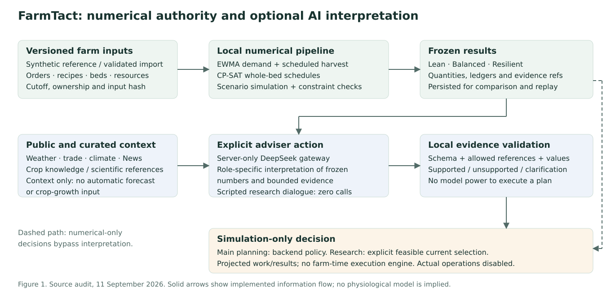

# FarmTact · Command & Cultivate

FarmTact is a mobile farm-planning game and research demonstration for a fictional
Singapore vegetable farm. Explore a visual farm, inspect orders and evidence,
compare planting strategies, and discuss the consequences with a council of advisers.
Local Python calculations produce quantities and schedules; optional DeepSeek calls
interpret frozen results. Actual planting, purchases and farm communications are disabled.

**Play:** [guided v10 council](https://farmtact.fly.dev/v10/research) ·
[main v10 farm](https://farmtact.fly.dev/v10/) ·
[edition chooser, v1–v10](https://farmtact.fly.dev/)

**Read:** [documentation index](docs/README.md) ·
[scientific implementation report](docs/technical/README.md) ·
[v10 grounding follow-up](docs/technical/v10-grounding-followup.md) ·
[v9 AI follow-up](docs/technical/v9-ai-followup.md) ·
[v8 remediation report](docs/technical/v8-remediation-report.md) ·
[V8 failed-quality postmortem](reports/v8/public-ai-postmortem.md)

The latest public edition is **v10**, pinned to source
[`ec4e298`](https://github.com/phuawenpu/FarmTact/commit/ec4e29874b2c7408f2bd93d012912e3c0cb8d2f3)
and immutable image
`sha256:874530e73f481b1197e528bb5f124b958a74be64c9934292c14438b4cdd503bf`.
All ten edition health/source checks and captured preservation of v1–v9 passed.
See [deployment health](reports/v10/deployment-health.json) and
[preservation evidence](reports/v10/preservation-after.json).

## What you can do

- Start the guided council study, calculate a plan, reserve a bed, test an
  unconfirmed order, challenge an assumption and compare frozen versions.
- Explore the main farm board, active batches, deliveries, constraints and worklists.
- Compare **Lean**, **Balanced** and **Resilient** schedules under the same declared
  scenarios. Inspect uncovered demand, costs, resource use, waste and closing stock.
- Use the Data Explorer to inspect records, vary synthetic-generation assumptions,
  adjust the demand baseline and save independent numerical experiments.
- Browse twelve evidence-linked crop profiles and original illustrations. Four
  profiles—caixin, pak choi, kailan and lettuce—have numerical demo recipes.
- Ask Demand, Weather, Market, Production, Supply Chain, Profit and Planner
  advisers for optional interpretations. Reopen saved responses without new inference.
- Inspect weather, trade, climate and News context with dates and provenance.
  Community feeds remain unconnected.
- Enable optional locally bundled music/effects. Text fields support device-keyboard
  dictation where the device offers it; custom recording/transcription is not integrated.

Acceptance saves projected outcomes and worklists. In v8, an accepted
current mission can create a tenant-owned synthetic execution world. Explicit
advance actions move its civil-date clock by one or seven days and record synthetic
sowing, transplanting, harvesting, delivery, inventory, cost and revenue events.
Replanning freezes the next unexecuted day, locks work already started and preserves
past events. The farm-map date slider remains a static preview and records nothing.
Neither path performs a real farm operation.
The [game backend audit](docs/technical/game-backend-and-state-machines.md) traces
these boundaries and the Council gaps in detail.

FarmTact has three distinct Council workflows:

1. A **planning mission Council** runs six specialist DeepSeek calls followed by
   the Planner on one frozen numerical result. Specialists do not debate each other;
   only the Planner receives their validated, bounded findings. There are no two
   challenge rounds. A mission declares `required` or `advisory` Council policy.
   Required policy withholds automatic selection on incomplete or unsupported
   findings; advisory policy keeps the numerical decision available while showing
   Council issues.
2. A **persistent adviser conversation** supports one direct reply, a two-turn
   invited exchange, or a seven-turn sequential Council on a frozen farm, scenario
   or research snapshot. Stored replay makes no inference call.
3. The **guided research study** uses scripted dialogue and local numerical jobs.
   It stores private versioned inputs and never changes the main farm. An explicit
   separate direct-adviser action may interpret a completed frozen research result.

## How the intelligence works



| Component | Implemented method | Interpretation boundary |
| --- | --- | --- |
| Farm records | Deterministic versioned fixture; validated imports and saved snapshots | Orders, recipes and farm outcomes in the demonstration are synthetic |
| Demand | Deployed alpha-0.35 EWMA over available weekly order history; confirmed bookings plus positive residual demand | Statistical baseline; the separate synthetic benchmark does not replace it or establish real-farm accuracy |
| Plant development | Recipe nursery/grow dates, fixed marketable yield per area, calendar-based visual progress | Scheduling simulation; no physiological growth, disease or biomass model |
| Strategies | `daily-bed-cpsat-v3` OR-Tools CP-SAT whole-bed selection plus FEFO local simulation and validation | Absolute crop-cycle IDs, collision-checked harvest-lot IDs and a persistent lot-origin map preserve identity across replans; feasibility within declared constraints does not imply full delivery coverage, and only an `OPTIMAL` solver result proves the stated optimum |
| Risk | Declared weighted stress scenarios; Resilient first maximizes the worst scenario aggregate fill floor, then applies its utility tie-break when that floor is proven | Engineering scenarios and weights, not calibrated probabilities, per-order guarantees or confidence intervals |
| Council | Separate planning, conversation and scripted research workflows | Seven roles do not establish seven independent sources of truth |
| DeepSeek | Server-only allowlisted text/native-vision routes use the exact canonical `deepseek-flash` model, bounded calls and local validation | The active caller manifest distinguishes product callers from diagnostic routes; configuration is not a current capability or correctness result |
| Public sources / News | Cached, provenance-aware context | No automatic numerical effect on demand, yield or maturity |
| Vision | Synthetic batch-label reading probe | No deployed crop-health, disease, satellite or biomass inference |

No model is trained or fine-tuned on real FarmTact farm/customer records. V8
introduced, and later editions retain,
independent generated train/evaluation cohorts and benchmarks fixed/tuned EWMA,
seasonal-naive and crop-residual candidates. Promotion is blocked because real-farm,
external-cohort and operational evidence is absent; deployed forecasts remain
`recipe-ewma-v1`. There is no embedding/vector-search or automatic retraining
pipeline. GPT/Codex builds and reviews the software; application inference uses
the DeepSeek gateway.
The [technical report](docs/technical/README.md) documents equations, prompts,
call triggers, budgets, persistence, evidence and limitations with source links.

## Reference farm and evidence

The default fixture represents 16 beds of 20 m², eight existing batches, 32 future
orders and 48 weekly historical observations across four crops. The planning
horizon is 56 days from the fixture's September 2026 cutoff; waiting for a job
does not advance the farm calendar. Nursery, labour, cash and inventory are explicit
constraints. Twelve crop knowledge profiles do not imply twelve validated recipes.

The original public ingestion report contains 200 normalized rows across seven
weather/trade/climate sources. These are recorded snapshots with bounded coverage,
not a promise of current availability or a complete historical warehouse. News is
a separate bounded RSS metadata cache. Research citations do not validate fixture
yields, financial assumptions or achieved farm benefits.

See [data inventory](docs/data-and-models.md),
[data lineage](docs/technical/system-data-and-evidence.md) and
[growth mathematics](docs/technical/numerical-models-and-growth.md).

## Repository map

| Path | Responsibility |
| --- | --- |
| `apps/web/` | React/TypeScript/Vite interface, farm artwork, council study, explorer and audio |
| `services/api/app.py` | FastAPI application, planning worker, simulation acceptance and routes |
| `services/api/` | Tenant persistence, scenarios, conversations, research, security and edition gateway |
| `runtime/deepseek_gateway.py` | Provider policy, transport, JSON/tool/vision/stream handling and safe audit |
| `config/deepseek_runtime.json` | Active caller inventory, exact canonical model routes, migration provenance and transport/budget limits |
| `packages/contracts.py` | Validated farm inputs, recipes and hashes |
| `packages/fixtures.py`, `packages/models/` | Synthetic generation and EWMA/harvest baselines |
| `packages/planner/` | Whole-bed scheduling, scenario simulation and research constraints |
| `packages/ingestion/`, `packages/news.py` | Public-source normalization and bounded News collection |
| `research/`, `data/manifests/` | Curated knowledge and source/feature provenance |
| `tests/`, `reports/` | Executable checks and dated evidence with scoped claims |
| `config/releases/`, `config/hosting/` | Immutable release registry and shared Fly topology |
| `docs/` | Technical report, requirements gaps, research and operational runbooks |

## Local setup

The locked application targets Python 3.13+, Node 24 and PostgreSQL 18.
Use the committed dependency files; the optional Docker Compose path remains
historically unverified. The separate Fly image was built and deployed.

```bash
python -m venv .venv
.venv/bin/pip install -r requirements.lock.txt
npm ci --prefix apps/web
npm run build --prefix apps/web
```

Provide an empty development PostgreSQL database through `FARMTACT_DATABASE_URL`.
The Sprite default is `postgresql+psycopg://sprite@/farmtact?host=/tmp/farmtact-pg`;
it works only when that local server/database has been provisioned. The checkout
does not contain a virtual environment, running database or generated frontend build.
`.env.example` documents names; it is not automatically loaded by `serve.py`.

```bash
.venv/bin/python scripts/initialize_database.py
.venv/bin/python -m packages.fixtures
.venv/bin/python scripts/build_dataset.py --fixture-bundle data/fixtures/public_context_v1
.venv/bin/python scripts/build_features.py
.venv/bin/python scripts/generate_web_contracts.py
```

The fixture-bundle command is a clean-checkout, network-free path. It verifies the
committed project-authored synthetic provider-contract bundle before running the
normalizers. `--offline` instead rebuilds previously captured immutable snapshots;
a live build makes bounded public-source requests and writes explicit failure/cache
states. See the [reproduction guide](docs/technical/reproducibility.md)
for offline checks, generated artifacts and service prerequisites.

Outside Sprite, run `.venv/bin/python scripts/serve.py` to serve the application
on port 8080. **Inside Sprite**, register that command using `sprite-env services
create`; follow the Sprite skill for service management. Numerical-only exploration
does not require a DeepSeek key. Actual adviser calls require `DEEPSEEK_API_KEY`
in the server environment (or the protected local delivery file supported by
`serve.py`). Keep credentials out of source, frontend variables, command arguments
and logs. Key presence does not establish current model availability.

## Verification and current limits

```bash
.venv/bin/python -m pytest -q
.venv/bin/python scripts/generate_web_contracts.py --check
npm run build --prefix apps/web
```

`apps/web/src/lib/types.ts` is generated from the authoritative Pydantic view
models; edit the models and regenerate rather than hand-editing that file. Fixture
import, planning, conversation, research and simulation mutations require an
`Idempotency-Key` of at most 128 characters. Reusing a key with identical input
returns the stored result; changed input is rejected.

V9 passed the final whole-repository regression with **606 tests passed and one
skipped** in 446.38 seconds. Its mobile typed-fact check passed **21 assertions**
at 390 × 844 with no JavaScript errors, using intercepted server-shaped fixtures
and zero provider calls. All nine public health/source checks and captured v1–v8
state preservation passed. These software and display checks do not establish
provider answer quality.

The [authenticated public V9 UI replay](reports/v9/ui-live-replay.json) passed **38 of 38** checks at mobile and
desktop widths. It read the saved mission, conversation and research state; all
mutation attempts and direct provider traffic were intercepted before network
dispatch, so no mutation or inference request was forwarded.

V9's public capacity check passed two overlapping numerical jobs and 58 browse
samples with zero provider calls. Its 56-day synthetic execution run passed mass,
cash and lot-receipt checks with 60 task events, 64 demand-service events, one
future replan and zero provider calls. That run did not exercise an actual
application restart.

**V8 public AI quality failed.** The planning Council completed seven validly
referenced replies, but some explanations confused metric meaning or role scope.
The invited conversation stopped at the existing response-length limit. The
combined scorer passed 6 of 10 completed cases and failed workflow completeness.
The [postmortem](reports/v8/public-ai-postmortem.md) preserves all evidence. V9
publishes the separate semantic-context, typed-evidence and display corrections,
but its live quality gate also failed: **12 of 18** automated cases passed while
workflow integrity passed. V9 consumed 21 actual requests (nine mission, eleven
conversation and one research), bringing the cumulative ledger to 76. Two Council
abstentions persisted as unsupported, and a Supply reply falsely said an 824 kg
booked request was fully delivered despite strategy deliveries of 370, 446 and
518 kg. The completed [AI-assisted semantic review](reports/v9/ai-assisted-semantic-review.md)
classified the 18 messages as 10 sound, 5 sound with limits and 3 materially
contradictory: Planning Supply and two Production replies. It found that four
automated failures were conservative keyword/prefix misses and two were real
abstention-contract failures. V10 is the published
[grounding-remediation edition](docs/technical/v10-grounding-followup.md).
Its full suite passed 611 tests with one skip in 441.23 seconds. The live
Council-only trial used nine requests for seven messages and passed 5 of 7 targeted
cases: Weather/Market absence handling passed, while Supply was withheld for the
model-authored word “zero” and Chair missed a topic word. A fresh mission was
correctly withheld before inference because seven daily requests remained but nine
were required; all three numerical strategies remained available. No new direct,
invite, research or vision result is claimed. That narrow fix
does not establish general prose or crop-mix entailment; AI quality remains partial.
The final task total is **85 actual requests** (44 local and 41 public), including
failed and repaired attempts. **V10 AI quality remains failed/incomplete.** Its
[seven-case semantic audit](reports/v10/ai-assisted-semantic-review.md) found two
sound messages, four with limits and one contradiction: Profit called a negative
Lean margin delta a gain. These gaps are retained as explicit next-iteration
requirements. The public 56-day V10 execution passed numerical reconciliation
and receipt replay with zero provider calls. **Shared-host capacity also failed**
the final two-job test: both scenarios exceeded 180 seconds and browse p95 was
15.04 seconds. [Capacity evidence](reports/v10/capacity-protocol-note.md) preserves
both runs; healthy endpoints do not establish acceptable loaded performance.

Expired anonymous workspaces can be reviewed and removed only through the explicit
[retention CLI](docs/runbooks/retention.md). It defaults to dry-run, retains 30
days, enforces a minimum of seven days and a maximum of 500 candidate tenants per
invocation, skips active jobs, and has no automatic deletion schedule.

The full suite includes PostgreSQL integration tests; use the dedicated test
databases documented in the [reproduction guide](docs/technical/reproducibility.md).
Browser checks require a running development service and Playwright Chromium.
`node tests/browser/run.mjs` covers the original journey; release-specific scripts
cover later features. The numerical evaluator rewrites its report and may produce
different feasible schedules under time-limited solving.

Archived v7 evidence records 33 final contracts/research tests, 111 planning/UI
checks and 48 novice checks. The broad candidate run had 492 passes and one contract
drift failure; that failure was fixed and checked in the focused group. Public
browser review passed 111 checks. These are historical scopes, not newly rerun
full-suite results. See [v7 evidence](reports/v7/implementation.md) and the
[documentation audit record](reports/documentation/2026-09-11.md).

Both recorded v7 actual adviser probes were flagged **unsupported**. They verified
transport/context/replay boundaries, not farming-answer quality. Earlier successful
provider trials do not erase those results. Future work includes grounded adviser
quality, capability freshness, clearer model semantics, stronger numerical validation
and human usability studies; acceptance criteria are in the
[v8 remediation report](docs/technical/v8-remediation-report.md). V8 package
evidence is in [Council](reports/v8/council.md), [planner](reports/v8/planner.md)
and [data/ML](reports/v8/data-ml.md); the V9 follow-up and its evidence are linked
above. Actual trial failures remain evidence rather than being overwritten by
later attempts.

## Hosting and releases

The `farmtact` app runs in Singapore on one shared 4-vCPU/4-GB Fly Machine and one
3-GB persistent volume. The gateway and v1–v10 occupy eleven isolated containers with
separate application databases/caches/progress; abuse and inference spending limits
are shared. One host is a shared failure boundary. Read-only checks on 11 September
2026 found the Machine started with 1/1 health checks passing.

Every newly published application iteration receives a new immutable edition.
Use [the edition publisher](docs/deployment/editions.md); a generic `fly deploy`
does not describe the active container topology. After V10 publication, the next
contiguous edition is v11. See [Fly operations](docs/deployment/fly.md).

Development scope and provider policy are controlled by the
[build specification](FarmTact_Build_Specification.md),
[runtime specification](FarmTact_DeepSeek_Runtime_Specification.md) and
[repository instructions](AGENTS.md). Their requirements include future work;
source and dated reports establish what has been implemented and tested.
