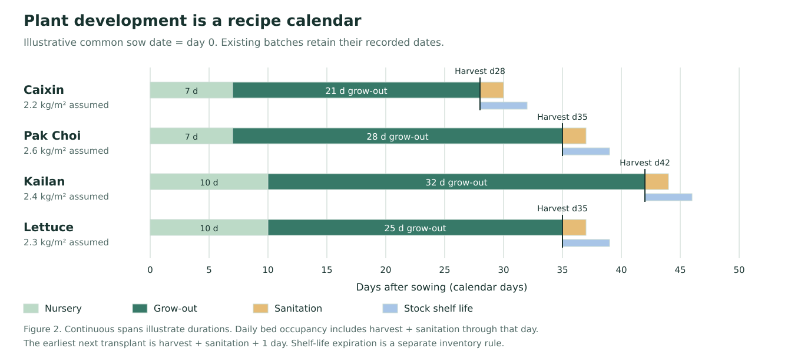
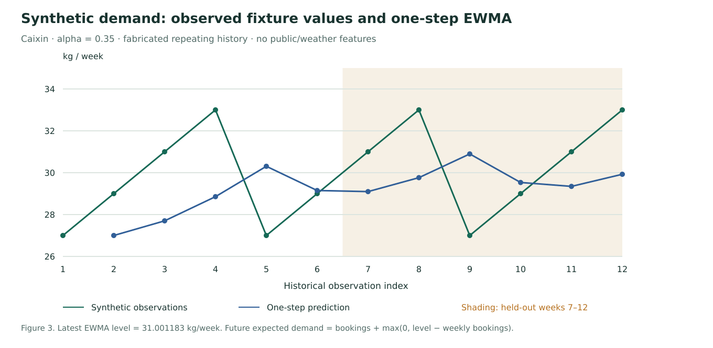

# FarmTact: scientific implementation report

> **Historical baseline:** This chapter records the pre-remediation audit of source `a96025e` and published v7. Its implementation findings and measured results describe that baseline. Read [the V8 remediation report](v8-remediation-report.md) for simulation and synthetic model remediation, and [the V9 AI follow-up](v9-ai-followup.md) for corrections prompted by the V8 public trial. Source links below are navigation aids into the maintained repository; use the [frozen baseline](https://github.com/phuawenpu/FarmTact/tree/a96025e) to reproduce the original inspection.

**AI orchestration, numerical planning, crop development and evidence boundaries**

Audit date: **11 September 2026** · Source baseline: [`a96025e`](https://github.com/phuawenpu/FarmTact/commit/a96025e)
· Published v7 source: [`6efbbfd`](https://github.com/phuawenpu/FarmTact/commit/6efbbfd5a57cb557683e636d1fe20ae63b6b9eda)
· Study type: **source-code and engineering-evidence audit**, not an agronomic trial.

**Original audit reading copies:** [PDF](../../reports/documentation/farmtact-technical-report.pdf) ·
[offline HTML](../../reports/documentation/farmtact-technical-report.html).
The Markdown chapters below preserve the original audit with explicit current-status notices.

**V8 follow-up:** [remediation report](v8-remediation-report.md) · [combined PDF](../../reports/v8/farmtact-remediation-report.pdf) · [offline HTML](../../reports/v8/farmtact-remediation-report.html).

**V9 follow-up:** [AI correction report](v9-ai-followup.md) · [PDF](../../reports/v9/farmtact-report.pdf) · [offline HTML](../../reports/v9/farmtact-report.html). V9 is published from [`89d29cc`](https://github.com/phuawenpu/FarmTact/commit/89d29cc3e071e12373204ff234d0a261ce71b5a1); all nine health/source checks and captured v1–v8 preservation passed, and the [GET-only public UI replay](../../reports/v9/ui-live-replay.json) passed 38 of 38 checks without forwarding mutation or inference requests. Its live quality gate failed: 12 of 18 automated cases passed while workflow integrity passed. The [AI-assisted semantic review](../../reports/v9/ai-assisted-semantic-review.md) classified 10 messages as sound, 5 as sound with limits and 3 as materially contradictory. [V10](v10-grounding-followup.md) is published from [`ec4e298`](https://github.com/phuawenpu/FarmTact/commit/ec4e29874b2c7408f2bd93d012912e3c0cb8d2f3); its full suite passed 611 tests with one skip in 441.23 seconds, and all ten health/source checks plus prior-nine preservation passed. Its Council-only live quality result is FAIL (5/7); the fresh mission was withheld before inference by the daily request budget, and other workflows were not rerun. The [PDF](../../reports/v10/farmtact-report.pdf) and [offline HTML](../../reports/v10/farmtact-report.html) document the frozen release boundary and remaining semantic gaps.

## Abstract

FarmTact combines a visual synthetic-farm application, local statistical baselines,
a constrained scheduling solver, deterministic scenario simulation and optional
pretrained DeepSeek interpretation. This report traces the implemented pathways
rather than inferring capabilities from role names or design requirements. Demand
uses an exponentially weighted moving average (EWMA) combined with booked orders.
Crop development uses fixed recipe durations and marketable yield assumptions;
the farm view derives progress from calendar dates. OR-Tools CP-SAT selects
whole-bed planting candidates, and a local inventory simulator evaluates three
fixed stress scenarios. Public observations, News and crop literature provide
context without automatically becoming numerical forecast inputs.

Acceptance stores a projected outcome and worklist; no farm-time or task-execution
engine advances sowing, harvesting or inventory state. The council has distinct
planning, conversation and research-study implementations.
Default v7 research dialogue is scripted; real numerical jobs and optional adviser
calls are separately triggered. Actual LLM calls use a server-only DeepSeek gateway
with role/model allowlists, typed output validation, finite reservations and recorded
replay. No application-specific ML training, crop physiological model, disease
classifier or autonomous farm execution is implemented. Archived tests support
specific engineering properties. In particular, both recorded v7 adviser responses
remain unsupported; those probes do not establish answer quality. The report
provides equations, architecture figures, source traces, reproducibility guidance
and a prioritized requirements register for the next immutable application edition.

## Contents

1. [Scope, method and evidence](#1-scope-method-and-evidence)
2. [System overview](#2-system-overview)
3. [AI provider and council mechanics](ai-provider-and-council.md)
4. [Numerical models and plant growth](numerical-models-and-growth.md)
5. [Complete game backend and state machines](game-backend-and-state-machines.md)
6. [System, data lineage and evidence](system-data-and-evidence.md)
7. [Results and interpretation](#3-results-and-interpretation)
8. [Limitations and next-iteration requirements](gaps-and-next-iteration.md)
9. [Reproduction and verification](reproducibility.md)

The linked chapters form one report. Each includes implementation references;
[the documentation index](../README.md) covers the wider repository.

## 1. Scope, method and evidence

### 1.1 Research questions

- Which user actions can cause provider inference, through which roles and models?
- How do the three council workflows obtain context, validate answers and persist results?
- What is calculated locally, and what does “plant growth” mean in the application?
- Which inputs are observed, synthetic, curated, inferred or simulated?
- What do the tests establish, and which requirements remain unimplemented or unvalidated?

### 1.2 Audit protocol

The audit inspected the committed source, runtime configuration, fixture generator,
contracts, numerical solver/simulator, API workers, frontend state mappings,
release manifests and dated reports. Three bounded specialist audits covered AI,
numerics and system/data architecture; the integrating author reconciled findings
into this report, the README and the specifications. These are code-review roles,
not application council calls or human study participants.

Read-only GitHub and Fly inspection established repository access, source state,
the active Machine and public edition registry. Offline tests and deterministic
figure generation are recorded separately in the
[documentation audit record](../../reports/documentation/2026-09-11.md).
No new metered adviser experiment, deployment, farm-state mutation or full browser
usability study was performed for this documentation task. Existing reports were
read as historical observations, not relabelled as newly reproduced results.

### 1.3 Evidence hierarchy used in this report

| Label | Meaning | What it cannot establish |
| --- | --- | --- |
| Source-inspected | Behavior traced to a function, contract, configuration or UI mapping | That every branch was executed successfully |
| Fresh offline check | Named command run during this audit against local code/fixtures/mocks | Current external account capability or production performance |
| Archived experiment | Dated committed report from an earlier execution | Present availability, a different source commit or unseen inputs |
| External documentation | Provider/tool documentation, with retrieval context | Account-level feature access or successful application integration |
| Requirement / recommendation | Desired future behavior with an acceptance criterion | Implemented or validated capability |

A schema-valid response is not automatically factually supported. A solver's
feasible result is not automatically globally optimal or commercially desirable.
A repeatable synthetic experiment is not external validation against real crops,
orders or human decision-making.

## 2. System overview

**Figure 1.** Source-derived information flow. Numerical tools create the authoritative
quantities. Frozen results and bounded context reach optional DeepSeek interpretation.
Local checks and the relevant backend decision path control simulation acceptance.
Scripted dialogue is a distinct zero-inference interaction. Source:
[`app.py`](../../services/api/app.py), [`council.py`](../../services/api/council.py),
[`council_research.py`](../../services/api/council_research.py) and
[`engine.py`](../../packages/planner/engine.py).
[PNG](figures/system-overview.png) · [SVG](figures/system-overview.svg).

### 2.1 Mechanism classification

| Mechanism | Inputs → outputs | Learned from FarmTact records? | Provider call? |
| --- | --- | --- | --- |
| Fixture generation | Fixed parameters → fictional orders/batches/history | No | No |
| EWMA | Available historical orders + bookings → weekly residual demand | Recursive statistical state; no trained regressor | No |
| Harvest calendar | Batch dates/recipe assumptions → harvest dates and marketable kg | No | No |
| Farm artwork | Snapshot planning date + batch dates → stage/progress | No | No |
| CP-SAT | Candidate schedules/resources → whole-bed allocation choices | No | No |
| Inventory simulation | Allocations + dated demand + stress cases → ledgers/metrics | No | No |
| Scripted research dialogue | Bounded intent/context → proposal or clarification | No | No |
| DeepSeek advisers | Frozen context + role prompt → typed interpretation | Pretrained external model; no app fine-tuning | Yes, explicit paths |
| Synthetic vision probe | Generated image → checked batch-label observation | No FarmTact training | Yes |
| News collector | Allowlisted RSS bytes → validated metadata cache | No | No LLM inference |

A registered `satellite_visual_reviewer` or `test_evaluator` route grants a bounded
capability to trusted server code; it does not establish a deployed satellite
pipeline or an LLM evaluation service. See the call-site inventory in the
[AI chapter](ai-provider-and-council.md).

### 2.2 Plant development and temporal meaning

**Figure 2.** The four fixture recipes shown on a common illustrative sow date.
Nursery and grow-out durations determine harvest. Sanitation affects bed reuse;
shelf life affects harvested inventory. Yield coefficients are **synthetic engineering
assumptions**. The chart is not a measured biological growth curve. Source:
[`fixtures.py`](../../packages/fixtures.py), [`contracts.py`](../../packages/contracts.py)
and [`engine.py`](../../packages/planner/engine.py).
[PNG](figures/growth-timeline.png) · [SVG](figures/growth-timeline.svg).

For a batch with sow date `s`, transplant date `t`, harvest date `h` and current
snapshot date `d`, the backend view computes
`progress = clamp((d − s) / (h − s), 0, 1)` and chooses nursery/growing/ready from
those dates. Artwork adds presentation categories, not biomass measurements.
A long calculation does not move `d`. Research dialogue does not secretly accelerate
crop maturity. See the [numerical chapter](numerical-models-and-growth.md) for
inclusive-day occupancy, expiry, yield shocks and the limits of simulated execution.

### 2.3 Demand baseline and interpretation

**Figure 3.** Freshly generated illustration from the source fixture. The blue
one-step forecast uses only preceding observations; the shaded observations match
the six held-out weeks used by the archived numerical evaluator. The newest EWMA
level is used across future weeks, with already booked quantities preserved and
only positive residual demand added. A repeating synthetic history can make a
baseline appear accurate without establishing performance on real orders. Source:
[`models`](../../packages/models/__init__.py),
[`evaluate_numerical.py`](../../scripts/evaluate_numerical.py).
[PNG](figures/demand-baseline.png) · [SVG](figures/demand-baseline.svg).

All figures have source SVGs, raster exports, accessible titles/descriptions and
textual explanations. [Generation code](figures/generate.py) and
[underlying fixture/forecast data](figures/data.json) support reproduction.
Architecture annotations are authored from source inspection; no generative-image
model or inferred experimental data was used to create these figures.

## 3. Results and interpretation

### 3.1 Numerical evidence

The archived [numerical evaluation](../../reports/numerical_evaluation.json)
compares EWMA with a last-week baseline over six held-out weeks per crop. Caixin
EWMA MAE is approximately **2.383 kg/week**, versus **2.667 kg/week** for last-week
naive; WAPE is approximately **7.77%** versus **8.70%**. These are synthetic targets
from a deterministic four-week pattern. The four crops share the pattern with
level offsets, so they do not constitute four independent real-world datasets.

The same archive records constraint-checked strategy outputs and time-limited
solver statuses. Its `FEASIBLE` statuses should not be translated into “the optimal
farm plan.” Whole-bed schedules may leave both shortages and surplus because
crops, dates and shelf life constrain allocation. The locally calculated minimum
across three stress cases is a scenario downside, not a statistical lower quantile.
Financial outputs use assumed prices and costs; they are not audited profit.

### 3.2 Adviser evidence

The [v7 local](../../reports/v7/advisor_local.json) and
[public](../../reports/v7/advisor_public.json) probes each made one actual request.
Their context/replay/isolation checks passed, but both responses remained
**unsupported**. This distinction is central: transport correctness and budget
control are necessary engineering properties; they do not validate agronomic
interpretation. The older [authenticated trial summary](../../reports/deepseek/authenticated_trial_summary.md)
retains its own tested roles, models, budget and dates.

The app's capability display also relies on archived trial records rather than a
fresh provider probe. The [gap register](gaps-and-next-iteration.md) requires the
next iteration to distinguish historical verification, current configuration and
recent successful execution without generating paid background calls merely for badges.

### 3.3 Interaction and infrastructure evidence

The [v7 report](../../reports/v7/implementation.md) records 111 public browser
checks and separate novice-agent checks. Automated completion times, screenshots
and AI reviewer opinions do not establish farmer learning, enjoyment, actual
screen-reader support or physical touch/keyboard comfort.

The archived shared-capacity experiment completed two concurrent v6/v7 numerical
jobs in approximately 22 seconds each and sampled at least 2.34 GiB available
memory. This is evidence for that bounded workload, not sustained scalability.
The 11 September read-only inspection found one running Fly Machine, 1/1 health
checks and seven published editions. No new concurrency experiment was performed.

## 4. Discussion and next iteration

FarmTact's strongest implemented separation is between numerical authority,
contextual interpretation and simulation-only decisions. Its most consequential
open issues are adviser evidence quality, truthful capability labels, temporal and
metric precision, realistic out-of-sample validation, and human evaluation.
Adding more role names or source cards cannot resolve these issues by itself.

The [gap register](gaps-and-next-iteration.md) assigns stable IDs, implementation
evidence, proposed changes and measurable acceptance criteria. The specifications
now reference those IDs and explicitly distinguish a current-state correction
from a requested future capability. The existing four-recipe demonstration remains
valid as a bounded engineering fixture; new crop recipes, observed growth response,
learned demand models and real operations each require their own data and validation.

## 5. Reproducibility and references

See [reproducibility](reproducibility.md) for commands and environment prerequisites,
and the [audit record](../../reports/documentation/2026-09-11.md) for commands actually
executed. The detailed chapters provide function-level source links and external
references where relevant. Source links target repository-relative files; the
baseline commit at the top defines the inspected implementation. Frozen release
manifests identify the distinct deployed source/image.

The report does not use archived pass counts as a substitute for new scientific
experiments. It supplies the implementation account and acceptance criteria needed
to design those experiments responsibly in the next iteration.

## V11 guided production planning

The [organizer-aligned V11 chapter](v11-guided-production-planning.md) documents the guided mission, future-demand/booking separation, scoped seasonal assumptions, fair retained-plan comparison, bounded numerical worker and structured Council. [Published V11 acceptance](../../reports/v11/implementation.md) is recorded separately from historical V10 evidence.
