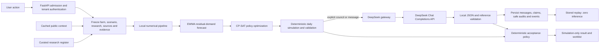
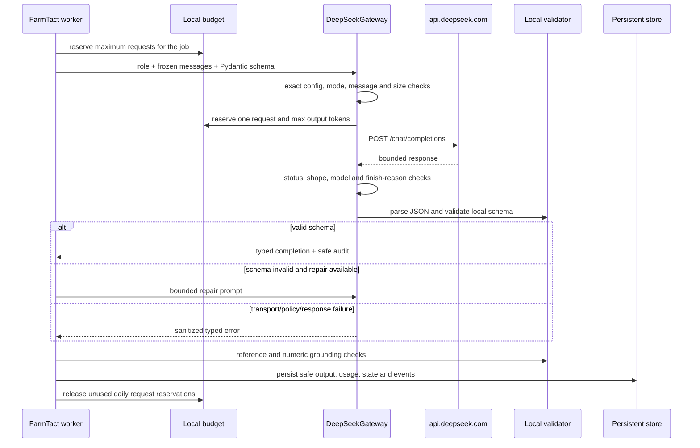
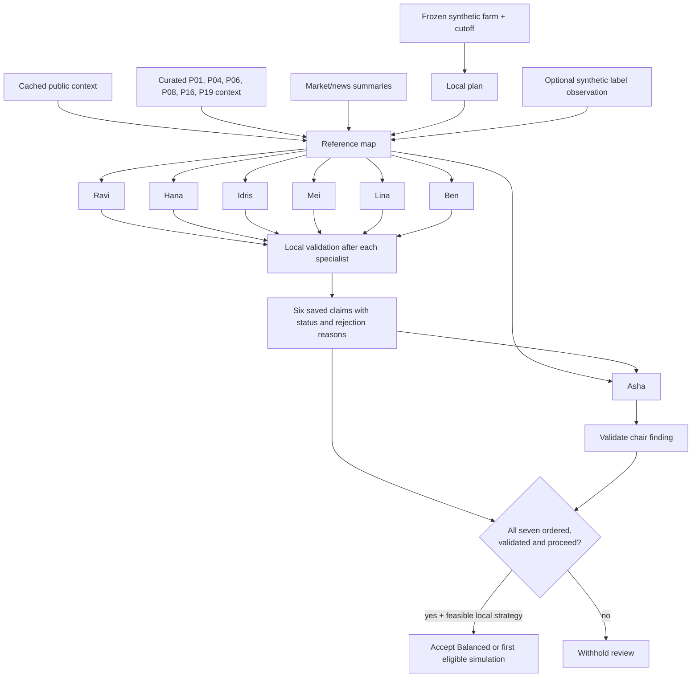
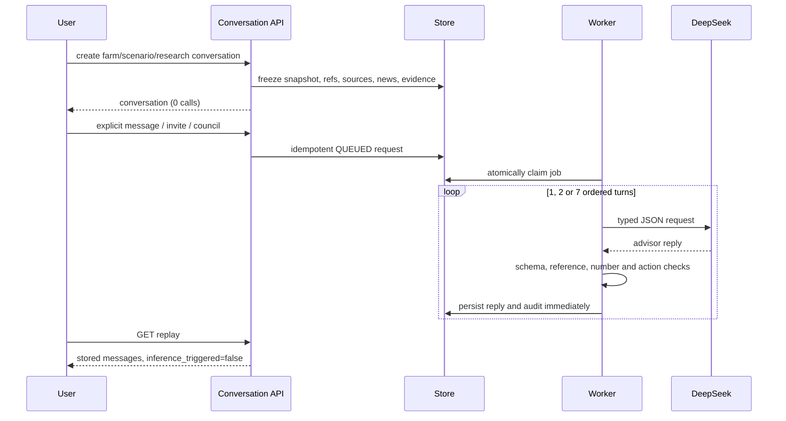
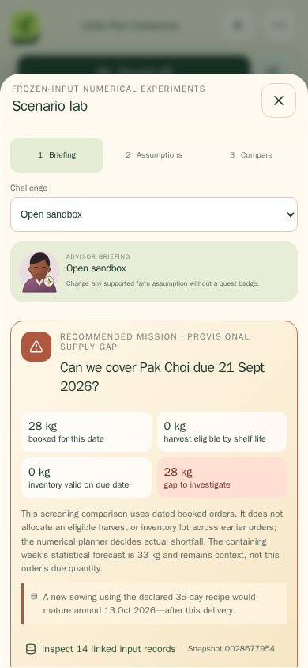
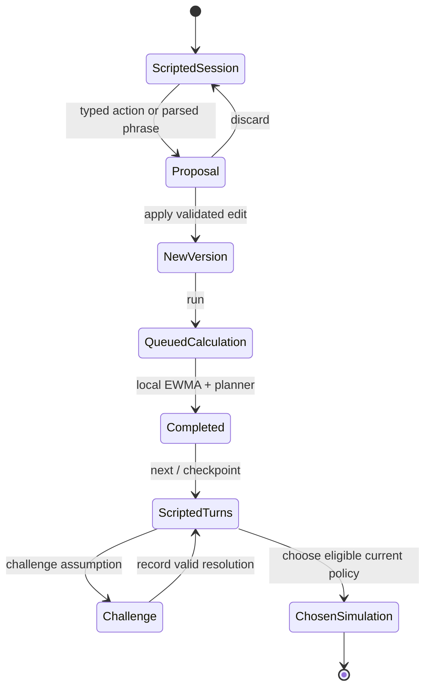
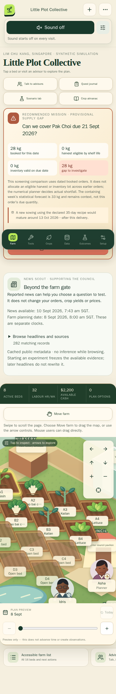
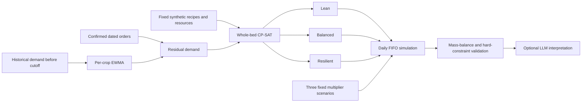
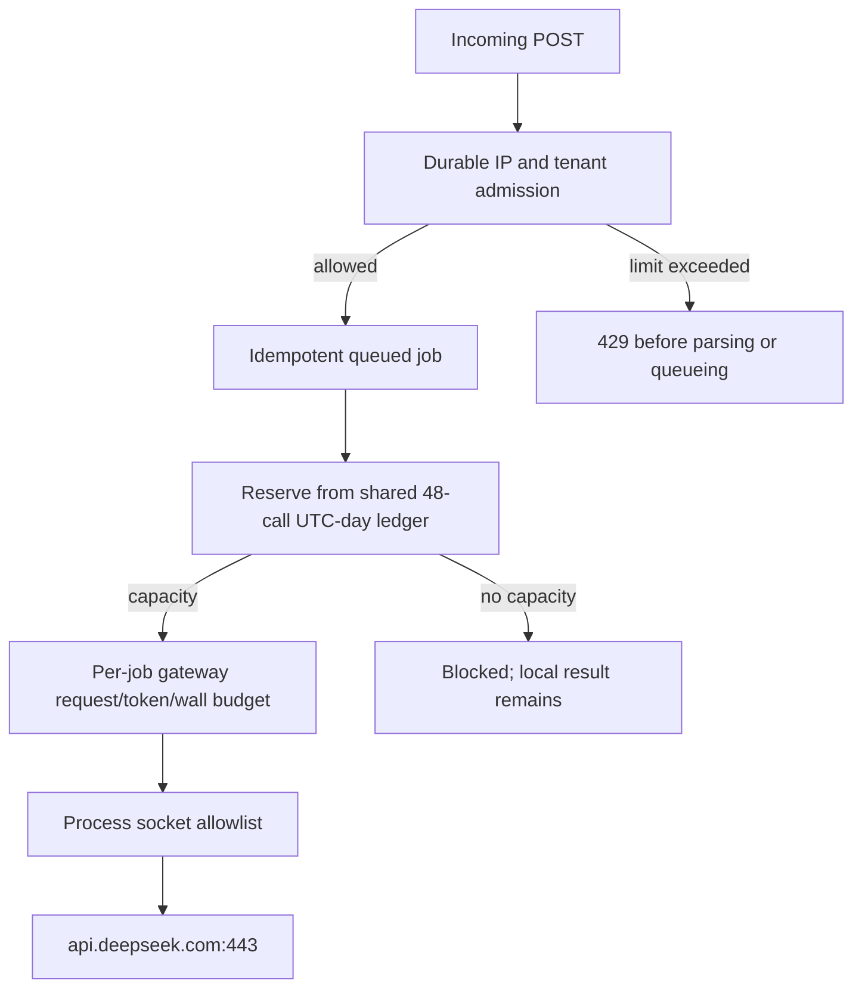

# AI provider and council implementation report

**Audit date:** 11 September 2026 (UTC)<br>
**Audited revision:** `a96025e49226d8ca641cf07b49192bd85b464805`<br>
**Scope:** the DeepSeek provider boundary, mission and conversation councils, the
playable council study, vision, numerical forecasting and simulation interfaces,
evaluation evidence, persistence, replay, budgets, admission control, and egress.

This chapter is part of the
[`FarmTact: scientific implementation report`](README.md). Consolidated issue IDs,
priorities and next-iteration acceptance criteria are maintained in the
[`implementation gap register`](gaps-and-next-iteration.md); this chapter supplies
the detailed call-path evidence behind its `AI-*` entries.

> **Safety and interpretation boundary.** FarmTact is a synthetic planning game in
> `execution_mode=test`. Its generated text is advisory, its crop parameters are
> demonstration fixtures, and accepted worklists are for simulation only. Nothing
> in the audited implementation authorizes a physical farm action.

## Abstract

FarmTact is a hybrid decision system. A local statistical baseline forecasts
unbooked demand; a local CP-SAT planner constructs three whole-bed policies; a
deterministic daily simulator checks timing, inventory, labour, cash, waste and
service; and, only after an explicit user request, DeepSeek models interpret a
frozen copy of those results. The language models neither calculate strategy
totals nor directly mutate the farm. A backend evidence gate checks model output
before the development policy can accept a strategy for simulation.

The current council has seven roles. Five use the configured
`deepseek-v4-flash` route and two use `deepseek-v4-pro`. A complete main-mission
council normally makes seven provider requests and permits at most two additional
schema-repair requests. Optional vision adds one request, but that workflow reads
an artificial batch label; it does not assess a plant. Persistent conversations
make one request for a direct question, two for an invitation exchange, or seven
for a full council, before bounded repairs.

There is no learned crop-growth, yield, disease, nutrient, or climate-response
model in the current application. “Growth” on the farm board is a linear schedule
progress indicator derived from declared sow, transplant and harvest dates.
Marketable yield is a fixed recipe coefficient multiplied by bed area, then
perturbed only by declared synthetic scenarios. These boundaries are central to
interpreting both the interface and evaluation results.

## Questions and method

This audit answers five questions:

1. What can trigger paid inference, which model does each route use, and how many
   HTTP requests can it create?
2. How do council outputs affect a planning decision?
3. Which parts are statistical estimation, mathematical optimization, deterministic
   simulation, scripted dialogue, or language-model inference?
4. What is persisted, replayed, validated, rate-limited, and allowed to leave the
   process?
5. Which repository claims are stale, incomplete, or stronger than their evidence?

The method was static source tracing from each public API trigger through job
creation, frozen inputs, gateway construction, response validation, persistence,
and replay. It also inspected checked-in trial artifacts and compared provider
claims with DeepSeek's official documentation. No paid inference request, Fly
deployment, or farm operation was made for this audit. Implementation facts take
precedence over prose and historical reports. A checked-in `PASS` file establishes
only what that particular artifact records; it is not a current provider health
check.

## System boundary



This separation is visible in the implementation: missions call the local
[`plan()` pipeline](../../services/api/app.py#L77-L91) before considering the
credential or reserving an inference budget. The council receives calculated
strategies and exact references, and the development policy performs its own
eligibility and evidence checks
([`services/api/app.py`](../../services/api/app.py#L132-L155)).

### Terms used in this report

| Term | Meaning in FarmTact | Provider call? |
|---|---|---:|
| Forecast | A per-crop EWMA of historical demand, converted to residual demand after confirmed orders | No |
| Optimization | A bounded CP-SAT search over whole-bed crop allocations | No |
| Simulation | Daily stock-flow accounting under three declared yield/demand scenarios | No |
| Schedule preview | Date interpolation and stage artwork in the UI | No |
| Computed perspective | A deterministic text template over scenario metrics | No |
| Scripted council study | Rules, buttons and predefined dialogue around local calculations | No |
| Advisor message/council | Structured natural-language interpretation returned by DeepSeek | Yes |
| Replay | Reading previously stored messages/events | No |

The numerical implementation has its own detailed report in
[`numerical-models-and-growth.md`](numerical-models-and-growth.md). Data lineage
and the evidence register are covered in
[`system-data-and-evidence.md`](system-data-and-evidence.md).

## Provider contract

### Current repository allowlist

The gateway admits one origin, two endpoints, three model identifiers and fourteen
named routes. Configuration is accepted only when it exactly matches the compiled
policy; unknown or missing fields, a different origin, an extra route, a larger
limit, or a model/route mismatch fail closed
([gateway policy](../../runtime/deepseek_gateway.py#L32-L67),
[`GatewayConfig.load`](../../runtime/deepseek_gateway.py#L131-L222),
[`config/deepseek_runtime.json`](../../config/deepseek_runtime.json)).

| Route | Configured model | Capability | Deployed caller in audited app |
|---|---|---|---|
| `demand_analyst` | `deepseek-v4-flash` | text | Mission and conversation councils; direct conversations |
| `weather_analyst` | `deepseek-v4-flash` | text | Mission and conversation councils; direct conversations |
| `market_analyst` | `deepseek-v4-flash` | text | Mission and conversation councils; direct conversations |
| `production_analyst` | `deepseek-v4-pro` | text | Mission and conversation councils; direct conversations |
| `supply_chain_analyst` | `deepseek-v4-flash` | text | Mission and conversation councils; direct conversations |
| `profit_analyst` | `deepseek-v4-flash` | text | Mission and conversation councils; direct conversations |
| `planning_chair` | `deepseek-v4-pro` | text | Mission and conversation councils; direct conversations |
| `visual_observer` | `deepseek-v4-flash-vision-exp` | vision | Optional synthetic-label observation |
| `evidence_extractor` | `deepseek-v4-flash` | text | No deployed HTTP call site found; gateway/trial surface only |
| `crop_alias_resolver` | `deepseek-v4-flash` | text | No deployed HTTP call site found; gateway/trial surface only |
| `runtime_researcher` | `deepseek-v4-pro` | text | No deployed HTTP call site found; gateway/trial surface only |
| `document_vision` | `deepseek-v4-flash-vision-exp` | vision | No deployed HTTP call site found; gateway/trial surface only |
| `satellite_visual_reviewer` | `deepseek-v4-flash-vision-exp` | vision | No deployed HTTP call site found; gateway/trial surface only |
| `test_evaluator` | `deepseek-v4-pro` | text | No deployed HTTP call site found; local evaluation does not use it |

“Configured” is not synonymous with “used.” The route registry is broader than
the current application call graph. The generic two-request tool continuation,
model-list request and streaming path are implemented in the gateway and exercised
by standalone trials, but the deployed mission/conversation workflows call
structured chat and vision only
([gateway methods](../../runtime/deepseek_gateway.py#L451-L683)).

### Comparison with official provider documentation

DeepSeek's official documentation, checked on the audit date, documents the API
origin and current model aliases in its [Quick Start](https://api-docs.deepseek.com/),
the `POST /chat/completions` request and JSON response mode in
[Chat Completion](https://api-docs.deepseek.com/api/create-chat-completion/), model
discovery in [List Models](https://api-docs.deepseek.com/api/list-models), inline
image content in [Vision](https://api-docs.deepseek.com/guides/vision/), and the
continuation treatment of `reasoning_content` in
[Thinking Mode](https://api-docs.deepseek.com/guides/thinking_mode/). The provider
also documents tool calls as model requests whose functions are executed by the
client, not by the model itself
([Tool Calls](https://api-docs.deepseek.com/guides/tool_calls/)). These documents
support the protocol choices and aliases in the repository as of this audit.

They do **not** prove that the FarmTact deployment's account currently has access,
credit, or healthy connectivity. The application does not perform a fresh model
or chat probe when it renders capability status. See “Evidence freshness” below.

### Request construction and privacy

Every inference request is constructed by
[`DeepSeekGateway`](../../runtime/deepseek_gateway.py#L386-L420) with:

- an environment-delivered bearer credential; no credential is accepted from an
  HTTP client;
- `trust_env=False`, so ambient proxy configuration is not inherited;
- redirects disabled and the origin fixed to `https://api.deepseek.com`;
- the model selected from the server-side role table;
- `execution_mode=test` and `data_mode` limited to `synthetic_demo` or
  `historical_replay` ([mode checks](../../runtime/deepseek_gateway.py#L730-L775));
- a stable provider `user_id` derived by hashing the internal tenant identifier,
  prefixed with `farmtact_` ([pseudonymization](../../runtime/deepseek_gateway.py#L1005-L1011)).

DeepSeek's official [Rate Limit & Isolation](https://api-docs.deepseek.com/quick_start/rate_limit/)
page permits an alphanumeric, hyphen or underscore `user_id` and says not to send
private information in it. FarmTact's hashed pseudonym complies with that shape;
the source tenant ID is not submitted as `user_id`. This is pseudonymization, not
an anonymity claim: frozen prompts still contain synthetic farm and conversation
context needed for the task.

### Gateway bounds

| Bound | Hard ceiling |
|---|---:|
| Requests in one gateway budget | 16 |
| Reserved output tokens | 16,384 |
| Concurrent requests | 1 |
| Images per request | 4 |
| Bytes per source image | 4 MiB |
| Maximum image dimension | 4,096 px |
| Serialized request | 16 MiB |
| Response | 4 MiB |
| Gateway wall time | 300 s |
| Connect/read/write/pool timeouts | 10 / 90 / 30 / 5 s |

These are code-enforced maxima, not statements about provider-wide limits
([limit constants](../../runtime/deepseek_gateway.py#L51-L67)). The budget reserves
the declared maximum output tokens immediately before each HTTP request. A failed
or shorter request still consumes the local request count and reserved-token
allowance; usage is not reconciled downward
([`RunBudget.reserve`](../../runtime/deepseek_gateway.py#L225-L259)). That is a
conservative token budget, but it is not a currency-cost estimator.

### Validation lifecycle



For text JSON, the gateway asks for `response_format={type: json_object}`, accepts
exactly one choice with an allowed finish reason, checks the returned model, parses
the content, and validates it with the supplied Pydantic type
([`chat_json`](../../runtime/deepseek_gateway.py#L459-L482),
[response validation](../../runtime/deepseek_gateway.py#L803-L883)). Provider
errors are converted to bounded messages and only safe request identifiers are
retained ([sanitization](../../runtime/deepseek_gateway.py#L939-L1025)). Raw request
bodies and credentials are not copied into public error records.

The generic tool method permits exactly one allowlisted tool call, validates its
arguments locally, runs a local callable, then submits a second request with the
tool result. Private `reasoning_content` is retained only in the local continuation
and removed from public return values
([`run_tool_json`](../../runtime/deepseek_gateway.py#L484-L562)). This method is
implemented and trialled, but it is not part of the current deployed council.

## Inference triggers and exact request counts

All counts below are provider HTTP requests, not UI turns, agents shown on screen,
or local tool executions.

| User/API trigger | Normal calls | Maximum calls | Models/routes | Notes |
|---|---:|---:|---|---|
| Browse, bootstrap, open advisor, open saved conversation | 0 | 0 | — | Read or create frozen state only |
| Local mission, `council=false` | 0 | 0 | — | Forecast, optimize, simulate and validate locally |
| Main mission council | 7 | 9 | 5 Flash + 2 Pro; same role may repeat for shared repair | One call per current role; at most two schema repairs across the council |
| Main mission council + `with_vision=true` | 8 | 10 | council models + vision-exp | One synthetic label image call before council |
| Direct conversation message | 1 | 2 | selected advisor route | At most one schema repair |
| Invite advisor | 2 | 3 | invited advisor, then original advisor | At most one shared schema repair |
| Persistent conversation council | 7 | 9 | 5 Flash + 2 Pro | One sequential turn per role; at most two shared repairs |
| Direct + invite + council trial sequence | 10 | 14 | role-dependent | Aggregate implemented by `deepseek_conversation_trial.py`; trial budget ceiling remains 16 |
| Playable council-research action or numerical run | 0 | 0 | — | Scripted dialogue and local calculation |
| “Ask DeepSeek” inside completed council research | 1 | 2 | selected advisor route | Creates a separate frozen research conversation; one question can require one repair |
| Planning or conversation replay | 0 | 0 | — | Stored events/messages only |
| Standalone tool-call trial | 2 | 2 | configured text route | One model tool selection + one continuation; no deployed call site |
| Standalone model-list probe | 1 | 1 | `/models` | Diagnostic script only |
| Standalone stream trial | 1 | 1 | configured text route | Diagnostic script only |

The main mission reserves exactly `7 + 2`, plus one when vision is requested
([reservation](../../services/api/app.py#L93-L128)). Conversation jobs reserve nine
for a council and five for either a direct or invite job; unused capacity is returned
after the job. Thus direct and invite reservations are more conservative than their
true maxima ([conversation worker](../../services/api/conversations.py#L1119-L1443)).
The main web client currently submits the council flag but does not expose
`with_vision`; synthetic-label vision is an optional API capability rather than part
of the ordinary board mission flow
([client mission request](../../apps/web/src/lib/api.ts#L69-L73)).

## The seven-person council

The authoritative roster and order are defined in
[`packages/agents.py`](../../packages/agents.py#L3-L18):

| Order | Person | Role | Model | Frozen responsibility |
|---:|---|---|---|---|
| 1 | Ravi | Demand analyst | Flash | booked orders, forecast residuals, quantities and dates |
| 2 | Hana | Weather analyst | Flash | observed context, freshness and environmental uncertainty |
| 3 | Idris | Market analyst | Flash | prices and sourced buyer/grower reactions, without treating reaction as demand |
| 4 | Mei | Production analyst | Pro | crop recipes, lead times, space and feasible production |
| 5 | Lina | Supply-chain analyst | Flash | inventory, expiry, inputs and delivery timing |
| 6 | Ben | Profit analyst | Flash | calculated cost, cash, labour and margin |
| 7 | Asha | Planning chair | Pro | reconcile evidence-backed trade-offs among feasible strategies |

There is no independent critic in the current roster. The former critic belonged
to the archived six-role council. Current automatic checking is ordinary local
code, separate from every persona
([`council_review_issues`](../../packages/agents.py#L21-L31)).

### Mission council data flow



The council receives each strategy's metrics, constraints, forecast cutoff and
uncertainty, the lead-time rule, weather scope, market summary, frozen news evidence,
and six selected research-register entries
([context assembly](../../services/api/council.py#L18-L37)). Every role is called
sequentially and returns exactly one `Claim` object. The prompt asks for a concise,
role-specific finding; thinking is explicitly disabled. Only Asha receives the
six preceding claims as `prior_claims`. The six specialists do not see one another's
claims ([council loop](../../services/api/council.py#L38-L64)). This is a sequential
roster with a final synthesis context, not a multi-round debate or two challenge
rounds.

The timing of validation matters. Each specialist claim is schema-checked, then
reference-checked and augmented with `status` and `rejection_reasons` before it is
appended. Because Asha runs last, her `prior_claims` includes both accepted and
rejected specialist findings and the reasons for a rejection. The chair can respond
to that state, but her response cannot retroactively validate an earlier claim.
There is no short-circuit: all seven roles are attempted unless cancellation,
budget, transport or response failure stops the job.

The word “tool” in council events can be misleading. The model is not offered a
function schema and does not decide to run the forecast, planner, source retrieval
or database queries. FarmTact runs those operations first and serializes selected
results into the model's user message. The `tool_result_refs` in a claim are keys
into that precomputed map. This council therefore implements retrieval-augmented
structured interpretation, not agent-directed tool execution.

### What local validation proves

For each mission claim the backend checks:

- every `tool_result_ref` is in the supplied reference map;
- every `evidence_id` is in the supplied six-document context; and
- each numeric literal in the statement exactly equals a numeric value in at least
  one cited scalar tool reference.

It then marks the claim `validated` or `rejected`
([claim checks](../../services/api/council.py#L54-L63)). This is useful structural
grounding. It does not prove that a qualitative sentence is entailed by the cited
record, that a paper is scientifically valid for the current farm, or that the
recommendation is agronomically correct. A schema-valid qualitative error can pass
unless another deterministic rule catches it.

The two repair allowances apply only when provider output fails JSON/Pydantic schema
validation. They do not retry a schema-valid claim with an unknown reference,
uncited number or unsupported recommendation. Such a claim is saved as rejected and
the council continues. The same distinction holds in persistent conversations:
format failure can consume a repair, while reference or action failure produces a
saved `unsupported` message without another provider request.

### What the council decides

The model does not pick an arbitrary allocation. The backend first keeps strategies
that are locally `FEASIBLE` and pass allocation validation, then chooses Balanced
when available. With council claims present, acceptance is withheld unless all
seven roles are present in order, all claims passed the checks above, and every
recommendation is `proceed_simulation`. With no council claims, the local numerical
baseline can be accepted on its own. The result is `ACCEPTED_FOR_SIMULATION`, never
an operational commitment ([acceptance policy](../../services/api/app.py#L132-L155)).

This gives natural-language advice a limited but material effect: it can veto an
otherwise feasible simulation through a rejected or non-proceeding claim. It cannot
make an infeasible strategy eligible, choose an unsupported new strategy, or execute
farm work.

## Persistent advisor conversations

Persistent conversations are a second inference surface. Creating or reading a
conversation freezes and returns state without calling DeepSeek. Explicitly posting
a message, inviting an advisor, or convening a council enqueues a job
([route definitions](../../services/api/conversations.py#L621-L776)).



### Frozen context

The snapshot kind is `farm`, `scenario` or `research`. The freezer copies the
applicable farm/version/hash, terminal calculation, tool-result map, sources, market
signals, news and evidence. A research conversation requires a completed calculation
for the current research version; scenario context requires a completed scenario
([snapshot freezer](../../services/api/conversations.py#L348-L439)). Subsequent
model turns operate on these saved values rather than silently reading a newer farm.

The prompt includes at most the last 32 messages and an explicit reply graph, along
with frozen tool and evidence values. Retrieved material is labelled untrusted
([context construction](../../services/api/conversations.py#L1020-L1092)). An invite
first asks the invited advisor and then asks the original advisor to respond. A
conversation council calls the seven current roles in order; this council also is
not a multi-round debate.

Unlike the mission council, every conversational speaker after the first receives
earlier persisted public turns, not only the chair. A reply is locally validated and
saved before the next prompt is assembled. Asha therefore sees earlier turns and
their `validation_status`, including `unsupported`, but the context projection does
not include the detailed `validation_errors` array. The system prompt says earlier
rejected turns are visible; in practice the rejected status is visible while its
specific reason must be inferred from the response and references. Each turn's
`reply_to` points to the previous advisor reply, forming a chain even though all
turns also address the same council question
([worker loop](../../services/api/conversations.py#L1259-L1369)).

Conversation models also receive no executable function tools. Their `tool_refs`
refer to the frozen lookup table. `proposed_actions` are JSON suggestions validated
after generation and displayed as hypotheses; they are not invoked by the worker.

### Reply validation and proposed actions

An advisor reply can contain narrative, references and bounded hypothetical action
controls. The validator rejects unknown tool, evidence or highlighted-message
references. It also rejects numeric literals, spelled-out numbers, dates and relative
dates in prose, directing exact quantities into separately rendered reference cards
([reply validation](../../services/api/conversations.py#L824-L934)). This conversation
rule is stricter than the main mission rule, which permits exact cited numeric values.

Action controls are locally bounded to:

- batch delay: 0–14 days;
- batch yield: 50–100%;
- crop demand: 50–150%; and
- labour or cash: 50–150%.

Targets must exist in the frozen snapshot. Actions remain `hypothesis_only` or are
blocked; the reply cannot execute them. The prompt requests two short sentences and
400 characters, but the response schema permits 900 characters and the validator
does not enforce the sentence or 400-character limits. The prompt also asks for at
most three tool refs, one evidence ref, one highlight and one action, while the schema
allows 10, 8, 8 and 3 respectively. Reference membership is checked, but those lower
prompt cardinalities are not. These are open deterministic-validation gaps
([reply schema](../../services/api/conversations.py#L136-L157),
[`_system_prompt`](../../services/api/conversations.py#L937-L975)).

### Partial results and restart semantics

Each validated or unsupported advisor message and its audit are persisted after its
turn. A later failure can therefore leave a `PARTIAL` conversation with useful saved
replies. On process restart, a conversation job that had reached `RUNNING` is marked
interrupted and is not automatically requeued, because the process cannot know
whether a paid request completed before interruption
([restart handling](../../services/api/conversation_store.py#L509-L550)). This is
the safe default for uncertain side effects. By comparison, purely numerical
scenario and research jobs can be requeued.

`COMPLETED` is the request lifecycle status: it means all requested provider turns
were received and persisted. It is not an answer-quality verdict. Each reply carries
its own `validation_status` (`references_verified` or `unsupported`) and remains an
`unverified_advisor_interpretation` even when references pass. A seven-turn request
may therefore be `COMPLETED` while one or more of its saved replies are unsupported
([message persistence and request completion](../../services/api/conversations.py#L1350-L1405)).

Replay explicitly reports `execution_mode=replay`,
`inference_origin=stored_messages`, and `inference_triggered=false`
([public replay](../../services/api/conversations.py#L442-L484)).

## Playable council research is scripted

The page labelled “Council research” is primarily a deterministic research
prototype, not a seven-call LLM council. It uses typed actions and a regular-expression
interpreter to reserve a bed, change an order's confirmation state, change a labour
limit, challenge an assumption, run a local calculation and choose an eligible
simulation. A new session records `inference_calls=0`,
`dialogue_mode=scripted_research` and `operational_execution=false`
([session creation](../../services/api/council_research.py#L178-L182)).



The numerical worker validates a frozen hash and version, calls
`calculate_research()` locally, and creates predefined turns only for inputs that
changed, followed by a Planner turn. An initial run normally shows Production and
Demand plus Planner; changing labour can add Profit. Roles with no changed input do
not speak ([research calculation](../../services/api/council_research.py#L191-L233)).
Agreement between those scripted speakers is explicitly not evidence.



Limits are 30 sessions per tenant, 400 actions per session, 12 numerical versions
per study, and one queued/running research calculation per tenant workspace
([research routes](../../services/api/council_research.py#L245-L335)). Choosing a
result records a `research-participant` simulation choice and does not change the
main farm.

After a current result completes, the user may deliberately open “Optional actual
DeepSeek interpretation.” That UI creates a separate persistent conversation with
`snapshot_kind=research` and posts one direct question
([component](../../apps/web/src/components/CouncilResearch.tsx#L86)). It does not run
the full seven-role council. “One question” normally means one provider request,
but one bounded schema repair can make it two.

## Forecasting, growth and numerical simulation

### What is actually learned or estimated

There is no trained machine-learning model. The only fitted statistical state is a
single exponentially weighted moving average per crop:

$$
E_t = \alpha D_t + (1-\alpha)E_{t-1}, \qquad \alpha=0.35\ \text{by default}.
$$

Only demand records available before the cutoff and before the planning date enter
the recursion. Each future week receives the same EWMA residual after booked demand:

$$
R_w = \max(0, E - B_w).
$$

That residual is placed on the end date of the week. Confirmed orders remain dated
commitments. The forecast labels uncertainty as the fixed synthetic scenarios below;
it does not calculate a prediction interval
([forecast implementation](../../packages/models/__init__.py#L1-L46)).

| Scenario | Yield multiplier | Residual-demand multiplier | Statistical meaning |
|---|---:|---:|---|
| Low yield / high demand | 0.85 | 1.15 | Declared stress case |
| Central | 1.00 | 1.00 | Declared reference case |
| High yield / low demand | 1.10 | 0.90 | Declared favourable case |

The cases each enter the optimizer once and carry an equal declared weight of one
third. The solver does not explicitly read the `weight` field, and the `seed`
argument does not generate samples. They are not learned probabilities, confidence
intervals, or calibrated quantiles.

### Plant growth is a schedule, not a biological model

For an existing batch the server derives a stage from recorded dates:

- `ready` when `harvest_date <= planning_date`;
- `nursery` before transplant; otherwise
- `growing`.

Its progress is the clamped linear fraction

$$
p = \operatorname{clip}_{[0,1]}
\left(\frac{\text{planning day}-\text{sow date}}
{\text{harvest date}-\text{sow date}}\right).
$$

The farm view implements exactly this calculation
([`farm_view`](../../services/api/views.py#L17-L26)). The frontend preview performs
a similar date interpolation and swaps stage artwork. It does not integrate sensor
readings, thermal time, light, nutrients, water, humidity, disease, cultivar traits,
biomass or observed growth. The UI describes it as schedule preview rather than an
observation.



For proposed crops, marketable yield is fixed by the synthetic recipe:

$$
Y_{bed} = A_{bed}\, y_{recipe},
$$

where `A` is bed area and `y` is declared marketable kilograms per square metre.
The simulator applies a scenario multiplier on the scheduled harvest date. There
is no growth curve between sow and harvest. Existing-batch forecasts simply copy
their declared harvest dates and expected kilograms.

The board and preview also have a boundary inconsistency worth retaining in tests
([`previewBed`](../../apps/web/src/components/World.tsx#L260-L280)):
the server labels an existing batch `ready` on its harvest date, while the frontend's
preview renders an existing bed empty at or after its scheduled harvest;
new accepted allocations render ready on their harvest date. The two views answer
slightly different questions but do not state that difference clearly.

### Optimization and daily accounting

The planner builds whole-bed candidates by counting backward from permitted harvest
dates through fixed nursery and grow durations. CP-SAT applies occupancy, nursery,
weekly labour and conservative cash constraints and solves Lean, Balanced and
Resilient policy objectives. It uses one worker, a fixed seed and a four-second
limit; a feasible solution need not be proven optimal
([planner](../../packages/planner/engine.py#L17-L216)). A deterministic backward
scheduler is used when CP-SAT produces no solution, then passed through the same
validation ([`plan`](../../packages/planner/engine.py#L230-L243)).

The daily simulator:

1. adds scheduled harvests on their declared day;
2. expires lots by shelf life;
3. serves confirmed orders and residual forecast demand from FIFO stock;
4. records unfilled demand without retroactively filling it from a later harvest;
5. calculates fixed input, labour, packing and disposal costs; and
6. checks mass balance and hard constraints.

This is a stock-flow model, not crop growth simulation
([daily simulation](../../packages/planner/engine.py#L120-L159)). Scenario controls
can directly move an existing batch harvest date, scale its yield, scale demand and
change resource ceilings before a new local plan is run
([scenario controls](../../services/api/scenarios.py#L77-L136)). The crop-demand
control scales both historical demand and matching current orders, so it changes
the EWMA baseline and commitments together; it should be interpreted as a broad
hypothetical branch, not a causal market forecast.



### Synthetic disruption and “replan”

The replan API does not ingest a measured plant observation. It takes the first
batch in the current synthetic farm, adds seven days to its harvest date and
multiplies expected marketable yield by 0.8, saves a new farm version, and replans
([replan route](../../services/api/app.py#L299-L323)). This is a useful deterministic
demonstration of versioning and response to a disruption. Calling it observed growth,
a detected delay, or a predictive crop model would be inaccurate.

## Vision

The only deployed vision path generates an 800×360 PNG in memory containing the
words “SYNTHETIC BATCH” and a run-derived `FT-` label. It sends that image to
`visual_observer`, checks that the returned label is exact, and records
`agronomic_measurement=false`
([`observe_fixture`](../../services/api/vision.py#L15-L26)). The resulting structured
description can be included in the text council's frozen references.

The gateway independently validates image count, encoded size, dimensions and
supported static formats, rejects animated images and decompression bombs, converts
the image to normalized PNG, and transports it inline
([image normalization](../../runtime/deepseek_gateway.py#L685-L720),
[`vision_json`](../../runtime/deepseek_gateway.py#L564-L592)). No current UI path
uploads a crop photograph. The vision feature therefore demonstrates bounded
multimodal transport and label extraction only; it gives no evidence of plant
health, growth, maturity, disease or yield measurement.

## Persistence, provenance and replay

Mission creation stores a frozen farm snapshot and hash, input version, cached
source snapshot, research-register version hash, market signals, frozen news,
council version, requested mode and parent/disruption metadata before work begins
([mission creation](../../services/api/app.py#L32-L46)). During a mission it persists
strategies, claims, safe provider audits, usage summaries and ordered events. The
acceptance transaction rechecks the current farm version and content hash; a changed
farm invalidates acceptance and starts a fresh local, no-council calculation.

Conversation records likewise preserve their snapshot and input hash, messages,
reply graph, references, job status, model, usage and validation status. Replay
returns these stored records without new inference. The mission replay endpoint also
returns stored events and identifies `inference_origin=stored_events`
([mission replay](../../services/api/app.py#L294-L298)).

The records do not currently carry an explicit prompt-template version on each
provider request or output. `council_version` identifies the roster on missions, but
it is not sufficient to reconstruct every prompt, schema and validator revision.
The generic event `schema_version='1.0'` identifies the event envelope, not the
Pydantic advisor/claim schema or prompt revision. Conversation records similarly
store model and usage without those semantic versions.
Exact reproducibility therefore also depends on the source commit, frozen edition
image and checked-in configuration.

## Admission, budgets and egress



AI-triggering paths have durable limits of 6 requests per IP per minute, 20 per IP
per hour and 12 per tenant per hour. The broader API, write, session, preview and
event-stream limits are separate
([rules and route matcher](../../services/api/security.py#L45-L57)). The AI route
matcher conservatively includes all planning-run creation and replan posts, including
requests whose body later selects `council=false`; these can consume admission
allowance even though they cause zero inference.

The persistent daily ledger has a hard ceiling of 48 provider calls. Published
editions delegate that ledger to the shared edition-control service; local instances
use their own database
([daily reservation](../../services/api/store.py#L121-L143)). Main mission and
conversation workers reserve worst-case counts before opening the gateway and release
unused requests against the original UTC day afterward.

The service entrypoint loads a protected local credential when necessary, installs
the process egress policy, then imports the API server
([`scripts/serve.py`](../../scripts/serve.py#L1-L22)). The Python socket policy allows
`api.deepseek.com:443`, the configured PostgreSQL host, validated private edition
upstreams when running as a gateway, and a validated `.flycast` control host
([`services/api/egress.py`](../../services/api/egress.py#L1-L75)). It checks hostname
resolution and socket-connect audit events.

This is defense in depth inside the Python process. It is not an operating-system,
container, subprocess or infrastructure firewall. Production isolation therefore
cannot be inferred from the hook alone. The gateway's fixed HTTPS origin and disabled
redirects independently constrain provider HTTP traffic.

## Evaluation and checked-in provider evidence

### Numerical evaluation

[`scripts/evaluate_numerical.py`](../../scripts/evaluate_numerical.py) runs locally.
It performs rolling held-out checks on the synthetic generator, compares EWMA with a
last-week naive forecast, and verifies that reported strategies have no recorded
violations. It makes no LLM call. Its own limitations correctly say that outcomes
and recipes are synthetic, scenario weights are not calibrated intervals, and no
real-farm forecast has been promoted. Passing it demonstrates internal consistency
on generated data, not agronomic accuracy or external predictive validity.

### Provider artifacts and what they establish

| Artifact | Recorded time / scope | Recorded requests | What it establishes | Limitation |
|---|---|---:|---|---|
| [`reports/provider_egress_probe.json`](../../reports/provider_egress_probe.json) | 8 Sep 2026 08:29 UTC | 1 | A model-list request succeeded under the process hook then | Not a current health or chat test |
| [`reports/deepseek/latest.json`](../../reports/deepseek/latest.json) | 8 Sep 2026 08:41:30–08:41:44 UTC | 15 cumulative | Flash/Pro JSON, generic two-call tool continuation, vision, streaming and an old council trial passed then | Council section is the archived six-role roster, including independent critic |
| [`reports/seven_agents/deepseek.json`](../../reports/seven_agents/deepseek.json) | Seven-agent local candidate; artifact contains no timestamp | 10 | Direct reply, two invited replies, seven current council replies, stored replay without inference | Cannot be independently dated from the JSON; outputs include unsupported claims |
| [`reports/deepseek_conversation_live.json`](../../reports/deepseek_conversation_live.json) | Deployed conversation aggregate; artifact contains no timestamp | 11 | Saved direct/invite/council messages, grounding states and no-inference replay were observed | Does not by itself identify current account health |
| [`reports/v7/advisor_local.json`](../../reports/v7/advisor_local.json) | 9 Sep 2026 23:55 UTC event | 1 | One local v7 advisor boundary run completed | Reply was not reference-verified |
| [`reports/v7/advisor_public.json`](../../reports/v7/advisor_public.json) | 10 Sep 2026 00:58 UTC event | 1 | One public v7 advisor run completed and remained isolated | Reply was marked unsupported |
| [`reports/fly_integrated_demo.json`](../../reports/fly_integrated_demo.json) | Historical integrated script artifact | — | Some component details are inspectable | Overall state is `INCOMPLETE`; it is not release proof |

On a fresh full run, current
[`scripts/deepseek_trial.py`](../../scripts/deepseek_trial.py#L264-L516) makes seven
base capability requests: model list, Flash JSON, Pro JSON, two-request tool
continuation, vision and streaming. `--with-council` adds seven current roster calls,
for fourteen normally and a hard ceiling of sixteen. However, the
`reports/deepseek/latest.json` file consumed by the capability badge came from the
prior six-role version and records fifteen cumulative requests. The script's council
scenario is a transport test using toy
partner-supply alternatives and a report-local decision event. It is not the deployed
planner, which deliberately does not invent partner purchases. A claim that the
current seven-role standalone DS-G2 trial has fresh authenticated proof would
therefore be unsupported.

### Evidence freshness and the capability badge

[`capabilities()`](../../services/api/views.py#L28-L35) labels DeepSeek text
`verified` when two fields in `reports/deepseek/latest.json` are `PASS` and a
credential exists in the current environment. It labels vision `verified` solely
from the archived vision `PASS`. It does not inspect the artifact timestamp, check
the current roster, call `/models`, perform a current account health request, or
verify that the credential can use the configured aliases.

| Badge field | Actual inputs | Missing from the decision |
|---|---|---|
| DeepSeek text status | Archived Flash JSON `PASS` + archived Pro JSON `PASS` + current process key presence | Trial age/roster, key validity, account credit/access, current model availability, live request success |
| DeepSeek model list | Models discovered in the archived report | Current configured-vs-discovered comparison and fresh discovery |
| DeepSeek overall trial | Archived report's `overall_status` | Current provider/account state |
| Vision status | Archived vision `PASS` only | Even current process key presence, plus every freshness/account check above |

Consequently the UI badge means approximately “a historical checked-in probe passed,
and for text a key is present.” It must not be described as a fresh provider or
account verification. A future capability contract should expose at least:

- `historical_trial_status` and `historical_trial_finished_at`;
- `configured_models` separately from models discovered by that trial;
- `credential_present` as a server-side boolean only;
- `current_availability` as `unknown` unless a deliberately authorized, timestamped
  health probe has run; and
- roster/trial version so old six-role proof cannot imply current seven-role proof.

## Findings and specification corrections

The following items should be treated as corrections or explicit future-work gaps,
not silently rewritten as capabilities that already exist.

| Priority | Finding | Evidence | Required correction or next iteration |
|---|---|---|---|
| Critical | “Plant growth simulation” currently means fixed date/yield scheduling plus daily inventory flow. There is no biological or learned growth model. | [`packages/models`](../../packages/models/__init__.py), [`farm_view`](../../services/api/views.py#L17-L26), [`planner`](../../packages/planner/engine.py#L57-L159) | Rename user-facing/spec claims to schedule and production simulation. Define validation data and equations before adding any empirical growth model. |
| High | Current council is seven turns plus at most two shared repairs; docs that say eight turns are stale. | [`packages/agents.py`](../../packages/agents.py#L5-L18), [`services/api/council.py`](../../services/api/council.py#L38-L64) | Replace “eight advisor turns plus two repairs” with “seven advisor turns plus at most two shared schema repairs.” |
| High | The independent critic no longer exists. | Current roster above; historical artifact has six old roles | Remove current-tense “simulated critic” language. Say deterministic backend evidence gate, and label the old critic as archived. |
| High | Specifications describing two challenge rounds do not match either deployed council. | Mission and conversation loops each call roles once | Specify seven sequential specialist/chair turns. If debate is desired, design and budget explicit rounds rather than implying them. |
| High | A runtime requirement recommends enabled thinking for deep council work, but both current councils explicitly send `thinking='disabled'`. | [`services/api/council.py`](../../services/api/council.py#L43-L53), conversation worker | Either change the requirement to disabled thinking for bounded structured claims, or implement and evaluate an enabled-thinking variant with privacy/cost limits. |
| High | Latest general capability artifact is an old six-role trial, although current trial code has seven roles. | `latest.json` timestamps and `all_six_roles_present`; current script | Separate archived transport evidence from current roster acceptance. Do not claim freshly authenticated seven-role DS-G2 until a deliberately authorized run is recorded. |
| High | Capability `verified` status has no freshness or account-health semantics; vision does not even require present credential. | [`views.capabilities`](../../services/api/views.py#L28-L35) | Publish archived timestamp/status and current availability separately; use `unknown` when no fresh probe exists. |
| Medium | Local checks validate schema, reference membership and numeric equality, but not qualitative entailment. | Council and conversation validators | Describe claims as structurally grounded or unsupported. Add deterministic entailment rules or reviewed eval sets before calling them fact-verified. |
| Medium | Persistent request records lack an explicit prompt/schema/validator version. | Mission and conversation persistence | Store prompt-template version, output-schema version, validator version, route and source commit with every request. |
| Medium | Conversation prompt says two sentences/400 characters and lower reference/action counts, while the schema allows 900 characters, 10 tool refs, 8 evidence refs, 8 highlights and 3 actions. The validator does not enforce the lower prompt limits. | [`AdvisorReply`](../../services/api/conversations.py#L136-L157), validator | Align the schema and deterministic validator with the documented limits, or remove the stronger prompt claims. |
| Medium | Main council reservations count requests and maximum output tokens, not total monetary cost; cancellation is checked between calls, not an external hard kill. | gateway budget and mission worker | State current semantics exactly. Add price-versioned cost accounting and an independently enforceable job deadline only if required. |
| Medium | Optional vision reads a synthetic label, not a plant. | [`services/api/vision.py`](../../services/api/vision.py#L15-L26) | Rename it synthetic label verification in capability text. A real crop-imaging feature needs consent, acquisition provenance, task-specific validation and agronomic uncertainty. |
| Medium | UI/server stage semantics differ around harvest for existing batches. | server farm view and frontend preview | Define whether preview means crop present, scheduled work, or post-harvest bed state; encode one date-boundary contract and test it. |
| Medium | Demand scenario control scales historical demand and booked orders together. | [`services/api/scenarios.py`](../../services/api/scenarios.py#L77-L94) | Split forecast-history, unbooked-demand and confirmed-order interventions so causal meaning is visible. |
| Low | Four configured text helper/evaluator routes and two extra vision routes have no deployed caller; generic tools/streaming are trial-only. | route registry and call-site audit | Mark them reserved/experimental or remove them from product capability claims until an owned workflow exists. |
| Low | The Python egress hook is described too broadly as the production network boundary. | [`services/api/egress.py`](../../services/api/egress.py#L1-L75) | Call it process-level defense in depth and document infrastructure egress controls separately. |

## Council assurance and acceptance tests

The council boundary should be reviewed as a chain of independently testable
properties. Existing tests cover many structural properties; the remaining quality
claims need concrete fixtures rather than provider-success assertions.

| Property | Acceptance test | Present evidence / gap |
|---|---|---|
| Exact roster and order | Submit a mocked council and assert Ravi, Hana, Idris, Mei, Lina, Ben, Asha exactly once in that order. | Current roster and mission-gate tests cover order; retain as a release gate. |
| Request ceiling | Force invalid schema responses at different roles and assert no more than two repairs and nine total council calls; add vision and assert ten. | Gateway and conversation repair tests exist; preserve an integrated main-mission maximum test. |
| Chair context | Return one locally rejected specialist claim and assert Asha's outgoing prompt contains its `status` and `rejection_reasons`; assert specialist prompts do not contain earlier claims. | Behavior follows current mission code; add a direct regression because it defines the intended synthesis chain. |
| Conversation context | Mark an early turn unsupported and assert every later prompt contains its public `validation_status`; decide whether to include bounded validation reasons and test the chosen contract. | Status is present, reasons are omitted. Current prompt language is stronger than the projection. |
| No model tool execution | Capture provider payloads and assert council requests have no `tools`; verify every cited key already exists in the frozen context. | Architecture currently satisfies this; encode it explicitly to prevent the generic gateway tool path being introduced accidentally. |
| Numerical authority | Have every model recommend an allocation absent from local results and assert it cannot be accepted or added. Have models approve an infeasible strategy and assert local validation still blocks it. | Backend chooses only locally eligible recorded strategies. Keep adversarial integration coverage. |
| Veto semantics | Give one otherwise valid claim `exclude_unsupported` and assert the mission becomes `REVIEW_WITHHELD`; run the same frozen input without council and assert the local baseline remains inspectable/eligible. | Current `council_review_issues` has this behavior. A paired test makes the model's exact influence measurable. |
| Numeric grounding | Generate zero, negative, comma-formatted and decimal literals with and without exact scalar refs. Assert only exact cited values pass; include dates and identifiers so the regex boundary is known. | Mission checks floats by tolerance; conversation blocks all quantitative prose. More adversarial fixtures would document edge cases. |
| Qualitative grounding | Use a valid reference ID with a statement that contradicts the referenced value and assert rejection. | **Not currently implemented.** This is the principal grounding gap. Build a typed claim/evidence relation or reviewed entailment fixture before claiming fact verification. |
| Research-page truthfulness | Exercise all scripted actions and numerical runs with provider transport set to fail if called; assert zero inference. Then use the explicit DeepSeek action and assert only a separate direct conversation is queued. | Existing council-research tests cover local behavior; retain a transport tripwire in browser/API integration. |
| Replay | Record completed and partial jobs, replay them with provider transport set to fail if called, and assert byte-stable messages/events plus `inference_triggered=false`. | Existing replay trials and tests support the invariant. Add it to every edition's release gate. |
| Restart uncertainty | Interrupt a paid conversation after one saved turn and assert `INTERRUPTED`/partial preservation with no automatic resubmit; interrupt local research calculation and assert safe requeue. | Current stores intentionally differ; retain database-backed concurrency tests. |
| Prompt reproducibility | Persist and assert prompt, schema, validator, council and source versions on every generated record. | **Gap:** only some surrounding versions are stored. |
| Capability freshness | Feed an expired six-role report plus a credential and assert UI says historical/unknown, not currently verified; feed a timestamped authorized current probe and assert its exact scope. | **Gap:** current `capabilities()` reports `verified` from stale archive fields. |
| Scientific validity | Evaluate forecasts and any future growth model on held-out real, provenance-controlled farm data with predeclared metrics and uncertainty calibration. | **Gap by design:** current evaluation is synthetic and cannot establish real-farm accuracy. |

## Reproducibility checklist

A no-inference review can be reproduced from a clean checkout with these classes of
checks:

```bash
# Static call graph and route inventory
rg -n "DeepSeekGateway|chat_json|vision_json|run_tool_json|list_models|stream_chat" \
  services runtime scripts

# Verify the current roster and exact compiled/configured gateway policy
python -m pytest -q tests/seven_agents tests/deepseek

# Exercise local forecasting, optimization and scenario behavior only
python -m pytest -q tests/numerical tests/council_research
```

Tests should run with provider transport mocked or the provider credential absent.
Authenticated scripts under `scripts/deepseek_*trial.py` and the egress probe make
real provider requests and require deliberate execution within the authorized budget;
they are not part of this documentation audit and are unnecessary to inspect the code
paths or replay stored evidence.

## Limitations of this report

This is a source and artifact audit at one revision. It does not measure model answer
quality, latency, current price, current account access, Fly network policy, physical
farm outcomes, or real crop growth. Checked-in screenshots demonstrate presentation
at their named viewport and release context; they are not evidence of provider
activity or scientific validity. DeepSeek may change its service documentation after
the audit date. Repository configuration remains the application authority until a
reviewed change is made.

The most defensible description of the present application is: **a synthetic,
versioned farm production-planning simulator with a bounded optional seven-role
DeepSeek interpretation layer and deterministic safety gates.**
