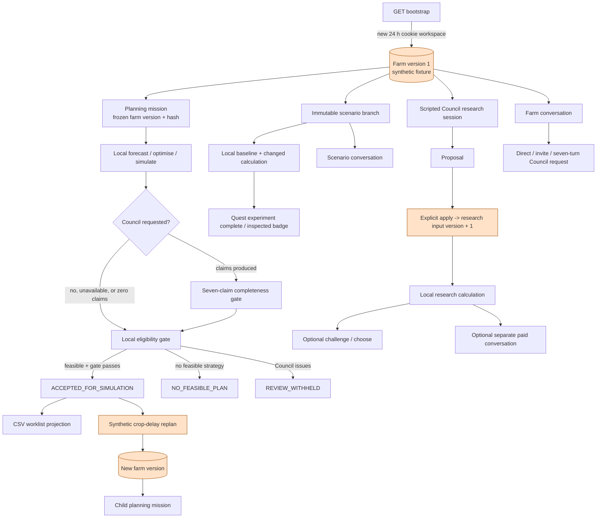
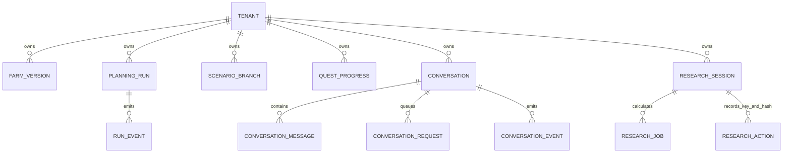
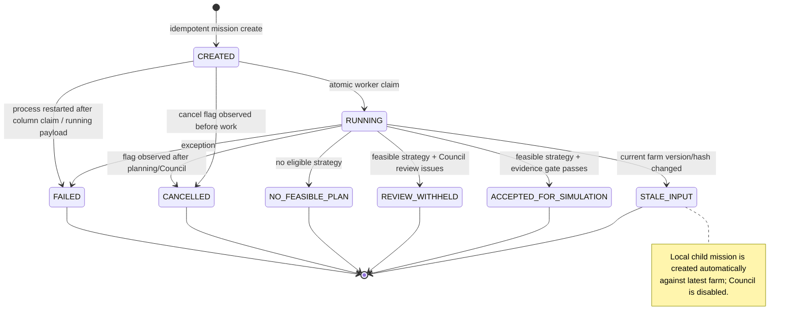
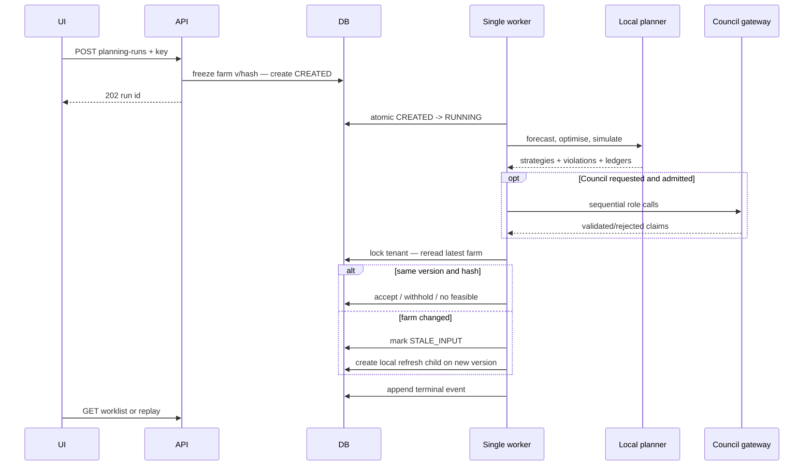
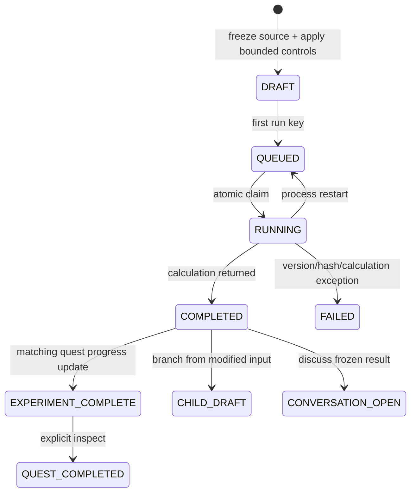
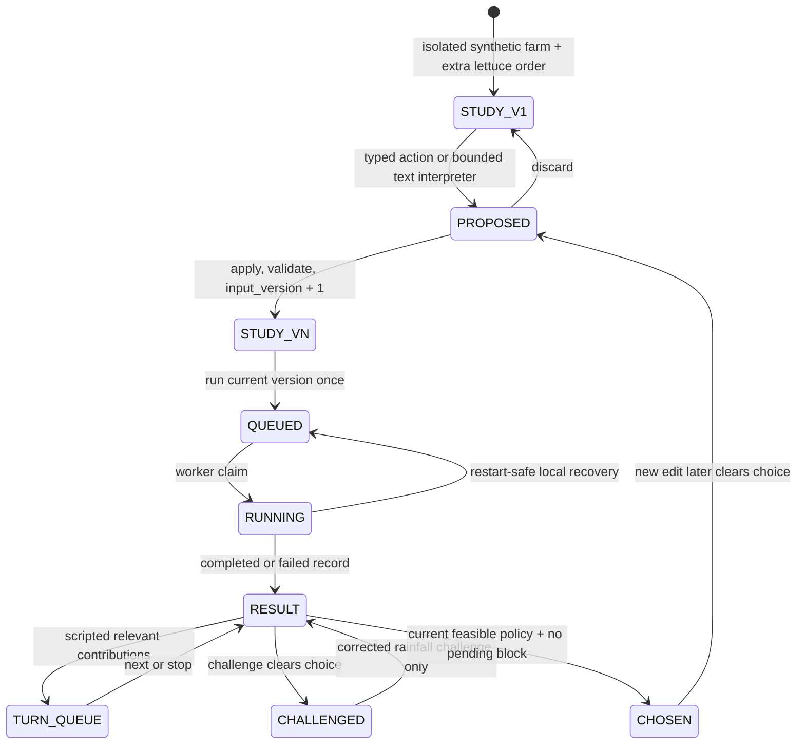

# Game backend and state machines

> **Historical baseline:** This chapter records the pre-remediation audit of source `a96025e` and published v7. Its implementation findings and measured results describe that baseline. Read [the V8 remediation report](v8-remediation-report.md) for the current simulation engine, synthetic model evaluation, Council contracts, tests and remaining limitations. Source links below are navigation aids into the maintained repository; use the [frozen baseline](https://github.com/phuawenpu/FarmTact/tree/a96025e) to reproduce the original inspection.

This chapter audits the implemented FarmTact game and simulation backend as of
11 September 2026. It follows persisted state from anonymous workspace creation
through planning, automatic simulation acceptance, disruption replanning,
scenario branches, quests, conversations and the playable Council research
study. It also separates backend facts from browser-derived presentation.

The central finding is simple: FarmTact has a durable **planning and experiment
game**, but it does not have a farm-time execution engine. Numerical routines
calculate dated ledgers over a frozen horizon. Missions, branches, quest badges
and research choices persist workflow progress. None of them advances the farm's
`planning_date`, consumes an accepted allocation, changes crop growth stage day
by day, fulfils an individual order, or records completion of sowing,
transplanting and harvest work. The only implemented main-farm mutation after
bootstrap/import is a deliberately synthetic disruption that edits the first
batch and creates a new farm version
([replan route](../../services/api/app.py#L299-L323)).

For the numerical equations and their scientific limits, see
[Numerical models and growth](numerical-models-and-growth.md). For provider
routing and claim validation, see
[AI provider and Council](ai-provider-and-council.md). This chapter concentrates
on authority, transitions, version binding, concurrency and recovery. It is part
of the [main scientific implementation report](README.md); remediation priorities
are consolidated in the [next-iteration gap register](gaps-and-next-iteration.md).

## The implemented game in one view



Orange marks the mutable farm/research state and its explicit update transitions.
Of those transitions, replan changes the main farm and apply changes only an
isolated research input. `ACCEPTED_FOR_SIMULATION`, the scenario acceptance
record, quest progress, a research choice and advisor messages are durable
decisions or game progress. They are not agricultural execution. Scenario and
research snapshots are isolated copies and never replace the main farm
([scenario isolation test](../../tests/gameplay/test_scenarios.py#L152-L176),
[research calculation](../../packages/planner/research.py#L45-L82)).

## What “simulation” means here

The same word covers several different mechanisms. They should not be presented
as interchangeable.

| Mechanism | What is actually calculated or persisted | Does farm time advance? | Does it mutate the main farm? |
|---|---|---:|---:|
| Planner simulation | Daily FIFO inventory ledger and aggregate crop/date demand, harvest, delivery, expiry, stock, cost and margin over the frozen horizon ([simulator](../../packages/planner/engine.py#L120-L159)) | No | No |
| Automatic mission acceptance | Service records a chosen eligible strategy, hashes, policy version and a copy of its unexecuted allocations as `simulated_outcome.work` ([acceptance](../../services/api/app.py#L141-L153)) | No | No |
| Worklist | CSV rendering of the accepted strategy, guarded by current farm version and labelled `SIMULATION_ONLY` ([worklist](../../services/api/app.py#L326-L341)) | No | No |
| Replan disruption | Adds seven days and applies a `0.8` yield factor to the first current batch; persists a new farm version and child mission ([replan](../../services/api/app.py#L299-L323)) | No | **Yes**, but only as a synthetic observation update |
| Scenario branch | Applies bounded controls to a copy, calculates baseline and branch, and records a simulation-only acceptance if an eligible strategy exists ([scenario execution](../../services/api/scenarios.py#L100-L136)) | No | No |
| Quest | Records that a matching branch completed and that the user explicitly inspected it; derives two fixed badge labels ([quest progress](../../services/api/scenarios.py#L174-L186)) | No | No |
| Council research | Applies typed edits to a private study input version, calculates three policies and records an explicit simulation choice ([actions](../../services/api/council_research.py#L282-L337)) | No | No |
| Conversation action | Stores a `hypothesis_only` scenario control proposal after local validation; the user must explicitly create a branch ([reply validation](../../services/api/conversations.py#L824-L934)) | No | No |
| Browser mission | Locally screens dated orders against eligible harvest and inventory and stores the selected mission in edition-scoped `sessionStorage` ([derivation](../../apps/web/src/components/DecisionJourney.tsx#L35-L85)) | No | No |
| Audio | Plays an ephemeral client effect when a result becomes terminal; no sound event is persisted ([audio result](../../apps/web/src/lib/audio.ts#L193-L199)) | No | No |

The planner steps through calendar dates inside one function call. “Day 12” is a
row in a hypothetical ledger, not a scheduled backend wake-up. Worker waiting,
advisor calls, scripted dialogue and UI animation do not change the biological
calendar.

## Persistence and ownership



The session cookie maps to a tenant through a SHA-256 hash. Authentication accepts
only tenants created during the previous 24 hours; the cookie is HTTP-only,
same-site strict and secure on HTTPS ([session store](../../services/api/store.py#L63-L70),
[bootstrap](../../services/api/app.py#L224-L231)). Rows themselves are not deleted
when authentication expires.

Farm versions are append-only by `(tenant_id, version)`. Version allocation locks
the tenant row, calculates `max(version)+1`, hashes the whole payload and inserts a
new row ([farm persistence](../../services/api/store.py#L71-L81)). Planning runs,
scenario branches, conversations and research sessions then freeze full JSON
snapshots. Most relationships also have tenant-aware foreign keys; conversation
messages, requests and events have their own monotonically increasing sequences
([conversation schema](../../services/api/conversation_store.py#L29-L111)).

There is no domain table for executed tasks, crop-stage observations, inventory
movements, order fulfilment, simulated clock ticks or game turns. `work` is nested
JSON in a run, and quest progress is a compact per-tenant/per-quest JSON record.

## HTTP surface and transition authority

All routes below require the tenant session except bootstrap and the fixed health
endpoint. Mutating requests pass same-origin, body-size and admission checks before
route parsing ([middleware](../../services/api/app.py#L170-L206),
[admission](../../services/api/security.py#L145-L176)).

### Main farm and planning missions

| Method and route | Transition / result | Guard and idempotency |
|---|---|---|
| `GET /api/v1/bootstrap` | Creates tenant + synthetic farm v1 when no valid cookie; otherwise returns latest farm view and latest run | New-session IP/global limits; cookie lifetime 24 h |
| `POST /api/v1/imports` | Validates exactly one fixture or `Farm`, always appends a farm version; after a terminal latest run also creates a local refresh mission | **No idempotency key**; tenant transaction serializes the version |
| `POST /api/v1/planning-runs` | Freezes latest farm and creates `CREATED` mission | Required key, tenant-wide key/hash equality, and at most one `CREATED`/`RUNNING` planning run |
| `GET /api/v1/planning-runs/{id}` | Returns public run and current `acceptance_stale` flag | Tenant ownership |
| `GET /api/v1/planning-runs/{id}/events` | SSE after query/header cursor; stops after terminal run | Per-IP open and active-stream limits |
| `POST /api/v1/planning-runs/{id}/cancel` | Sets `cancel_requested` only while created/running | Cooperative; response always says `cancel_requested` even if already terminal |
| `GET /api/v1/planning-runs/{id}/replay` | Returns stored run/events with replay labels | Run must be terminal; no inference |
| `POST /api/v1/planning-runs/{id}/replan` | Writes the fixed synthetic first-batch disruption, new farm version and child mission | Parent must be accepted, current farm version must equal parent input, required tenant-wide run key; body/key conflict is 409 |
| `POST /api/v1/strategies/{id}/accept-for-simulation` | Always 403 | Browser cannot accept; backend policy owns acceptance |
| `GET /api/v1/planning-runs/{id}/worklist.csv` | Renders accepted allocation list | Accepted strategy must exist and latest farm version must still equal run input version |
| `GET /api/v1/reports/{id}` | Alias of public run | Tenant ownership |
| `GET /api/v1/strategies/{id}` | Searches all owned run JSON for the strategy | Tenant ownership; no run/version parameter |

The definitions are in the [main route installer](../../services/api/app.py#L217-L355).
Import's lack of idempotency is especially relevant: an identical retry creates a
new version, makes accepted worklists stale and may enqueue another refresh.

### Scenario branches and quests

| Method and route | Transition / result | Guard and idempotency |
|---|---|---|
| `GET /api/v1/scenarios` | Returns every owned full branch, newest first in Python | No pagination or branch count limit |
| `POST /api/v1/scenarios` | Freezes one source and creates `DRAFT` branch | Required tenant-wide key; source is explorer **or** parent/conversation; completed parent required; quest must change its named assumption |
| `POST /api/v1/scenarios/{id}/run` | `DRAFT -> QUEUED`; later worker claims `RUNNING` | First `run_key` binds the branch forever; same key reuses, any other key gets 409 |
| `GET /api/v1/scenarios/{id}` | Returns full saved branch/results | Tenant ownership |
| `GET /api/v1/scenarios/compare?ids=...` | Returns one to three completed branches and shared baseline | Distinct IDs; same comparison root, baseline hash, baseline forecast settings and calculation version |
| `GET /api/v1/quests` | Combines four fixed quest definitions with progress rows | No mutation |
| `POST /api/v1/quests/{id}/inspect` | Adds branch ID to inspected set, marks quest completed and grants fixed badges | Scenario must be completed and have the matching quest ID; semantically deduplicated, no request key |

See [scenario request and controls](../../services/api/scenarios.py#L23-L67) and
[scenario routes](../../services/api/scenarios.py#L188-L287). Controls are bounded:
batch delay `0..14` days, marketable yield `50..100%`, demand, labour and cash
`50..150%`. Delay/yield require a known batch; changed demand requires one of the
four fixture recipe crops. Demand control scales both historical ordered kg and
all booked/cancelled order quantities for that crop
([control application](../../services/api/scenarios.py#L77-L94)). A child starts
from its parent's already-modified input, so percentages compound across branches.

### Persistent conversations

| Method and route | Transition / result | Guard and idempotency |
|---|---|---|
| `GET /api/v1/conversations/advisors` | Returns current seven-person roster | Read only |
| `GET /api/v1/conversations` | Lists public conversation metadata without messages | Tenant ownership; no pagination |
| `POST /api/v1/conversations` | Freezes farm, completed scenario or current completed research calculation; creates `OPEN` | Required tenant-wide conversation key; same body reuses |
| `GET /api/v1/conversations/{id}` | Public state, all messages, frozen tool/evidence context | Tenant ownership |
| `GET /api/v1/conversations/{id}/replay` | Same messages with replay labels | Read only, no provider call |
| `POST .../{id}/messages` | Appends user message + direct one-role `QUEUED` request atomically | Required key scoped to conversation; one active request per conversation |
| `POST .../{id}/invite` | Queues invited role followed by author of referenced advisor message | Must reply to an advisor and invite a different advisor |
| `POST .../{id}/council` | Queues seven ordered roles | Optional reply must belong to same conversation |
| `GET .../{id}/events` | JSON cursor page or SSE | Cursor nonnegative; stream stops when latest request is terminal |

The route implementation is in
[conversations](../../services/api/conversations.py#L608-L817). A farm
conversation always freezes the latest farm; its optional `snapshot_id` checks
the farm ID but cannot select an old farm version. Scenario conversations require
`COMPLETED`. Research conversations require a completed result whose version is
the current research input version, although the error text says “complete and
select” and the implementation does not require `chosen`
([snapshot freezer](../../services/api/conversations.py#L348-L439)).

Conversation request admission counts one user message plus all requested roles
against a hard 120-message conversation limit. User message and job creation are
one locked transaction, with `(conversation, tenant, key)` uniqueness
([request persistence](../../services/api/conversation_store.py#L268-L351)).

### Playable Council research

| Method and route | Transition / result | Guard and idempotency |
|---|---|---|
| `GET /api/v1/council-research` | Lists up to 30 session summaries | Query limit occurs before Python sort; no explicit SQL order |
| `POST /api/v1/council-research` | Creates isolated synthetic study v1 | Required tenant-wide session key; 30-session tenant cap |
| `GET /api/v1/council-research/report` | Returns bounded local report excerpts, fixed citations and screenshot URLs | Read only; paths are fixed in code |
| `GET /api/v1/council-research/{id}` | Returns complete mutable session JSON | Tenant ownership |
| `POST .../{id}/actions` | Applies one of 12 action types and normally increments `revision` | Required key unique across **all research actions in the tenant**; body revision must equal current; 400 actions/session |

The route implementation and exact action switch are in
[Council research routes](../../services/api/council_research.py#L236-L337).
`say`, `select`, `propose`, `apply`, `discard`, `challenge`, `resolve`, `choose`,
`configure`, `stop`, `next` and `run` are one endpoint because the request model is a
tagged action with optional fields. Unknown action names and extra fields fail schema validation; action-specific
guards validate required context. Known optional fields are not a fully discriminated
per-action schema and may be unused on a different action
([action schema](../../services/api/council_research.py#L36-L59)).

## Main planning state machine



Creation freezes the whole farm payload and its hash, source cards, evidence file
hash, market summary, news context, Council version and parent/disruption
metadata before queueing ([mission creation](../../services/api/app.py#L32-L46)).
`Store.create_run` locks the tenant, reuses an equal key/hash, rejects a changed
body under the same key, and permits only one active planning mission for the
tenant ([run persistence](../../services/api/store.py#L88-L100)).

The worker calculates all three strategies locally first. Strategy eligibility is
exactly:

1. stored strategy `status == FEASIBLE`;
2. a fresh `validate_allocations(frozen_farm, allocations)` returns no violations;
3. choose `Balanced` when present, otherwise the first eligible strategy in the
   planner's current list order;
4. if Council claims exist, all seven roles must appear in exact roster order,
   all must have `status=validated`, and all must recommend
   `proceed_simulation` ([Council gate](../../packages/agents.py#L21-L31));
5. immediately before acceptance, the latest farm must still have the same
   version **and** content hash.

An accepted record binds input version/hash, strategy ID/hash, validation report
hash, policy version, service actor and `simulation_only=true`. The public manual
acceptance endpoint always returns 403, so no browser or advisor can bypass that
gate.

There is a significant asymmetric rule. If a requested Council fails or is
blocked before producing any claim, `claims=[]`; the evidence gate uses
`numerical-baseline` and the strategy can still be accepted. If even one claim
was persisted before failure, the incomplete seven-role set produces review
issues and acceptance is withheld. This is intentional in the current test
contract ([mission gate test](../../tests/seven_agents/test_mission_gate.py#L25-L60)),
but the API has no explicit `council_required_for_acceptance` policy field.

### Planning sequence, stale input and replan



Stale-input refresh intentionally disables the Council, avoiding automatic repeat
paid inference. Process restart is different: a planning job recorded as running
becomes `FAILED` and is never replayed because the system cannot know whether a
paid request completed ([restart rule](../../services/api/store.py#L115-L120)).

Replan is only available from `ACCEPTED_FOR_SIMULATION`. It requires the parent
farm version still be current, preserves existing sow/transplant dates, changes
the first batch's expected harvest date/yield, appends a farm version and creates
a child. Its request schema exposes only `crop_delay`; callers cannot choose the
batch, delay or yield factor ([schemas](../../services/api/app.py#L19-L30)). This
is a fixed demo transition rather than a general disruption engine.

## Scenario branches, comparisons and quests



A scenario source is one of:

- a saved explorer snapshot;
- a completed parent scenario's modified input;
- a conversation's frozen snapshot, with a scenario conversation resolving back
  to its scenario parent;
- otherwise the current farm.

The branch stores its modified input, root baseline, hashes, optional generator
and forecast settings, news context and calculation version. The worker refuses
to substitute a current forecast/planner implementation when the frozen version
does not equal the installed version ([version check](../../services/api/scenarios.py#L100-L120)).
On success it calculates same-policy baseline/branch deltas, validates allocations
again and writes its own simulation-only acceptance. A `COMPLETED` branch may
still have `simulation_status=NO_FEASIBLE_PLAN`; completion means the experiment
calculated, not that the requested farm plan was feasible.

Comparison eligibility is strict enough to prevent mixing unrelated roots: one
to three distinct, completed branches must share comparison root, baseline hash,
baseline forecast configuration and calculation version. Child control factors
apply to the parent's already changed snapshot. For example, a 90% cash child of
a 90% cash parent represents 81% of the root cash, not another branch at 90% of
root.

Quest state has no prerequisite graph or scoring engine. Four definitions are
hard-coded. Creating a matching changed branch is permitted in any order; worker
completion adds it to `experiment_ids`; explicit inspect adds it to
`inspected_ids`, changes status, and assigns `Experiment explorer` plus
`Tradeoff discovered`. Even infeasible results count as completed learning
([infeasible quest test](../../tests/gameplay/test_scenarios.py#L111-L117)).

`affected_bed_ids` compares allocation hashes grouped by bed across every policy.
`affected_deliveries` identifies changed order inputs or orders on dates where
aggregate ledger demand/delivery changed. It explicitly is not per-order
fulfilment attribution ([impact calculation](../../services/api/scenarios.py#L147-L164)).

## How the three Councils work

### 1. Mission Council: seven provider-backed findings

The current roster is Ravi/demand, Hana/weather, Idris/market, Mei/production,
Lina/supply chain, Ben/profit and Asha/planning chair. The mission Council runs one
structured provider request per role with at most two shared schema repairs. Each
role receives the same frozen numerical strategy summary and bounded reference
map. Only the planning chair receives the claims already produced by earlier
roles ([Council loop](../../services/api/council.py#L38-L64)).

This is sequential multi-role review, not a deliberative debate. Specialists do
not see or rebut other specialists. There are no implemented challenge rounds,
votes, tool calls initiated by roles, or user intervention points. The chair
synthesizes prior claims once. Local validation checks schema, role, known
reference membership and literal numeric correspondence; it does not prove that
qualitative prose follows from the cited item.

Council output may block automatic simulation acceptance but cannot alter a
strategy or execute work. All seven findings must validate and recommend proceed.
Any dissent, rejection, duplicate, reorder or partial set with at least one claim
withholds acceptance.

### 2. Conversation Council: a persisted reply chain

```mermaid
stateDiagram-v2
    [*] --> OPEN: frozen conversation created
    OPEN --> QUEUED: direct / invite / council
    PARTIAL --> QUEUED: new explicit request
    BLOCKED --> QUEUED: new explicit request
    QUEUED --> RUNNING: request claim
    RUNNING --> OPEN: all requested turns stored; request COMPLETED
    RUNNING --> PARTIAL: some turns then error
    RUNNING --> FAILED: error before any turn
    RUNNING --> BLOCKED: missing credential or daily capacity
    RUNNING --> PARTIAL: restart -> request INTERRUPTED
```



Direct mode has one role. Invite mode has two: the invited advisor responds to a
specific advisor message, then that original advisor responds to the invited
reply. Council mode produces seven turns in roster order; each turn after the
first replies to the immediately preceding generated message. The planning chair
must use the final `conclusion` relationship to be marked a planner conclusion
([conversation execution](../../services/api/conversations.py#L1253-L1390)).

Every generated message is stored before the next provider call, so a later
failure preserves a useful partial transcript. Restart marks uncertain running
requests `INTERRUPTED`, conversation `PARTIAL`, and never automatically retries
possibly billed work ([conversation recovery](../../services/api/conversation_store.py#L509-L550)).
A new explicit request is allowed after a terminal partial/failed/blocked request.

`COMPLETED` is transport/workflow completion. A reply can be stored with
`validation_status=unsupported`, blocked proposed actions and validation errors,
yet the request still becomes `COMPLETED`. Thus conversation status does not mean
that the Council's conclusion passed a decision gate. Conversation proposals are
always hypotheses and require an explicit user-created scenario branch.

### 3. Council research: scripted study and local tool



The study begins from a new synthetic fixture plus an 18 kg lettuce order due in
48 days. It records `dialogue_mode=scripted_research`, `inference_calls=0` and
`operational_execution=false` ([session creation](../../services/api/council_research.py#L178-L182)).
Its text interpreter recognizes a small set of reservation, order-status, labour
and challenge phrases. It never executes free text. A proposal has a
`base_version`; only explicit `apply` validates the controls and creates the next
research input version ([proposal/application](../../services/api/council_research.py#L84-L175)).

Each input version can have only one research job. One queued/running research job
is allowed per tenant across all studies, and one study stores at most 12 result
versions. A restart requeues a running job because calculation is local and has no
paid side effect. When a later version calculates before v1 has a completed
baseline, the worker reconstructs v1 from the original controls. A result that
finishes after inputs changed is archived and cannot overwrite current input
state ([research worker](../../services/api/council_research.py#L185-L233)).

After a result, the backend creates fixed scripted contributions only for control
categories that changed, plus a planner message. `continuous` and `checkpoints`
change how `pending_turns` are revealed; they do not change numerical logic. The
presentation concept, selection mode and animation setting are also game/UI
configuration only.

A challenge stores one mutable object and clears any choice. Rainfall gets a
specific supported correction: outdoor rainfall is context, not a sheltered
hydroponic yield input. Other challenge categories have no verified correction.
`resolve=evidence` leaves status unchanged; `corrected` is allowed only for
rainfall; `unresolved` and `reject` continue to block choose. `choose` requires a
completed result for the current version, a feasible violation-free selected
policy, no proposal, and no challenge whose status differs from `corrected`
([challenge](../../services/api/council_research.py#L142-L154),
[choose](../../services/api/council_research.py#L329-L335)). It writes a
simulation-only research choice and never affects the main farm.

The optional “actual DeepSeek interpretation” in this screen creates a separate
research-snapshot conversation and sends a direct one-role message. It is not the
scripted dialogue and it is not a full Council
([UI boundary](../../apps/web/src/components/CouncilResearch.tsx#L86-L86)).

## Worker concurrency, admission and recovery

One daemon thread polls all queues every 300 ms. In each pass it exhausts pending
planning runs, then scenarios, research calculations and conversations, in that
fixed order. Each job runs synchronously on the same thread
([worker loop](../../services/api/app.py#L48-L76)). This provides simple atomic
claiming but no fairness, parallelism, per-tenant scheduling or isolation between
paid provider latency and local numerical play.

The application-level concurrency rules are:

| Work type | Active limit | Claim rule | Restart behavior |
|---|---:|---|---|
| Planning mission | One `CREATED/RUNNING` per tenant | Conditional status update | Running -> `FAILED`; explicit new mission required |
| Scenario | No tenant-wide active cap | Conditional `QUEUED -> RUNNING` | Running -> `QUEUED` |
| Research calculation | One queued/running per tenant | Conditional job status update | Running -> `QUEUED` |
| Conversation | One queued/running request per conversation | Locked request row | Running -> `INTERRUPTED`; conversation -> `PARTIAL` |
| Provider calls | One at a time inside each synchronous job | Gateway/run budget | Never automatically repeated after uncertain planning/conversation interruption |

Planning and conversation inference attempts have durable request admission:
6/IP/minute, 20/IP/hour and 12/tenant/hour. All writes also consume 60/IP/minute;
all API requests consume 600/IP/minute and 3,000 global/minute. The shared
provider reservation ceiling is 48 calls per UTC day. SSE openings have their own
12/IP/minute rule plus four active streams/IP, 32 globally and a 360-second
deadline ([rules](../../services/api/security.py#L45-L57),
[stream slots](../../services/api/security.py#L179-L226)). Scenario and research
calculation actions do not consume the AI-specific admission bucket because they
make no provider calls.

Cancellation exists only for main planning. It is cooperative: a queued mission
will stop before planning; a running mission checks after local planning and the
Council receives a callback it can check between bounded work. There is no
external kill of a current solver or provider HTTP request. Scenarios, research
jobs and conversations have no cancel route. Research `stop` clears pending
scripted turns but explicitly does not cancel a calculation.

## Browser-derived game state and audio

The UI derives several useful views that are not backend domain state:

- `DecisionMission` groups future booked orders by crop/date, subtracts harvests
  and inventory that appear eligible by date/shelf life, and selects the earliest
  positive provisional gap. It warns that it does not allocate those lots across
  earlier orders. It is edition-scoped `sessionStorage`, not a server entity.
- `NumericalPerspectives` renders seven named perspectives deterministically from
  scenario comparison metrics and violations. These cards are not provider
  messages even though they use the same advisor personas.
- selected scenario, explorer filters and current research/actual-conversation
  pointers live in edition-scoped session storage. The durable objects remain in
  the backend; the selection/navigation state does not.
- main mission events use SSE plus 2.5-second polling fallback. Scenario and
  research screens poll. Conversation supports JSON cursors and SSE.

Audio defaults are edition-specific and preferences are stored in local storage,
but every visit begins inactive until direct user activation. Background music
pauses while hidden. Effects are rate-limited in memory and stop each other so
only one plays at a time ([audio state](../../apps/web/src/lib/audio.ts#L17-L47),
[playback](../../apps/web/src/lib/audio.ts#L121-L185)).

Main-run sound outcome is derived from terminal status and the accepted, Balanced
or first strategy's `shortfall_kg`; scenario sound uses the same fallback order
([sound mapping](../../apps/web/src/lib/game.ts#L166-L185)). A run only becomes
audible if this browser instance started/replanned it and kept its ID in an
in-memory set. `playSimulationResult` suppresses duplicate sounds in that page
lifetime. These cues are presentation feedback, not durable evidence that a
backend event was consumed, and are appropriately absent from replay provenance.

## Gaps and acceptance tests

The IDs below are stable references for remediation. Severity reflects decision
integrity and reliability, not visual polish.

| ID | Severity | Implemented gap and consequence | Recommended acceptance test |
|---|---|---|---|
| **GAME-01** | Critical | There is no simulated clock or execution state machine. Acceptance and worklist export cannot record task start/completion, inventory movement, batch stage, order fulfilment or observed outcome. Gamified progress can therefore be mistaken for farm progression. | Given an accepted version, advance a synthetic clock through sow/transplant/harvest/delivery; assert idempotent task events update new versioned state, conserve mass, never touch operational integrations, and replay exactly. Until built, assert every UI/API result retains `simulation_only` and no “completed farm work” wording. |
| **GAME-02** | High | One synchronous worker causes head-of-line blocking across all tenants and job types. A slow Council/provider request can delay unrelated scenario and research calculations for up to its bounded wall time. | Queue a blocked 300-second provider job and local jobs from another tenant; require bounded local-job start latency and independent worker pools/leases. Kill a worker mid-claim and prove each job class follows its documented recovery rule once. |
| **GAME-03** | High | Requested Council acceptance is asymmetric: zero claims after block/failure passes as numerical baseline, while one-to-six claims withhold. The request has no field stating whether Council is advisory or required. | Parameterize missing credential, budget block, failure before first claim, failure after each claim and seven valid claims. Assert the chosen explicit policy (`advisory` or `required`) and persist it in the acceptance record. |
| **GAME-04** | High | Neither provider-backed Council implements the build specification's two challenge rounds. Mission specialists are independent; only the chair sees prior findings. Conversation Council is a linear reply chain. Scripted research has one user challenge object but no agent debate. | Record the exact expected topology: participant visibility, round number, challenge target, rebuttal and final synthesis. Test request ceilings and restart behavior for every round, or change the specification/UI to “seven sequential reviews plus chair synthesis.” |
| **GAME-05** | High | Research challenge version binding is incomplete. `challenge.input_version` is recorded, but `apply` leaves the challenge in place and `resolve`/`choose` do not require its version to match current inputs. A correction to an old version can authorize choosing a later version. A new challenge also overwrites the prior one. | Challenge v1, apply v2, resolve the old challenge and attempt choose v2; require rejection or explicit challenge migration/revalidation. Preserve multiple challenge records with version and resolution evidence. |
| **GAME-06** | High | API idempotency exists for most expensive transitions, but browser helpers generate a fresh UUID on every call and do not retain it across an uncertain network retry. Import has no key at all. Duplicate imports append versions and stale accepted work; a lost mission response can be retried as a second run after the first finishes. | Simulate “server commits, response lost” for import, mission, scenario creation/run, conversation send and research action. Reload/retry from UI and assert exactly one logical mutation/provider job using a persisted operation key. |
| **GAME-07** | High | Conversation request `COMPLETED` only means all turns were stored. Every reply, including the final chair, may be `unsupported`; the conversation returns to `OPEN` and looks terminal-successful. No separate Council validity/result state exists. | Make one and all seven replies fail semantic/reference validation. Assert transport status and decision-validity status are distinct, the final result is visibly withheld, and no proposed action can be applied implicitly. |
| **GAME-08** | High | The scenario “run once” key is permanent. A failed calculation cannot be retried on the same immutable branch, including after a transient local failure. The UI must create a new branch, losing a direct retry/recovery relation. | Inject a transient calculation failure after claim; retry same run key and a dedicated retry endpoint. Require either safe same-input local recomputation with attempt history or a child retry that explicitly links to the failed branch. |
| **GAME-09** | Medium | Frozen calculation version support is equality with the currently installed code, not a runner registry/container reference. Old uncalculated branches or jobs fail after deployment; exact source commit is not embedded in every game object. | Create DRAFT/QUEUED objects on version N, deploy N+1, then prove either version-N execution remains available or a migration creates a separately identified result without overwriting frozen provenance. |
| **GAME-10** | Medium | Research `messages` and `events` are mutable JSON arrays truncated to 120 and 240. The separate action table retains only key/hash identity, not action payload, response, resulting revision or challenge history. Long studies lose early audit detail. | Execute 400 actions and reconstruct every state transition from append-only records. Assert old messages/events remain queryable with pagination and action retries return the original response revision. |
| **GAME-11** | Medium | Scenario storage/listing has no per-tenant branch cap or pagination. Conversation listing also lacks pagination. Expired tenant data is not reclaimed by the application. A 24-hour anonymous session can create substantial persistent JSON and every scenario list returns it all. | Fill to documented quotas, verify 429 before expensive work, paginate with stable cursors, expire a tenant and prove retention/deletion policy without affecting active edition data. |
| **GAME-12** | Medium | Only planning can be cancelled, and its cancellation cannot interrupt current solver/provider work. Scenario, research and conversation jobs lack cancel endpoints. | Cancel before claim, during solver, between Council turns and during provider I/O for every job type. Assert bounded terminal latency, no new paid request after cancel, unused reservation reconciliation and unambiguous terminal status. |
| **GAME-13** | Medium | Main replan is hard-coded to the first batch, +7 days and ×0.8 yield. The request's `disruption` enum does not bind a target or magnitude, so it is a demo rather than a general game action. | Submit typed disruptions for explicit batch/version with bounds; reject stale/unknown targets; prove executed commitments remain identical; hash the observation and deterministic child input. |
| **GAME-14** | Medium | Strategy fallback is `Balanced`, then first eligible in current list order. No explicit ranking result explains why the fallback won if Balanced is absent. | Permute strategy order with Balanced infeasible; require an explicit deterministic rank/tie-break record and stable selected ID across permutations. |
| **GAME-15** | Medium | Scenario affected deliveries and the planner ledger are aggregate crop/date flows, not per-order allocations. Quest completion can establish that tradeoffs were inspected, but not which buyer order is covered. | Add two same-crop orders on the same/earlier dates and competing lots. Require an allocation ledger with lot-to-order quantities, expiry, shortfall and mass balance before displaying order-level coverage. |
| **GAME-16** | Medium | Browser mission, persona perspectives, navigation pointers and sound completion memory are local derived state. They are not revisioned backend progress and do not synchronize across tabs/devices; sound does not acknowledge event consumption. | Change farm/branch in another tab and verify derived mission invalidates by hash. Reload during a terminal event and assert UI truth stays correct with or without sound. Label deterministic persona cards separately from actual Council messages. |
| **GAME-17** | Low | Cancel returns `{"status":"cancel_requested"}` for terminal runs even though it changed nothing. This can mislead client state. | Cancel every terminal status and require an explicit no-op/409 plus unchanged persisted record; cancel active run and return the actual current cancellation state. |
| **GAME-18** | Medium | One conversation contract test assumes cached public source `D04` is present, while `source_views()` legitimately returns an empty list when the ignored public cache is absent. A fresh offline checkout therefore fails a game test for environmental data availability rather than conversation behavior. | Seed a minimal versioned public-context fixture in the test or assert a typed unavailable source state. Run the same test from a clean Git checkout with network disabled and with a populated cache; conversation-state assertions must be identical. |

## Specification corrections to keep synchronized

These observations refer to the pre-audit specifications. The documentation update
now incorporates the corrections; GAME implementation gaps remain future work.

These are documentation corrections, not claims that the code should necessarily
grow to match every older requirement.

1. [Build specification](../../FarmTact_Build_Specification.md) lines 527, 717
   and 833 describe two challenge rounds. Current mission and conversation
   Councils have no challenge-round state. Specify seven sequential reviews and a
   final chair synthesis, or design the missing versioned rounds.
2. Build specification line 523 lists terminal states including
   `MISSING_INPUT`, `SOURCE_UNAVAILABLE` and `BUDGET_EXCEEDED`; the planning-run
   state machine uses warnings/council status for those conditions and terminal
   run states `STALE_INPUT` and `ACCEPTED_FOR_SIMULATION`, which that list omits.
3. Build specification lines 630 and 693, and DeepSeek runtime specification
   DS-20, refer to idempotent simulated work. The implementation has idempotent
   plan/branch/job creation and a worklist, but no simulated work execution API or
   work-event table. Narrow the claim or implement GAME-01.
4. Build specification line 735 calls the CSV a practical worklist. Clarify that
   it is a stale-version-guarded simulation projection with no completion/update
   path.
5. Current product copy should reserve “Council” qualifiers: **mission Council**
   is seven provider calls, **conversation Council** is a seven-turn provider
   chain, and **Council research** is scripted with zero provider calls unless the
   user opens and sends the separate optional actual-advisor question.
6. “Plant growth simulation” should mean dated yield endpoints and inventory flow
   unless and until GAME-01 and an empirical growth model exist. No backend
   transition models daily morphology, environment response or stage observation.

## Reproducible verification boundary

The existing automated suite covers mission acceptance/replay/replan and stale
worklists ([security API tests](../../tests/security/test_api.py#L44-L119)),
scenario isolation, branching, comparison, quests and restart recovery
([scenario tests](../../tests/gameplay/test_scenarios.py#L59-L215)), conversation
idempotency, reply graphs, validation, partial failure, tenant isolation and
PostgreSQL persistence
([conversation tests](../../tests/gameplay/test_conversations.py#L175-L1000)), and
research controls/session behavior
([research tests](../../tests/council_research/test_sessions.py)). PostgreSQL
tests also cover concurrent planning/replan idempotency and event sequencing
([concurrency tests](../../tests/review/test_postgres_concurrency.py#L61-L200)).

The coordinated fresh offline run used:

```text
pytest tests/council_research/test_sessions.py \
  tests/council_research/test_independent_review.py \
  tests/gameplay/test_scenarios.py \
  tests/gameplay/test_conversations.py -k 'not real_postgres'
```

It reported **66 passed, 1 failed, 1 deselected in 36.06 seconds**. The failure was
`test_seven_current_advisors_and_frozen_create_idempotency` at its assertion that
`source:D04.summary` exists. The ignored public-data cache was absent; no source
fetch was run. This is GAME-18, not evidence that conversation idempotency failed.
No database service, external provider or inference was started for this chapter.

The highest-value next verification is a deterministic lifecycle test harness that
queues all four job classes, injects response loss and process restarts at each
claim/commit boundary, and proves the state diagrams above. That would validate
workflow correctness. It would not establish agronomic validity, real farm
performance or safe operational execution.
