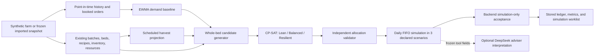
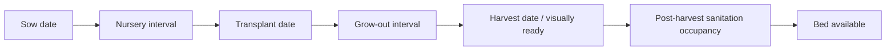

# Numerical models, planning, and crop-growth representation

> **Historical baseline:** This chapter records the pre-remediation audit of source `a96025e` and published v7. Its implementation findings and measured results describe that baseline. Read [the V8 remediation report](v8-remediation-report.md) for the current simulation engine, synthetic model evaluation, Council contracts, tests and remaining limitations. Source links below are navigation aids into the maintained repository; use the [frozen baseline](https://github.com/phuawenpu/FarmTact/tree/a96025e) to reproduce the original inspection.

**Implementation audit date:** 11 September 2026

**Current numerical versions:** `synthetic-farm-v1`, `recipe-ewma-v1`, `daily-bed-cpsat-v1`, `council-research-v1`

This report describes the numerical behavior in the current repository. It separates implemented calculations from requirements and future research. FarmTact currently combines a deterministic fictional farm, a constant-level exponentially weighted moving average (EWMA), fixed recipe dates and yields, whole-bed constraint optimization, and a daily inventory ledger. It has **no trained or fine-tuned FarmTact model**, no learned plant-growth model, and no validation on commercial farm outcomes. The four crop recipes and all scenario coefficients are engineering fixtures with `validation_status=demo_only` and `origin=synthetic`.

The principal implementation sources are the [private-data contracts](../../packages/contracts.py), [fixture generator](../../packages/fixtures.py), [forecast baseline](../../packages/models/__init__.py), [planner and simulator](../../packages/planner/engine.py), [research wrapper](../../packages/planner/research.py), [scenario service](../../services/api/scenarios.py), [farm view](../../services/api/views.py), and [world preview](../../apps/web/src/components/World.tsx). The higher-level inventory in [data-and-models.md](../data-and-models.md) is consistent with this core boundary, but some specification phrases are broader than the implementation; those differences are listed below.

## 1. What each component actually does

| Component | Implemented method | Output | Scientific status |
| --- | --- | --- | --- |
| Fixture generator | Closed-form deterministic records | Fictional recipes, beds, batches, orders, history, resources, inventory | Engineering test data; no measured farm observations |
| Demand forecast | Simple level EWMA per crop | Weekly confirmed and residual kilograms | Statistical baseline evaluated only on synthetic patterned history |
| Harvest forecast | Copies scheduled batch date and declared marketable mass | Batch/date/kg records | Schedule projection; no fitted maturity or yield model |
| Growth display | Date thresholds and linear interpolation from sow to harvest | `nursery`, `growing`, `ready`, and percent progress | Calendar visualization; no physiological state estimate |
| Planner | OR-Tools CP-SAT over Boolean whole-bed candidates | Lean, Balanced, and Resilient schedules | Deterministic optimization over declared assumptions; no ML |
| Outcome simulator | Daily crop-specific lot ledger, with expiry and FIFO delivery | Harvest, delivery, shortfall, waste, stock, margin, labour | Synthetic counterfactual accounting; no actual outcome prediction validation |
| Research wrapper | Deep-copies a farm, applies bounded controls, reruns the planner | Versioned, isolated policy comparison | Local numerical experiment; no inference and no main-farm mutation |
| Runtime advisers | Receive frozen numerical results through the separate DeepSeek gateway | Bounded interpretations and claims | Pretrained model output; advisers do not calculate or validate the plan |



Public NEA, SingStat, NASA POWER, and News records are displayed as context but do not enter the current EWMA, harvest projection, scenario factors, or solver coefficients. The feature manifest explicitly records `public_features_used=[]`; see the [feature builder](../../scripts/build_features.py) and [feature manifest](../../data/manifests/feature_manifest.json).

## 2. Units, calendar, and numerical conventions

The farm cutoff is a timezone-aware instant. Planning dates are Singapore civil dates obtained by converting the cutoff to `Asia/Singapore`. The reference cutoff is `2026-09-08T00:00:00Z`, which is 8 September 2026 in Singapore. The default horizon is 56 calendar days, represented internally by day indices 0 through 55 and eight week bins.

The contracts use `Decimal` for physical and financial inputs. Several planner calculations convert values to Python floating point before rounding. CP-SAT coefficients use:

- whole beds and Boolean selection variables;
- grams for mass inside the optimization;
- cents for prices and costs;
- minutes for weekly labour capacity; and
- daily occupancy intervals.

The solver uses one search worker and the farm's `fixture_seed`, which improves repeatability. Its default limit is four wall-clock seconds per policy, so the incumbent can still vary with OR-Tools version, machine speed, or load when search ends before optimality. A returned `FEASIBLE` result is not claimed to be optimal; the output retains the objective, best bound, elapsed time, and solver status.

## 3. Reference fixture generation

The [fixture generator](../../packages/fixtures.py) constructs `Little Plot Collective`, a fictional sheltered-hydroponic farm in Lim Chu Kang. It contains 16 beds of 20 m², so the declared effective growing area is 320 m². It creates eight active batches, 32 future order lines, 48 historical weekly demand records, and one opening inventory lot. The same data is materialized in [synthetic_farm.json](../../data/fixtures/synthetic_farm.json).

### 3.1 Synthetic recipes

All four recipes assume 16 plants/m², 0.08 sow-labour hours/m², 0.07 harvest-labour hours/kg, four days of shelf life, and two sanitation days after harvest.

| Crop | Nursery (days) | Grow-out (days) | Total lead time (days) | Marketable yield (kg/m²/cycle) | Input cost (SGD/m²) | Full 20 m² bed (kg) |
| --- | ---: | ---: | ---: | ---: | ---: | ---: |
| Caixin | 7 | 21 | 28 | 2.2 | 2.00 | 44 |
| Pak choi | 7 | 28 | 35 | 2.6 | 2.50 | 52 |
| Kailan | 10 | 32 | 42 | 2.4 | 2.80 | 48 |
| Lettuce | 10 | 25 | 35 | 2.3 | 3.00 | 46 |

These coefficients were declared to exercise scheduling logic. They were not estimated from the papers in the evidence registry and are not claimed to be locally optimal crop recipes.

### 3.2 Existing batches and inventory

For zero-based batch index $i$, the scheduled harvest date is

$$
h_i=d_0+14\left\lfloor\frac{i}{4}\right\rfloor+6\text{ days},
$$

where $d_0$ is the planning date. The first four batches therefore harvest on day 6, and the next four on day 20. Sow and transplant dates are obtained by subtracting the recipe's total and grow-out durations. Every batch occupies a whole 20 m² bed and its expected mass is

$$
Y_i=20\text{ m}^2\times y_{r(i)}.
$$

The opening stock is 5 kg of caixin, harvested one day before the planning date and explicitly expiring two days after it. The lot ledger uses the supplied expiry date; it does not replace it with a recipe-derived date.

### 3.3 Orders and historical demand

For crop index $c\in\{0,1,2,3\}$ and future week $w\in\{0,\ldots,7\}$, the unmodified order fixture is

$$
Q^{order}_{c,w}=22+4(c\bmod 2)+2(w\bmod 3)\quad\text{kg},
$$

with price

$$
P_c=6+c\quad\text{SGD/kg}.
$$

Every order is booked seven days before the cutoff and due on day $7w+6$. There is one order per crop per week in the default fixture.

For historical week $u\in\{0,\ldots,11\}$, the Data Explorer generator uses

$$
Q^{hist}_{c,u}=
\left[27+2c+2(u\bmod4)a\right]m_h
\left(1+\frac{g u}{11}\right),
$$

where $a$ is `pattern_amplitude`, $m_h$ is `history_multiplier`, and $g$ is `history_trend`. The multiplication in code is equivalently base × multiplier × trend; the bracket above includes the amplitude-adjusted four-week pattern. With default settings $(a,m_h,g)=(1,1,0)$, the four-week pattern repeats exactly. This periodicity is designed, not discovered seasonality.

The bounded playground controls are:

| Setting | Minimum | Default | Maximum | Affected records |
| --- | ---: | ---: | ---: | --- |
| Historical multiplier | 0.50 | 1.00 | 1.50 | Historical kg |
| Historical trend | -0.30 | 0.00 | 0.30 | Historical kg |
| Pattern amplitude | 0.00 | 1.00 | 2.00 | Historical kg |
| Order multiplier | 0.50 | 1.00 | 1.50 | Order quantity kg |
| Price multiplier | 0.50 | 1.00 | 1.50 | SGD/kg |

The default resources are 2,560 simultaneous nursery sites, 32 labour hours per week, and SGD 2,200 for the planning horizon. These are declared capacities, not measured availability.

## 4. Demand and harvest baselines

### 4.1 Point-in-time filtering

For each crop, history is eligible only when both

$$
available\_at\le cutoff\quad\text{and}\quad week<planning\_date.
$$

Orders are eligible when `booked_at <= cutoff`. The `Farm` contract already rejects future-booked orders, and the forecast repeats this cutoff check. Net booked demand is `quantity_kg - cancelled_kg`.

### 4.2 EWMA formula

Let $q_{c,1},\ldots,q_{c,n}$ be the eligible historical weekly kilograms for crop $c$. The implementation initializes the level with the first value and folds subsequent observations:

$$
e_{c,1}=q_{c,1},\qquad
e_{c,t}=\alpha q_{c,t}+(1-\alpha)e_{c,t-1}.
$$

The same terminal level $e_{c,n}$ is used for every future week. There is no seasonal index, trend extrapolation, public covariate, buyer model, quantile model, or fitted uncertainty distribution. `ForecastSettings` accepts finite floating-point $\alpha\in[0.05,0.95]$; the default is 0.35.

For crop $c$ and planning week $w$, let $B_{c,w}$ be all net booked kilograms in that week. Residual forecast demand is

$$
R_{c,w}=\max(0,e_{c,n}-B_{c,w})
$$

when history exists, and zero otherwise. Confirmed lines retain their actual due dates. The entire residual $R_{c,w}$ is added once, on the final day of the planning week. Thus confirmed bookings are not double-counted, but the weekly residual is given an artificial week-end due date.

When several order lines share a due date, their forecast price is the quantity-weighted mean price. A week-end residual without a same-date booking uses the first order price found elsewhere in that week. A week with residual demand and no booked order line receives a price of zero. This is a defined software behavior, not an economic estimate.

### 4.3 Harvest projection

The harvest baseline simply emits each active batch's recorded `harvest_date` and `expected_marketable_kg`, with endpoint `fresh_marketable_kg`. No inference is made from plant observations. Future planned harvest is similarly

$$
Y_j=A_j y_{r(j)},
$$

where $A_j$ is the entire bed area and $y_r$ is the fixed recipe yield. The marketable endpoint is assumed to include survival and packout once; there is no second reduction.

### 4.4 Versioning and lineage

The forecast stores:

- a hash of the complete farm input;
- a configuration hash of model version plus EWMA settings;
- a numerical-input hash combining those two hashes; and
- `validation_status=demo_only` plus an explicit uncalibrated-uncertainty statement.

The [feature builder](../../scripts/build_features.py) emits 32 crop/week rows for the reference fixture and records order/history dependency IDs, cutoff, input hash, and version. Saved Data Explorer snapshots additionally freeze the generated farm, generator and forecast settings, forecast payload, reference snapshot, and corresponding hashes. The [explorer service](../../services/api/data_explorer.py) rejects a saved snapshot if its schema version, farm contract, settings, dataset hash, frozen forecast hash, or reference hash no longer agrees.

## 5. Crop-growth representation

FarmTact currently represents a crop cycle as scheduled milestones:



The backend and frontend do not implement the entire diagram as a shared state machine. The planner accounts for sanitation in bed occupancy. The visual farm has no sanitation stage.

The backend farm view computes an existing batch's progress as

$$
p(d)=\operatorname{clip}_{[0,1]}
\left(\frac{d-sow}{harvest-sow}\right),
$$

then labels it `nursery` before transplant, `growing` from transplant to the day before harvest, and `ready` on or after harvest. The interactive preview applies the same linear ratio as a percentage to accepted allocations. It displays `nursery`, `growing`, or `ready` while the preview date is within the allocation's sow-to-harvest interval. For an existing bed without an accepted allocation overlay, it displays the bed as empty at or after its scheduled harvest.

Consequently, “progress” means elapsed calendar fraction between declared dates. It is not measured development, thermal time, accumulated light, biomass, leaf area, stress, quality, disease, or probability of maturity. The crop SVG changes are representative artwork tied to date labels. The interface itself correctly states that the view is a schedule preview and does not claim observed growth.

The scenario system can alter one existing batch by adding 0–14 days to its harvest date and multiplying its declared marketable mass by 50–100%. These are direct counterfactual controls. The main replan endpoint applies a fixed synthetic disruption of +7 days and ×0.8 marketable mass to the first batch. Neither operation derives the delay or loss from weather, sensor data, an image, or a biological model.

## 6. Candidate schedules and constraints

### 6.1 Candidate construction

Each candidate $j$ is one full-bed planting for a compatible recipe and harvest date. Candidate harvest dates are every week-end day in the horizon plus any exact booked order due dates. The planner schedules backward:

$$
sow_j=harvest_j-(nursery_r+grow_r),
$$

$$
transplant_j=sow_j+nursery_r.
$$

A candidate is discarded if sowing would precede the planning date, if transplanting would occur before that bed is released by an existing batch and its sanitation period, or if its grow-out/sanitation occupancy intersects a research reservation. New sowing can therefore never be offered as supply for a due date earlier than its recipe lead time.

The decision variable is Boolean:

$$
x_j\in\{0,1\}.
$$

There is no fractional bed, partial area, or arbitrary planting-site decision in this version.

### 6.2 Capacity constraints

For day $d$, candidate nursery usage is the ceiling of bed area times declared density throughout `[sow, transplant)`. With fixed existing usage $N_d^0$,

$$
N_d^0+\sum_j \left\lceil A_j\rho_j\right\rceil I(j\text{ in nursery on }d)x_j\le N^{max}.
$$

Grow-out bed occupancy is inclusive from transplant through `harvest + sanitation_days`. For each bed $b$ and day $d$, existing and selected occupancy may not exceed one batch.

Sow labour is charged on the sow-date week at $A_j l^{sow}_j$. Harvest labour is reserved on the harvest-date week using the maximum declared yield factor 1.1 and rounded upward to the next minute:

$$
L^{harvest}_j=\left\lceil
1.1Y_jl^{harvest}_j\times60
\right\rceil/60.
$$

Weekly existing plus candidate labour cannot exceed the farm's declared hours/week.

The CP-SAT cash bound is a conservative planning allowance composed of input cost, labour valued at SGD 12/hour, and a combined SGD 0.45/kg packing/disposal reserve at 1.1× yield. It is then limited to a policy-specific fraction of declared cash. Existing sunk input cost is not recharged. The post-solve validator also checks the simulated total cost against the full farm cash amount.

The independent allocation validator checks duplicate actions, immutable executed work, dependencies, crop/system compatibility, exact whole-bed area, minimum biological lead time, past sowing, declared yield, reservations, nursery capacity, weekly labour, overlapping bed occupancy, and input cash. Its violations are retained as structured hard-constraint records.

The current data contract does not supply seed availability, water, energy, HVAC, packing capacity, grade, packaging, rotation rules, multiple cuts, partner supply, or crop-specific harvest windows. Although the build specification requires these for a fuller operational planner, the current solver cannot enforce absent fields.

## 7. CP-SAT objective and strategy families

All policies use the same candidate set and three static scenarios. The policies change four hand-set coefficients:

| Policy | Shortage reward/penalty coefficient | Expiry/waste coefficient | New-commitment markup | Cash fraction |
| --- | ---: | ---: | ---: | ---: |
| Lean | 1 | 9 | 0.20 | 0.65 |
| Balanced | 4 | 5 | 0.04 | 0.85 |
| Resilient | 25 | 1 | 0.00 | 1.00 |

For each scenario, crop, and day, the model creates age-bucket inventory, delivery, and remaining-stock variables. Supply consists of eligible opening inventory, scenario-scaled existing harvest, and scenario-scaled selected harvest. Delivery is bounded above by due demand. Delivering a gram earns a coefficient based on selling price, shortage preference, and SGD 0.30/kg packing cost. Stock that reaches its final shelf-life age before the last horizon day incurs the policy waste coefficient plus SGD 0.15/kg disposal cost. Selected candidates incur input and reserved-labour cost, multiplied by the policy's commitment markup.

This is best described as a **policy-weighted utility objective**, not a literal expected contribution-margin maximization. The shortage, waste, and commitment weights are engineering preferences. Confirmed delivery is encouraged but is not a hard service requirement. The three scenario weights are stored as 1/3, but the solver loops over the scenarios equally and does not read the `weight` field. With the current equal weights, this is numerically equivalent to an unnormalized equal-weight expectation; changing stored weights alone would not change the optimization.

The Resilient policy does not solve a maximin or chance-constrained problem. It applies a much larger shortage coefficient across all three scenarios. “Downside” fill rate and margin are calculated after optimization as the minimum result across the three declared cases.

If CP-SAT returns neither `FEASIBLE` nor `OPTIMAL`, the planner invokes `backward-scheduling-v1`. That fallback orders demand rows by week, descending confirmed kilograms, and crop ID; it greedily adds matching-date candidates that pass the independent validator and remain under simulated cash in the high-yield/low-demand scenario. The fallback primarily covers confirmed demand and is explicitly recorded in solver metadata.

## 8. Scenario simulation and accounting

The fixed scenario set is:

| Scenario | Yield factor | Residual-demand factor | Stored weight |
| --- | ---: | ---: | ---: |
| Low yield / high demand | 0.85 | 1.15 | 1/3 |
| Central | 1.00 | 1.00 | 1/3 |
| High yield / low demand | 1.10 | 0.90 | 1/3 |

Yield factors apply to both existing and newly planned harvest. Demand factors apply only to EWMA residual demand:

$$
D_{c,d,s}=B_{c,d}+f_s^D R_{c,d}.
$$

Confirmed commitments never shrink in the low-demand scenario. The farm seed is stored as `scenario_seed` and is also used as the CP-SAT random seed. The `scenarios(seed)` function does not use its argument to generate a draw, and `scenario_set_id` hashes the same static three-case list rather than the seed.

The outcome simulator evaluates a frozen daily accounting ledger; it does not advance farm time or execute events. For each dated ledger row, expired lots are disposed first, scheduled harvest is then added, due demand is served crop by crop from the earliest-expiring eligible lot, and remaining stock carries to the next calculated row. Harvest-day product can serve harvest-day demand. A newly harvested lot with shelf life $k$ is eligible on the harvest day and the next $k-1$ civil dates.

For each day, the simulator asserts

$$
opening+harvest-delivery-disposal-closing=0
$$

within $10^{-6}$ kg. It reports weekly demand, harvest, delivery, and same-date shortfall. Later supply cannot repair an earlier day's shortfall.

Central-scenario financial metrics use:

$$
revenue=\sum delivered_{c,d}\times price_{c,d},
$$

$$
cost=input+12\times labour+0.30\times delivered+0.15\times disposed,
$$

$$
margin=revenue-cost.
$$

`margin_sgd` is therefore a synthetic contribution-like metric under a partial cost fixture. It excludes fixed overhead, tax, depreciation, financing, customer-specific fulfilment cost, and any unmodelled resource cost. `area_m2` is the sum of the areas of all new allocations, so repeated use of one bed in separate cycles is counted repeatedly; it is planted cycle-area, not unique land footprint or peak occupied area.

The accepted `simulated_outcome` is the selected strategy's **central** ledger, metrics, and proposed future work. Acceptance freezes a projection and bookkeeping record. It does not run a farm-time clock, execute the dated ledger as events, mutate batches as work occurs, or create observed biological or commercial outcomes.

## 9. Isolated scenarios and council-research wrapper

### 9.1 Scenario Lab

The [scenario service](../../services/api/scenarios.py) deep-copies a frozen farm and supports:

- harvest delay: 0–14 whole days;
- expected batch yield: 50–100% of the frozen value;
- crop demand: 50–150%, applied to both order quantities/cancellations and historical demand for that crop;
- weekly labour: 50–150%; and
- planning cash: 50–150%.

Each branch stores its input snapshot, hash, baseline root, numerical versions, output, same-policy deltas, and zero inference calls. A changed crop-demand control scales both history and orders, so it changes both booked kilograms and the EWMA level. Completed branches are comparable only when their frozen baseline root, baseline hash, baseline forecast settings, and planner version agree. A branch result never replaces the main farm or its accepted worklist.

The backend selects a feasible Balanced branch for simulation when available, otherwise the first feasible policy. This branch acceptance is local and simulation-only.

### 9.2 V7 council research

The [research wrapper](../../packages/planner/research.py) accepts inclusive in-horizon bed reservations, a unique list of unconfirmed order IDs, and a whole-number labour ceiling from 50–100% of declared labour. It rejects reservations that intersect an executed batch from transplant through harvest plus sanitation.

Calculation occurs on a deep copy:

1. listed unconfirmed orders are removed from the booked-order set;
2. labour capacity is multiplied by the selected percentage;
3. the ordinary EWMA and three-policy planner run with the reservation windows; and
4. the result is bound to the base-farm hash, numerical-input hash, controls, and `council-research-v1` version.

Removing an order does not erase historical demand. Its quantity can reappear partly or fully as EWMA residual demand, which is displayed separately from booked commitments.

The [research service](../../services/api/council_research.py) freezes each job's farm, input version, controls, model versions, and hash. It permits at most 12 numerical versions per study and only one queued/running research calculation per workspace. A late result for an older version is archived and cannot become current. If a later version runs before the unchanged version-1 reference was calculated, the worker calculates and stores that baseline too. Scripted research dialogue and calculations make no model request; an explicit adviser conversation is a separate action.

## 10. Evidence and evaluation

### 10.1 Archived repository evidence

The checked-in [numerical evaluation](../../reports/numerical_evaluation.json) is an archived run for the original fixture hash `002867…f76`. It reports six held-out synthetic weeks per crop. EWMA MAE is about 2.383 kg for every crop, compared with 2.667 kg for a last-week naive baseline. Crop WAPE ranges from about 6.50% to 7.77% for EWMA. This result only shows that the implementation can replay a predictable synthetic four-week pattern. It is not evidence of demand accuracy on an SME farm.

The same archived report records feasible, non-optimal four-second solver results for all three policies and daily mass-balanced central ledgers. Those strategy values belong to that exact fixture, software state, time limit, and OR-Tools run. They are examples, not stable benchmarks or farm-performance claims. Other archived release reports record wider API/browser/persistence checks; see [completion_audit.md](../../reports/completion_audit.md) and [the V7 implementation report](../../reports/v7/implementation.md).

The [evaluation script](../../scripts/evaluate_numerical.py) performs a growing-window one-step synthetic comparison from history indices 6–11, runs the planner, and compares its strategies with the deterministic backward scheduler on the same declared scenarios. It does not hold out independent farms or crop cycles, estimate harvest error, test calibration, or perform statistical significance analysis.

### 10.2 Tests executed for this documentation audit

The command and outcome from this audit should be read separately from the archived evidence above. On 11 September 2026, the following current-tree command completed with **35 passed in 57.09 seconds**:

```bash
/tmp/farmtact-docs-venv/bin/python -m pytest -q \
  tests/numerical/test_planner.py \
  tests/models/test_explorer_numerics.py \
  tests/planner/test_research_constraints.py
```

The targeted suite covers fixture determinism and bounds, EWMA setting/hash behavior, planning feasibility and strategy distinction, impossible early sowing, daily mass balance, cost reconciliation, executed-work locks, independent bed/nursery/labour checks, yield semantics, timeout fallback, zero demand, downside aggregation, research reservations, unconfirmed orders, and a same-environment research repeatability check. That repeatability check is not a guarantee that a time-limited solver returns an identical schedule across environments. The suite does not constitute real-world agronomic validation.

## 11. Limitations and factual gaps

### 11.1 Scientific limitations

1. There is no fitted growth, maturity, yield, quality, disease, or weather-response model. Scheduled dates and fixed marketable kg/m² are assumptions.
2. No farm-specific crop cycle or harvest outcome has been used for training, calibration, or external validation.
3. Public weather, forecasts, trade records, and News do not affect numerical demand, yield, timing, or prices.
4. The static three-case uncertainty set has no empirical probability or correlation calibration. Its seed does not produce random scenarios.
5. The EWMA is a constant-level forecast. Calling it seasonal would overstate the implementation.
6. The synthetic evaluation's periodic generator favors a smoothing baseline and cannot establish accuracy under promotions, stockouts, trend breaks, buyer churn, or genuine seasonality.
7. A batch's yield changes only through a direct scenario multiplier; a harvest delay does not mechanistically affect mass, quality, shelf life, or later crop development.
8. The visual progress percentage is linear calendar time. It should never be interpreted as percent biomass, maturity, or completion confidence.

### 11.2 Planning and accounting limitations

1. Decisions are whole-bed Boolean choices. Partial beds, plant-site quantities, continuous area, mixed beds, and harvest-window choices are unavailable.
2. The current farm contract permits at most one existing batch per bed, regardless of whether historical intervals would be non-overlapping. It does not represent a complete sequence of historical/current commitments on one bed.
3. CP-SAT has age buckets but does not explicitly constrain deliveries to FIFO order. The outcome simulator does use FIFO. This can create a difference between the optimized inventory flow and the reported replay, even though expiry penalties usually favor old-stock use.
4. Final-horizon remaining stock is not assigned a terminal salvage value or a general closing-stock penalty in the CP objective. Results can depend on the arbitrary horizon boundary.
5. The objective is not pure expected margin and does not enforce a minimum service target. It combines revenue-like delivery reward with hand-set shortage, expiry, and commitment preferences.
6. Stored scenario weights are not consumed by the solver. They happen to be equal today.
7. “Resilient” is a high-shortage-penalty policy, not robust optimization, CVaR, maximin protection, or a service guarantee under the low-yield case.
8. The solver cash constraint uses a conservative approximation; reported scenario cost uses actual simulated delivery and disposal. These are related but not identical quantities.
9. Demand is fulfilled in aggregate by crop/date. The system does not attribute delivered kg to individual orders, grades, or customers.
10. Residual demand without any booked line in a week has zero selling price. That understates its possible revenue and should remain an explicit missing-price state.
11. Water, energy, HVAC, seed, packaging, buyer-grade, rotation, multi-cut occupancy, supplier lead time, and partner purchases are specified future constraints but absent from the implemented contract and solver.

### 11.3 Interface and reproducibility gaps

1. The forecast emits harvest mass as `marketable_kg`, while the conversation reference builder looks for `expected_kg` in harvest forecast rows. Batch-level references still expose `expected_marketable_kg`, but the forecast-harvest mass reference is omitted.
2. The backend marks an existing batch `ready` on and after harvest, whereas the standalone frontend preview makes that bed empty at and after harvest when no accepted allocation overlay is present. Neither view exposes the sanitation interval that still blocks planner occupancy.
3. The preview slider allows the date at `planning_date + horizon_days`, one day beyond the planner's final indexed day (`horizon_days - 1`).
4. The checked-in numerical report contains an `evaluation_scope` field that the current evaluation script does not write. Regenerating the report from the current script would remove that field unless the script is corrected.
5. The historical integrated-demo script still checks for ten crop profiles, while the current catalogue contains twelve. That script cannot report `PASS` under its current condition even when the current catalogue is correct.

## 12. Recommended next numerical iteration

The most useful next iteration is to preserve the transparent baseline while replacing implicit assumptions with measured states and testable contracts.

1. **Unify crop-cycle state.** Define one backend state function covering nursery, grow-out, harvest-ready, harvested, sanitation, and available. Return both scheduled and observed states, and make the UI consume it. Keep progress unknown unless there is an explicitly defined estimator.
2. **Collect farm-specific batch outcomes.** Record cultivar, system/zone, sow/transplant dates, repeated observations, harvest window, gross kg, marketable kg, reject reasons, and independent crop-cycle ID. Require enough independent cycles before fitting a challenger.
3. **Build honest harvest baselines first.** Compare recipe median duration/yield, recent farm/system medians, and a partially pooled model using whole-batch temporal holdouts. Report harvest-date MAE, marketable-yield MAE, interval coverage, and sharpness by crop and system.
4. **Strengthen demand evaluation.** Use rolling-origin multi-horizon backtests, cancellation and availability states, buyer/product hierarchy, and explicit missing-price handling. Compare EWMA with last-week and seasonal-naive baselines before considering gradient boosting or quantile models.
5. **Calibrate scenarios.** Estimate residual blocks from independent cycles and demand periods; preserve shared zone/weather shocks. Store effective sample size and realized coverage. Until then, name the current cases “declared stress cases,” not probabilities.
6. **Align optimization and replay.** Enforce FIFO or prove an equivalent inventory formulation, add terminal stock value/cost, consume declared scenario weights, and expose objective terms in physical/financial units. Test the CP objective against the simulator on small enumerated cases.
7. **Make policy semantics contractual.** Add explicit service targets or risk constraints where desired. If Resilient is intended to protect the worst case, implement maximin, CVaR, or scenario-specific service constraints and report the resulting trade-off.
8. **Expand resources only when measured.** Add seed/seedling lots, packing capacity, water/energy/HVAC, grade, packaging, rotation, repeated cuts, and supplier quotes as versioned inputs with units and availability times. Do not insert placeholder capacity as if observed.
9. **Separate observed outcomes from simulated ledgers.** Store actual harvest/delivery records independently, reconcile forecast error versus execution shortfall, and prohibit a simulated worklist from creating actual observations.
10. **Create a reproducible evaluation manifest.** Pin fixture hash, dependency versions, solver parameters, generated report schema, command, timestamp, and git commit. Fail report generation when the archived schema and generator disagree.

Any learned challenger should remain `demo_only` until it beats simple baselines on temporally and biologically independent farm cycles, passes leakage tests, and has uncertainty calibration adequate for its stated use. Even then, the optimizer and its constraints remain separate numerical systems; model accuracy alone does not validate a planting decision.
