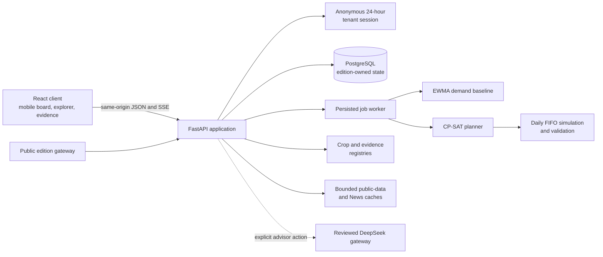
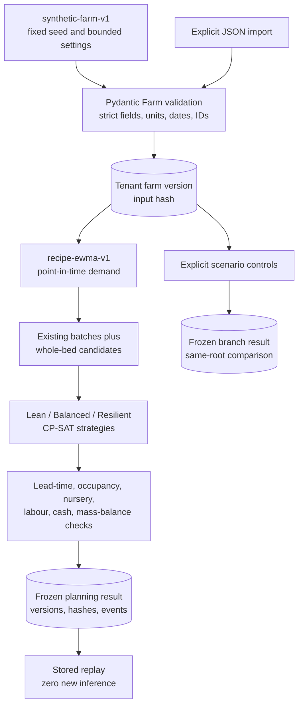
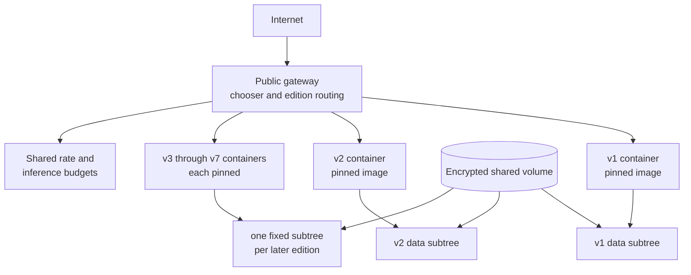

# System, data, and evidence architecture

**Audit date:** 11 September 2026 UTC  
**Repository baseline:** commit `a96025e` (the working tree may contain the documentation changes prepared for the next release)  
**Published application covered:** immutable v7, with v1–v6 retained as separate editions

This chapter describes what the FarmTact source and recorded release evidence implement. It does not promote roadmap items in the v1.2 specification to shipped capabilities. FarmTact is a synthetic planning demonstration: its farm records, recipes, demand histories, schedules, yields, prices, costs, scenarios, and simulated outcomes are fictional. Real public weather, forecast, trade, news, and scholarly records supply attributed context. They do **not** automatically change demand, yield, recipe, price, or solver inputs.

The key separation is therefore:

> Real public information can help a person or advisor ask a better question. The numerical planner only changes when a validated, tenant-owned farm snapshot or an explicit bounded scenario changes.

The implementation evidence for that statement is the empty `public_features_used` array in the committed [feature manifest](../../data/manifests/feature_manifest.json), the planner's `Farm`-only input in [engine.py](../../packages/planner/engine.py), the News context's explicit `numerical_effect="none"` in [news.py](../../packages/news.py), and the bounded scenario controls in [scenarios.py](../../services/api/scenarios.py).

## Implemented system

FarmTact is a React/TypeScript client served by a Python FastAPI application. PostgreSQL stores anonymous tenant state, immutable farm versions, planning jobs, scenario branches, conversations, explorer snapshots, and research sessions. A small in-process worker claims persisted jobs. Local Python code performs forecasting, constraint solving, simulation, comparison, and validation. The DeepSeek boundary is optional for explicit advisor interpretation and is not the source of numerical values.



Primary implementation links:

- Application assembly, lifecycle, API boundaries, worker, and bootstrap: [services/api/app.py](../../services/api/app.py)
- Persistent core store and tenant predicates: [services/api/store.py](../../services/api/store.py)
- Browser API adapter: [apps/web/src/lib/api.ts](../../apps/web/src/lib/api.ts)
- Board and farm-world views: [Board.tsx](../../apps/web/src/components/Board.tsx), [World.tsx](../../apps/web/src/components/World.tsx)
- Data, crop, and evidence views: [DataExplorer.tsx](../../apps/web/src/components/DataExplorer.tsx), [PublicExplorer.tsx](../../apps/web/src/components/PublicExplorer.tsx), [Rooms.tsx](../../apps/web/src/components/Rooms.tsx)
- Public API response contracts: [services/api/view_contracts.py](../../services/api/view_contracts.py)

The client uses edition-scoped browser storage for presentation preferences and continuation pointers such as the selected scenario or explorer snapshot, the current research/advisor identifiers, and a cached decision-journey view. Authoritative farm, plan, scenario, conversation, and research records remain server-side and are reloaded through owned APIs. API calls use a random session cookie; the database stores its SHA-256 hash rather than the bearer value. The session is an anonymous workspace identity, not a verified user account.

## Data domains and authority

| Domain | Current contents | Origin | Can directly drive the planner? | Persistence and authority |
| --- | --- | --- | --- | --- |
| Private farm snapshot | 16 beds, four recipes, batches, orders, demand history, opening inventory, labour, nursery capacity, and cash | Synthetic fixture or schema-valid JSON import; current contract still restricts all records to `synthetic_demo` | **Yes** | Versioned per tenant in `farm_versions`; this is the planner's numerical authority |
| Derived demand and harvest baseline | Confirmed orders, residual weekly EWMA, scheduled harvests | Deterministic local calculation over the frozen farm snapshot | **Yes** | Frozen into planning, explorer, and scenario results with model/configuration/input hashes |
| Plan and simulation | Lean, Balanced, Resilient allocations; daily inventory ledger; scenario metrics | Deterministic CP-SAT plus local simulation | **Yes** | Persisted with calculation version, strategy IDs, constraints, hashes, and simulation-only acceptance |
| Scenario/playground | Delay, yield, demand, labour, cash, bed-reservation, order-status, and EWMA-alpha changes | Explicit bounded synthetic controls | **Yes, inside the frozen branch only** | Tenant-owned immutable roots and versioned results; no automatic main-farm mutation |
| Public observations | NEA station weather, NEA forecasts, SingStat trade volume, NASA POWER history | Real public APIs | **No** | Content-addressed raw snapshots and normalized cache; displayed with source/time/licence limits |
| News | RSS metadata from four allowlisted feeds; three additional sources visibly unconnected or blocked | Real public headline metadata | **No** | Separate bounded cache; copied into a decision snapshot at its cutoff |
| Crop knowledge | Twelve crop concepts linked to 24 reviewed publication records | Curated public/government and scholarly metadata | **No** | Version-controlled JSON; recipe parameters remain separate synthetic engineering assumptions |
| Community/market reactions | Validated supplied-record adapter with no connected feed | No runtime records in the published demonstration | **No** | Status is `not_connected`; it cannot manufacture demand or sentiment |
| AI advisor prose | Qualitative interpretation of frozen numerical and evidence references | Actual DeepSeek only when explicitly invoked; scripted v7 dialogue otherwise | **No** | Persisted and locally validated; unsupported text cannot authorize a change |

The private contract in [contracts.py](../../packages/contracts.py) is intentionally narrower than the future operational schema proposed by the build specification. It supports four synthetic crops—caixin, pak choi, kailan, and lettuce—and forces recipe and row `origin` to `synthetic`. The broader catalogue contains twelve knowledge profiles, but the other eight crops do not have numerical recipes. This is a useful safety property: a literature record cannot silently become a production coefficient.

## Private synthetic data lineage

The reference generator is `synthetic-farm-v1` in [fixtures.py](../../packages/fixtures.py). It uses a fixed default cutoff (`2026-09-08T00:00:00Z`) and seed (`20260908`). It creates four demo recipes, sixteen 20 m² sheltered-hydroponic beds, eight already-executed batches, eight future orders per crop, twelve historical weeks per crop, one opening inventory lot, and declared farm resources. Every record that can carry an origin is labelled synthetic.

The Data Explorer may vary five bounded generator settings: historical multiplier, historical trend, repeating-pattern amplitude, order multiplier, and price multiplier. Its demand baseline uses `recipe-ewma-v1`; alpha is bounded from 0.05 to 0.95 and defaults to 0.35. For each crop, the forecast starts from the first point-in-time-eligible historical value, folds later values through an exponentially weighted moving average, retains booked orders by due date, and adds only the positive residual on the week end. This is an engineering baseline, not a learned production model.



Availability rules are applied before demand calculation. Historical values require `available_at <= cutoff` and a week before the planning date. Orders require `booked_at <= cutoff`; the private contract rejects an order booked after the farm cutoff. Dates are converted to Singapore civil dates for the planning horizon. The [feature builder](../../scripts/build_features.py) records dependency IDs for each forecast row and produces a Parquet artifact plus a manifest. The committed [feature manifest](../../data/manifests/feature_manifest.json) records 32 synthetic features and the exact input, artifact, and private-snapshot hashes.

The planner does not mutate executed batches. It creates whole-bed candidates by recipe and date, reserves nursery sites from sowing to transplant, reserves a bed from transplant through harvest and sanitation, and budgets weekly labour and cash. A daily FIFO lot ledger keeps opening stock, harvest, delivery, disposal, and closing stock in mass balance; later harvest cannot fill an earlier delivery. The implementation and its exact policy weights are in [packages/planner/engine.py](../../packages/planner/engine.py). A companion numerical chapter should be used for formula-level interpretation.

### Snapshot and scenario lifecycle

1. `/api/v1/bootstrap` creates an anonymous tenant and its first synthetic farm version when no valid session exists.
2. `/api/v1/imports` validates either the named reference fixture or a strict `Farm` payload, then appends a farm version. It never overwrites the prior version.
3. `/api/v1/planning-runs` freezes the latest farm payload, input hash, farm version, public source-card snapshot, evidence-register hash, market scaffold, and News context. An idempotency key prevents changed inputs from reusing the request identity.
4. The worker calculates all three policies against one forecast and scenario set. Persisted, sequenced events support server-sent-event reconnect.
5. A versioned backend policy can mark a feasible result `ACCEPTED_FOR_SIMULATION`. The result includes the synthetic ledger and simulated work; it does not authorize a farm operation.
6. Replay returns persisted results and events with `execution_mode=replay`. It does not calculate again or create a provider request.
7. A replan appends a new synthetic farm version and child run. If the farm changes during a run, acceptance becomes stale and a numerical-only refresh starts against the current version.
8. Scenario branches copy a farm or saved-playground root, apply bounded controls, and persist baseline and result. Comparisons reject branches with different roots, baseline hashes, forecast settings, or calculation versions.

Explorer snapshots add another integrity layer. A saved playground freezes the actual generated dataset, forecast, settings, generator/forecast versions, cutoff, reference snapshot, and hashes. Reload validates stored JSON against the recorded hashes. Unsupported old numerical versions fail explicitly rather than being recomputed under current code. Relevant implementation is in [data_explorer.py](../../services/api/data_explorer.py); verification is recorded in [reports/data_explorer.md](../../reports/data_explorer.md).

## Real public-data ingestion

The source registry identifies 23 candidate datasets, but only seven connectors produced normalized observations in the recorded dataset build. “Listed” and “integrated” therefore mean different things.

| Source | Implemented record type | Recorded release snapshot | Point-in-time/planning status |
| --- | --- | ---: | --- |
| [D01 NEA rainfall](https://data.gov.sg/datasets/d_6580738cdd7db79374ed3152159fbd69/view) | Station rainfall, provider interval retained | 88 rows | Observation `available_at` is uncertain; context only |
| [D02 NEA air temperature](https://data.gov.sg/datasets/d_66b77726bbae1b33f218db60ff5861f0/view) | Station air temperature | 18 rows | Context only; not root-zone or on-farm temperature |
| [D03 NEA relative humidity](https://data.gov.sg/datasets/d_2d3b0c4da128a9a59efca806441e1429/view) | Station relative humidity | 18 rows | Context only; station microclimate differs from farm conditions |
| [D04 NEA 24-hour forecast](https://data.gov.sg/datasets/d_ce2eb1e307bda31993c533285834ef2b/view) | Issued and valid forecast fields | 20 rows | Eligible metadata exists, but no planner feature consumes it |
| [D05 NEA four-day outlook](https://data.gov.sg/datasets/d_f131f6e343bf8168e4057a04c4326a0a/view) | Four daily forecast groups | 20 rows | Valid horizon is preserved and cannot be stretched over a crop cycle |
| [D06 SingStat T010002](https://tablebuilder.singstat.gov.sg/table/TR/T010002) | Monthly HS8 merchandise trade volume | 15 rows | Exact release time unknown; broad codes are not crop demand; export blocked while reuse terms remain unverified |
| [D11 NASA POWER](https://power.larc.nasa.gov/docs/services/api/temporal/daily/) | Seven days of gridded historical temperature, humidity, and precipitation | 21 rows | Release timing unknown; historical grid context, not a farm sensor or forecast |

The counts above come from the retained [dataset manifest](../../data/manifests/dataset_manifest.json): 145 weather observations, 40 weather-forecast fields, 15 trade observations, 200 normalized rows total, and eight raw snapshots because D06 required an initial period probe and a larger response. The manifest was built on 8 September 2026 and is historical evidence, not a claim that the same observations are current now.

The implementation stores raw responses by SHA-256 under a source-specific directory with mode `0600`, then records request URL, sorted query, retrieval time, byte count, media type, safe response headers, licence state, and relative path. It normalizes rows with stable IDs and raw locators. Quality validation rejects duplicate IDs, wrong units, non-finite values, naive timestamps, uncertain availability marked as point-in-time eligible, untraceable rows, and orphaned snapshot references.

```mermaid
flowchart LR
    Registry[research/dataset_registry.json\n23 candidates and access states] --> Allowlist[Seven implemented adapters]
    Allowlist --> Fetch[Bounded HTTPS fetch\ntimeout, byte and retry policy]
    Fetch --> Raw[(Content-addressed raw snapshot\nSHA-256 plus safe metadata)]
    Raw --> Normalize[Source-specific normalization\nstable IDs, units, time, raw locator]
    Normalize --> Quality{Quality gate}
    Quality -->|pass| Artifacts[Weather / forecast / trade JSONL]
    Quality -->|source failure| Cache[Explicit failure or prior cached source]
    Artifacts --> Manifest[Dataset manifest and lineage graph]
    Manifest --> Explorer[Read-only public explorer\nsource and licence labels]
    Explorer -. no automatic edge .-> Planner[Private synthetic planner]
```



Source-specific code is split among [NEA normalization](../../packages/ingestion/nea.py), [SingStat normalization](../../packages/ingestion/singstat.py), [NASA POWER normalization](../../packages/ingestion/power.py), [snapshot storage](../../packages/ingestion/storage.py), [context orchestration](../../packages/ingestion/context.py), and [quality validation](../../packages/ingestion/validation.py). The machine-readable dependency graph is retained in [data/manifests/lineage.json](../../data/manifests/lineage.json).

The public explorer only exposes curated fields. Callers cannot provide file paths. Lists, pages, queries, and exports are bounded; CSV cells beginning with spreadsheet formula characters are escaped. A source-level reuse policy enables export only when licence state is verified. Weather rows from D01–D05 are exportable under the recorded Singapore Open Data licence status; D06 and D11 rows are view-only in the current configuration. Registry-only candidates appear as metadata without invented observations.

### Rebuild semantics and an important reproducibility limit

`python scripts/build_dataset.py --data-dir data` performs a current live refresh. `--offline` rebuilds from raw snapshot files named in the manifest. Raw, normalized, and runtime data directories are intentionally excluded by [.gitignore](../../.gitignore), while manifests and quality reports are committed. As a result:

- a live rebuild is reproducible at the code and transformation level, but it will fetch the provider's current responses and need not reproduce the 8 September row values or hashes;
- an offline byte-for-byte rebuild requires an authorized copy of the original raw snapshot directory, which a clean Git checkout does not contain;
- the committed manifest permits audit of hashes, row counts, source queries, transforms, and provenance, but does not independently permit recomputing every retained public value;
- public data licences and terms still govern redistribution even when a checksum is public.

This distinction should accompany any “reproducible dataset” claim.

## News and current-information lifecycle

News is a deterministic supporting collector, not an eighth council agent and not a numerical feature pipeline. [packages/news.py](../../packages/news.py) contains seven declared sources. Four are allowlisted RSS metadata collectors: SFA Newsroom, SFA Circulars, AFSIS agricultural-disaster reports, and ASEAN Agri-food. Reddit, SAFEF, and the Central Singapore CDC calendar remain visibly unavailable, link-only, or blocked. The v5 release evidence records 346 valid metadata records (154 SFA Newsroom, 123 SFA Circulars, 64 AFSIS, and 5 ASEAN Agri-food); see [the News implementation report](../../reports/v5/news_implementation.md).

The collector runs separately from the application and provider inference. It follows no redirects, refuses compressed responses, limits each response to 1 MiB and 200 items, validates a fixed HTTPS host, accepts XML media types, strips HTML to bounded text, and never fetches linked articles, images, or social profiles. It retains old records on a refresh failure and exposes the source failure state. A six-hour minimum attempt interval prevents repeated collection.

Each record preserves the exact raw publication string, parsed publication time, retrieval time, canonical URL, publisher geography, keyword-derived crop/topic tags, optional explicit structured event dates, reuse mode, and content hash. A date mentioned in a title is never inferred as an event date. Headlines are treated as untrusted context.

For a new decision, the API chooses a cutoff and copies a bounded News pack into the run or branch payload:

- historical replay uses the farm cutoff;
- a current synthetic decision uses its creation time while retaining the separate farm cutoff;
- both publication and retrieval must be at or before the chosen cutoff;
- continuation and child branches inherit the parent's frozen News context;
- replay reads the copied context;
- the pack declares `numerical_effect: none`.

There is no code path from a News record, headline keyword, social observation, public weather row, or trade row into EWMA demand, recipe yield, order quantities, or CP-SAT constraints. An advisor can cite a recognized frozen key, but any proposed numerical change must become an explicit bounded scenario and pass local validation.

## Crop knowledge and scientific evidence

The version-controlled [crop catalogue](../../research/crop_catalogue.json) contains twelve unranked Singapore-relevant leafy-herb concepts. The [evidence register](../../research/evidence_register.json) contains 24 publication records (`P01`–`P24`). The catalogue-to-publication relation is many-to-many and preserves taxonomy status, aliases, harvested part, system relevance, evidence IDs, scope boundaries, and parameter gaps.

| Crop knowledge profile | Linked evidence | Numerical demo recipe? | Major unresolved boundary |
| --- | --- | --- | --- |
| Caixin | P01, P02 | Yes, synthetic | Local commercial mature marketable yield and cultivar cycle |
| Pak choi / xiao bai cai | P03–P05 | Yes, synthetic | Species/cultivar-to-SKU mapping and commercial packout |
| Kailan | P05–P07 | Yes, synthetic | Authority-resolved name/cultivar and commercial yield |
| Bayam | P10 | No | Portfolio species, full-size yield, and multi-cut response |
| Kangkong | P12 | No | Singapore commercial yield, cultivar, and regrowth |
| Lettuce | P08, P09, P16, P17, P19 | Yes, synthetic | Cultivar/SKU, Singapore cycle yield, energy, and shelf life |
| Kale | P15 | No | Taxon and cultivar remain blocked pending methods confirmation |
| Mustard greens | P11 | No | Evidence taxon does not resolve all portfolio SKUs |
| Malabar spinach | P14 | No | Singapore evidence, trellis capacity, and cut-specific yield |
| Sweet-potato leaves | P13, P18 | No | Fresh-market leaf yield and local regrowth schedule |
| Garlic chives | P21, P22 | No | Local accession, commercial yield, and cut-specific regrowth |
| Sawtooth coriander | P23, P24 | No | Local seed source, flowering/regrowth, and buyer quality |

The two v6 additions and their primary-study interpretation are documented in [docs/research/v6_crop_evidence.md](../research/v6_crop_evidence.md). The catalogue also links public government identifiers and names through [source_registry.json](../../research/source_registry.json), while [crop_hs_mappings.json](../../research/crop_hs_mappings.json) distinguishes exact product references from unresolved broad customs codes.

The evidence register is a targeted research set, not a systematic review or a training corpus. It records access-review status, study setting, finding, design implication, transfer limit, licence state, and a `parameter_use` decision. Most entries are restricted to context, candidate evaluation, or citation discovery. None of the 24 papers supplies the four numerical demo recipes. In particular:

- a non-Singapore controlled experiment does not validate Singapore commercial performance;
- biomass, dry weight, physiology, metabolomics, and nutritional quality are not interchangeable with fresh marketable kilograms;
- study measurements available only at harvest would leak future information into an earlier yield prediction;
- one review and its cited trial are not independent replications;
- a title, abstract, or inaccessible full text cannot authorize a numeric coefficient;
- broad HS trade categories cannot become named-crop customer demand;
- an illustration is representative artwork and does not resolve a cultivar, SKU, disease, or growth measurement.

The Crop Atlas returns the exact linked evidence records for a selected profile and displays the record's source URL and transfer limit. It also shows a planning recipe only for the four simulated crops and labels it `demo_only`. This makes the scientific layer inspectable without presenting it as numerical authority.

## Persistence, tenancy, and lifecycle controls

The application uses one SQLAlchemy metadata collection and creates additive tables at service startup. The important persisted grains are:

| Tables | Grain and lifecycle role |
| --- | --- |
| `tenants`, `farm_versions` | Anonymous session identity and append-only tenant farm versions |
| `planning_runs`, `run_events` | One idempotent planning request and its ordered event stream |
| `scenario_branches`, `quest_progress` | Isolated numerical experiment and per-tenant game progress |
| `explorer_snapshots` | Integrity-checked synthetic playground snapshot |
| `conversations`, `conversation_messages`, `conversation_requests`, `conversation_events` | Frozen advisor context, messages, idempotent provider request, and replayable events |
| `council_research_sessions`, `council_research_jobs`, `council_research_actions` | V7 isolated research state, one result per input version, and idempotent actions |
| `inference_budget`, `rate_counters`, `security_settings` | Durable global provider budget and abuse-control state |

All user-state queries include `tenant_id`. Planning events and conversation children additionally use composite foreign keys that bind child identity to the same tenant as the parent. Unknown or unowned IDs return not found. Idempotency keys are scoped to the tenant or parent resource and reject reuse with changed request hashes. Tenant-row locking serializes farm-version allocation and competing creates.

Worker recovery reflects side-effect risk. Numerical scenarios return from `RUNNING` to `QUEUED` because recalculation is local and deterministic. An abandoned inference-bearing planning or conversation request is marked failed or interrupted so a restart does not silently repeat a paid call. Reconnect and replay consume stored events.

The v7 research route is a separately persisted study. Free text is parsed only into a small allowlisted set of proposals. An explicit apply action creates a new research input version, and calculation uses a deep copy of the synthetic farm. The main farm and its missions are not modified. The optional actual-advisor action is separately labelled and persists evidence-validation status. Implementation: [council_research.py](../../services/api/council_research.py) and [planner/research.py](../../packages/planner/research.py).

## API-to-interface traceability

The API is the only bridge from persisted or curated data into the React client. The public OpenAPI/Swagger endpoints are disabled, so source contracts and generated TypeScript types are the reviewable interface definition.

| User surface | API source | What the UI can truthfully establish |
| --- | --- | --- |
| Farm board and planning room | `/bootstrap`, `/planning-runs`, `/events`, `/replay`, `/worklist.csv` | Synthetic current farm, frozen inputs, locally calculated alternatives, event status, and simulation-only work |
| Crop Atlas | `/crops`, `/crops/{id}/evidence` | Catalogue identity, unresolved boundaries, demo recipe status, and linked evidence records |
| Data Explorer | `/data-explorer/*` | Selected tenant snapshot, records, charts, EWMA preview, exact hashes, same-root comparisons, and bounded exports |
| Public Explorer | `/data-explorer/public*`, `/sources` | Cached public rows, source time, retrieval time, freshness, licence state, and metadata-only candidates |
| News panel | `/news` | Frozen or current cache metadata with explicit time/relevance limits and no numerical effect |
| Scenario Lab | `/scenarios`, `/scenarios/compare`, `/quests` | Explicit synthetic control, immutable baseline, local result, and affected-resource pointers |
| Advisor conversations | `/conversations/*` | Frozen snapshot/evidence context, provider-request status, validated references, and stored replay |
| V7 council research | `/council-research/*` | Versioned scripted interaction, explicit proposal/apply lifecycle, local plans, challenges, and optional provider interpretation |

The UI renders provider prose as text, opens external evidence links with safe browser attributes, and exposes structured provenance rather than provider internals. Static routes are fixed build directories; there is no route that accepts a filesystem path. Request bodies use strict Pydantic models with unknown fields rejected, and writes are same-origin checked and capped at 1 MiB.

## Edition and deployment isolation

The current [release registry](../../config/releases/registry.json) marks v7 as latest and records a full source commit and immutable OCI image digest for every v1–v7 edition. Since v6, one Singapore Fly Machine and one encrypted volume host the gateway and all edition containers. Sharing a host is not sharing application state: the host adapter binds a fixed edition subtree to `/data`, removes access to the common parent, and each container maintains its own PostgreSQL cluster, cache, session state, and game records. The gateway owns shared abuse counters and the 48-call daily inference ceiling because those are operational safeguards rather than game progress.



Cross-edition cookies are rejected and published source/image identities are immutable. A new edition begins with fresh reference state. The single Machine and volume remain a shared availability and capacity boundary: a host restart can interrupt every edition, and the v7 verification is a bounded two-job smoke test rather than a saturation or long-duration study. Details and recovery procedure are in [docs/deployment/editions.md](../deployment/editions.md); v7 preservation and capacity evidence are in [reports/v7/implementation.md](../../reports/v7/implementation.md).

## Evidence strength and claim limits

| Claim | Best supporting artifact | What the artifact does not establish |
| --- | --- | --- |
| The public pipeline produced 200 traceable rows from seven source IDs | [dataset manifest](../../data/manifests/dataset_manifest.json), [lineage graph](../../data/manifests/lineage.json), [quality report](../../data/reports/data_quality.json) | Current freshness, farm relevance, commercial prediction accuracy, or redistribution permission for every source |
| The feature builder excludes public context from the demand baseline | [feature manifest](../../data/manifests/feature_manifest.json), [build_features.py](../../scripts/build_features.py) | That public signals would be useless after future validation; only that they are unused now |
| Twelve crop profiles link to 24 publications | [crop catalogue](../../research/crop_catalogue.json), [evidence register](../../research/evidence_register.json) | Exhaustive literature coverage, independent replication, local transferability, or approved production coefficients |
| The News collector retained 346 valid metadata records for v5 | [News report](../../reports/v5/news_implementation.md) | Full-article verification, sentiment, causal impact, representative public opinion, or current availability |
| Explorer snapshots and scenarios persist and replay | [Data Explorer report](../../reports/data_explorer.md), [v7 persistence evidence](../../reports/v7/persistence.md) | Durability under arbitrary infrastructure failure or migration from unsupported future model versions |
| Prior edition records survived v7 publication | [v7 release report](../../reports/v7/implementation.md) | Multi-region availability or unlimited shared-host capacity |
| An actual v7 advisor request completed | [v7 advisor probe](../../reports/v7/advisor_public.json) | Correct farming advice; the recorded response had no verified evidence references and was marked unsupported |

Automated checks provide strong evidence for schema enforcement, deterministic calculations, idempotency, tenant isolation, browser flows, hashes, and bounded release preservation. They are weaker evidence for scientific validity, human usability, and real operations. Agent walkthroughs are not human studies. Headless mobile geometry is not physical touch or software-keyboard testing. Digital audio checks are not proof of audibility on a farmer's device. Synthetic held-out weeks generated by the same fixture process do not measure out-of-sample commercial accuracy.

No real farm outcome dataset is present. There is no trained supervised demand model, harvest/yield model, disease classifier, satellite predictor, calibrated probabilistic risk model, production retraining pipeline, drift monitor, causal estimator, or measured SME benefit. EWMA is a statistical baseline, CP-SAT is an optimizer, and scenario weights are declared assumptions. “AI” in this release refers to optional qualitative advisor calls; it does not replace data collection, model validation, or numerical computation.

## Reproduction and audit route

From a dependency-complete checkout, the main read-only or local-data reproduction commands are:

```bash
# Validate the committed synthetic fixture and rebuild its point-in-time features.
.venv/bin/python scripts/build_features.py

# Fetch current bounded public observations and write a new manifest.
.venv/bin/python scripts/build_dataset.py --data-dir data --with-power

# Rebuild from an authorized local copy of the raw snapshots named in the manifest.
.venv/bin/python scripts/build_dataset.py --data-dir data --offline

# Refresh the bounded RSS metadata cache; no inference is involved.
.venv/bin/python scripts/refresh_news.py

# Run focused data, private-contract, explorer, and isolation verification.
.venv/bin/python -m pytest -q \
  tests/contracts/test_private_data.py \
  tests/contracts/test_features.py \
  tests/data/test_ingestion.py \
  tests/data/test_explorer_public.py \
  tests/explorer/test_data_explorer.py \
  tests/review/test_postgres_concurrency.py

# Verify the generated browser contracts and production client build.
.venv/bin/python scripts/generate_web_contracts.py --check
npm run build --prefix apps/web
```

The public-data commands access changing upstream services, so record retrieval time, response status, row counts, failures, and new hashes rather than expecting the historical manifest's values. PostgreSQL concurrency tests require a dedicated test database and must never target a live application database. Running the commands above does not require or authorize a provider call.

## Material gaps found in this audit

The following discrepancies were found against the audit baseline. This documentation update corrects stale prose and specifies code fixes; it does not claim the listed code gaps are repaired:

1. [packages/ingestion/validation.py](../../packages/ingestion/validation.py) still hard-codes `catalogue_profiles: 10` and `scientific_evidence_documents: 20`. The current registries contain 12 profiles and 24 documents. Consequently, the committed [data quality report](../../data/reports/data_quality.json) is historically accurate for the 8 September build but stale as a current coverage statement. Coverage should be derived from the registries or clearly versioned as build-time metadata.
2. [FarmTact_Build_Specification.md](../../FarmTact_Build_Specification.md) labels its v6 section “Current implementation,” says the shared host runs v1–v6, and says the evidence register has 20 publications. V7 is the current published edition and the register now has 24 publications. Historical descriptions should be labelled historical and the current amendment consolidated at the top.
3. [docs/execution-plan.md](../execution-plan.md) correctly names v7 as current, but its unqualified “Acceptance scope” still says ten crop profiles and its early build summary says ten profiles/twenty records/six roles. Those statements describe the original milestone and need an explicit “historical v1 scope” qualifier where they appear.
4. [docs/deployment/fly.md](../deployment/fly.md) describes v6 and v1–v6 as the current topology. It should defer to the v7 editions runbook or identify itself as a v6 historical snapshot.
5. [docs/v5-engagement-plan.md](../v5-engagement-plan.md) says v6 is current. Its historical-plan label is useful, but the “current” sentence should point readers to v7.
6. [docs/research/v5_news_sources.md](../research/v5_news_sources.md) refers to coverage broader than “the ten crops.” The source was a v5 research brief, but the current shared crop vocabulary has twelve identifiers; either freeze the statement as v5-era scope or update it.
7. The build specification's recommended architecture mentions Next.js, DuckDB, an object-store abstraction, and broader operational tables. The implementation uses Vite React, FastAPI, PostgreSQL JSON payloads, local content-addressed files, and a much narrower synthetic `Farm` contract. This is a roadmap-versus-implementation difference and should be stated where the architecture recommendation appears.
8. The committed public manifest points to ignored raw and normalized files. The documented offline rebuild is therefore not self-contained in a clean checkout. The docs should say that an authorized raw-snapshot bundle is required for exact historical reproduction.

These gaps do not invalidate the implemented synthetic demonstration. They narrow what can be claimed from its current artifacts and make clear which records are historical evidence, which are active contracts, and which remain future design requirements.

The specification/documentation wording findings above refer to the audit baseline.
The integrated documentation update corrects current pointers and labels historical
requirements; numerical, data-generation and runtime gaps remain future work.
