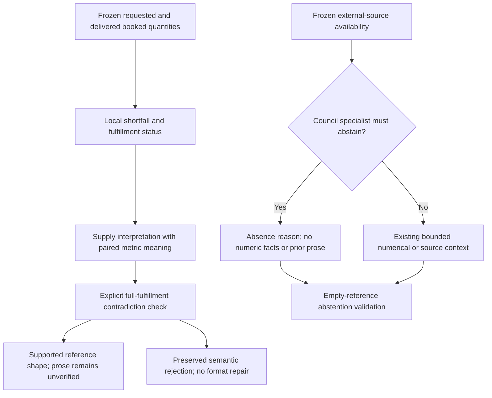

# V10 grounding follow-up: fulfillment and evidence-absence boundaries

**Date:** 11 September 2026 UTC 
**State:** published; targeted AI quality failed and mission live verification was budget-blocked 
**Scope:** corrections from retained public V9 failures 
**Operational boundary:** synthetic simulation only; actual farm operations disabled

## Abstract

V9 completed all five actual-provider workflows but failed its quality evaluation. Its Supply adviser asserted full booked-order delivery despite a positive booked shortfall in every strategy. Its conversational Weather and Market roles abstained but attached numerical claims, which the validator rejected. V10 addresses those concrete mechanisms without treating arbitrary prose as verified. It adds code-derived fulfillment evidence and a conservative contradiction check, and supplies a minimal absence-only context to external-source specialists who must abstain. Synthetic data, numerical models, execution mechanics and the browser implementation remain those verified in V8/V9.

## 1. Observations and falsifiable corrections

| Observed failure | Frozen evidence | Implemented correction | Remaining limitation |
| --- | --- | --- | --- |
| Supply said booked-order routing was fully delivered | V9 requested 824 kg under each policy; Lean/Balanced/Resilient delivered 370/446/518 kg | Derive booked shortfall and fulfillment status locally; include requested/delivered/shortfall in Supply context; reject explicit positive full-fulfillment assertions when the relevant status is partial | A finite phrase guard cannot establish general free-form entailment |
| A format repair preserved the false fulfillment assertion | The initial reply said each booked order was fully delivered; repaired prose removed the prohibited count word | The new semantic contradiction code is ineligible for format repair, so the unsupported premise cannot be repaired as punctuation or schema | Semantic rejection may withhold a required Council; a numerical plan is not thereby disproven |
| Absent-source conversational specialists attached numeric facts | Weather/Market returned `relationship=abstention` with nonempty `fact_refs`, rejected as `abstention_payload` | Required absence turns receive no numerical facts, scenario summary, evidence records, highlights or prior prose; typed evidence is explicitly not required and all output arrays must be empty | The model can still disobey; the existing local validator remains authoritative |
| The automated score missed Supply's contradiction while flagging other wording | V9 scored 12/18; six failures included prefix and keyword checks | Preserve the score and separately inspect meaning against frozen evidence | Human expert review, calibrated semantic evaluation and empirical farming outcomes remain absent |

The [V9 report](v9-ai-followup.md), [planning record](../../reports/v9/planning-public.json), [conversation replay](../../reports/v9/conversation-public-replay.json) and [quality result](../../reports/v9/ai-quality-final.json) retain the original observations. A new iteration does not overwrite those records or retroactively change their scores.

## 2. Evidence and rejection paths

For strategy $s$, the implementation derives booked shortfall as the nonnegative difference between booked requested mass and booked delivered mass, rounded to six decimal places. This is bookkeeping over the existing gram-based numerical result, not a fitted model or new yield calculation. The derived typed fact retains the strategy identifier and kilogram unit. Zero shortfall gives `fully_delivered`; positive shortfall gives `partial_delivery`. This status does not mean that residual forecast demand is covered, nor that a physical delivery occurred.

The phrase guard addresses explicit positive statements of full, complete or universal booked fulfillment. It preserves truthful negatives such as “not fully delivered,” and permits a named fully covered policy in a mixed context. It does not prove arbitrary paraphrases, sentence scope or causal claims. The original quantity/date blocker, exact reference gate and finite repair policy remain in force.

The absence-only projection applies specifically to Weather or Market in conversational Council mode when their declared external source is absent. It changes only the provider projection: the full frozen snapshot and dialogue remain durable. Direct and invited questions about answerable numerical results retain their facts. Research advisers retain the existing research projection. The system still calls the absent-source specialist and labels actual execution truthfully; replacing those calls with explicitly labelled deterministic notices is future work.

Mission prompt/context is **V7**, conversation prompt/context **V6**, and shared validator **V5**. Output schema remains **V3**, including its 400-character content bound, three typed references and existing repair ceilings. Numerical solver, data/evaluation and execution versions are unchanged.

## 3. Verification and paid-experiment scope

The [conversation focus](../../reports/v10/conversation-focused.xml) passed 45 tests. Mission tests cover exact derived coverage, false total-fulfillment assertions, truthful negative and mixed-policy cases, and semantic rejection without consuming a format repair. The final [PostgreSQL regression](../../reports/v10/full-regression.xml) passed **611 tests with one skip** in 441.23 seconds against its own isolated database and the frozen V9 browser assets.

Through V9, the [task ledger](../../reports/v8/live-call-ledger.json) records **76 actual requests**: 44 local and 32 public. The public application retains its **48-request daily ceiling**, leaving at most 16 further requests today in the absence of unrelated usage. The internal experiment ceiling remains 96 and is not a runtime spending override.

V10's targeted paid follow-up exercises the two changed paths: the planning Council and the conversational Council. Each normally uses seven requests; each workflow can allow up to nine including repairs, but combined execution is additionally constrained by the unchanged shared daily limit and a 16-request remaining experiment envelope. No extra direct, invite, research or vision call is claimed for V10. Their retained V8/V9 evidence and deterministic regression have distinct source scopes. A blocked or partial result will be retained rather than bypassing the cap or retrying for a favorable answer.

Replaying stored outputs, reading the UI, checking edition identity and prior-state preservation, and advancing a synthetic execution world make no provider calls. Numerical acceptance is separate from interpretation quality. Actual-provider results below must state completed roles, repairs, rejection state and semantic limitations rather than collapse them into a single success label.

## 4. Publication and final evidence

V10 is published at [the immutable application](https://farmtact.fly.dev/v10/) from source `ec4e29874b2c7408f2bd93d012912e3c0cb8d2f3` and image `registry.fly.io/farmtact@sha256:874530e73f481b1197e528bb5f124b958a74be64c9934292c14438b4cdd503bf`. All ten [public health/source checks](../../reports/v10/deployment-health.json) passed. The first machine update failed with registry `404 MANIFEST_UNKNOWN` for the newly pushed image; retrying the identical pinned image and source succeeded. No alternate V10 image was built or substituted. The registry's next unused number is V11; always check it before publishing.

Targeted actual-provider results and prior-edition preservation are recorded below when complete. The full regression result is in Section 3; publication does not itself establish answer quality.

## 5. Open semantic acceptance criteria

The completed [V9 AI-assisted review](../../reports/v9/ai-assisted-semantic-review.md) examined 18 messages and 62 atomic assertions: ten messages were sound, five sound with limits, and three materially contradictory. Besides the Supply error targeted here, two Production replies described crop mix as unchanged even though Lean and Balanced changed their allocation composition. Unchanged total growing area does not establish unchanged crop mix. Simultaneously changing delay and yield and rerunning allocation cannot identify a sole cause.

These broader Production interpretation defects remain open; V10 does not claim to close them through its fulfillment or absence corrections. The next acceptance criteria are: expose code-derived per-crop allocation comparisons when discussing composition; reject or abstain on composition claims without that evidence; explicitly distinguish the crop-ID set from allocation counts/areas; and test causal wording against multi-control changes and replanning. A semantic evaluation should contain truthful paraphrases and false claims with valid references, measuring both false rejections and missed contradictions. Human expert review and real-farm outcome calibration are separate future requirements.

## 6. Final targeted live outcome

The [public Council-only trial](../../reports/v10/conversation-public.json) completed seven turns with **nine actual requests**, including bounded repairs. Weather and Market now produced valid source-absence statements with empty reference arrays. This directly verifies that particular correction. Supply nevertheless retained a prohibited quantity word and was marked unsupported. The [unchanged case checks](../../reports/v10/ai-quality-targeted.json) passed **five of seven cases** and failed two. The overall targeted workflow check failed because a new mission Council could not execute. No general answer-quality pass is claimed.

After this trial, public usage was **41 of 48** daily requests. A planning Council reserves its full nine-request maximum before execution, so the remaining seven calls were insufficient even though seven is the no-repair normal count. The [budget-boundary check](../../reports/v10/planning-budget-boundary.json) passed: the application retained three numerical strategies, made **zero provider requests**, and returned `REVIEW_WITHHELD` with Council status `blocked`. The [mission record](../../reports/v10/planning-public.json) is therefore incomplete for live adviser quality. The Supply guard has the deterministic test evidence above; it does not have a fresh successful V10 mission-provider trial. No cap was changed, no separate route was used to bypass it, and no favorable-output retry followed.

The final task ledger records **85 actual requests**: 44 local experiments and 41 public calls, across all successful, repaired and failed attempts. V10 contributes nine. Unused budget reservations are not counted as actual calls. The daily application limit remains 48 and the internal task experiment ceiling remains 96.

All ten edition health/source checks passed and [all captured V1–V9 records were preserved](../../reports/v10/preservation-after.json). The [V10 56-day execution](../../reports/v10/execution-public.json) passed: 56 day closures, 60 task events, 64 demand-service events, one future replan, exact mass/cash/order-lot reconciliation and historical receipt replay, with zero provider calls. This run did not perform a process restart.

The [public script-byte comparison](../../reports/v10/ui-asset-equivalence.json) confirms that V9 and V10 serve the identical frontend bundle. V9's 38-check actual browser replay therefore exercises that same frontend implementation, although its records and browser execution belong to V9. This is not a claim of a new V10 browser interaction test.

The first capacity probe exceeded the browse latency threshold while the independent execution trial was also submitting numerical jobs. Its failure and the reason for repeating the intended isolated pair protocol are retained in the [capacity protocol note](../../reports/v10/capacity-protocol-note.md). The isolated repeat also **failed**: both jobs exceeded 180 seconds and browse p95 was **15.0367 seconds**. Farm/cookie isolation and zero inference passed; memory available was about 1,988,608 KiB after the run. This does not establish a root cause, and the initial extra execution workload is not a sufficient explanation. The [final capacity result](../../reports/v10/shared-capacity-public.json) and [scoped job cleanup](../../reports/v10/capacity-cleanup.json) retain the evidence. Current shared-host capacity must be treated as **failed under this tested load**, despite all health endpoints passing. Future acceptance must separate queue wait from computation, measure CPU/platform quota behavior, evaluate a shared numerical admission limit, and test bounded cancellation and latency under sustained load.

## 7. Semantic result and interpretation limits

The [V10 AI-assisted audit](../../reports/v10/ai-assisted-semantic-review.md) examined all seven final messages and 26 atomic assertions against the frozen scenario and its allocation records. It classified **two messages as sound, four as sound with limits, and one as contradictory**. Weather and Market are the sound clean abstentions. Profit incorrectly called Lean's margin change a gain: the frozen values are SGD 2,467.60 to SGD 2,414.73, a **−SGD 52.87** delta. The Chair's statement that all margins fell is correct, although its compressed ranking sentence is ambiguous about fill versus shortfall. Supply's timing interpretation has support in full order records, but it remained application-unsupported for the prohibited quantity word and its selected citations were incomplete.

These are AI-assisted record checks, not a human expert study. The chronological V8/V9/V10 trials have their own frozen snapshot hashes, context versions and workflow scopes; their scores are not a paired causal ablation or an estimate of general provider reliability. A new valid abstention demonstrates the bounded correction on this sample. It does not cancel the retained failures or establish that all AI calls make sense. The next specifications explicitly require locally verified typed comparison propositions and calibrated semantic evaluation before strengthening that claim.

Post-deadline inspection found both capacity jobs already completed, after about
236.96 seconds on V9 and 196.64 seconds on V10. No cancellation or mutation was
needed. Completion after the deadline does not change the failed capacity result.
No test job was left active by this inspection.
