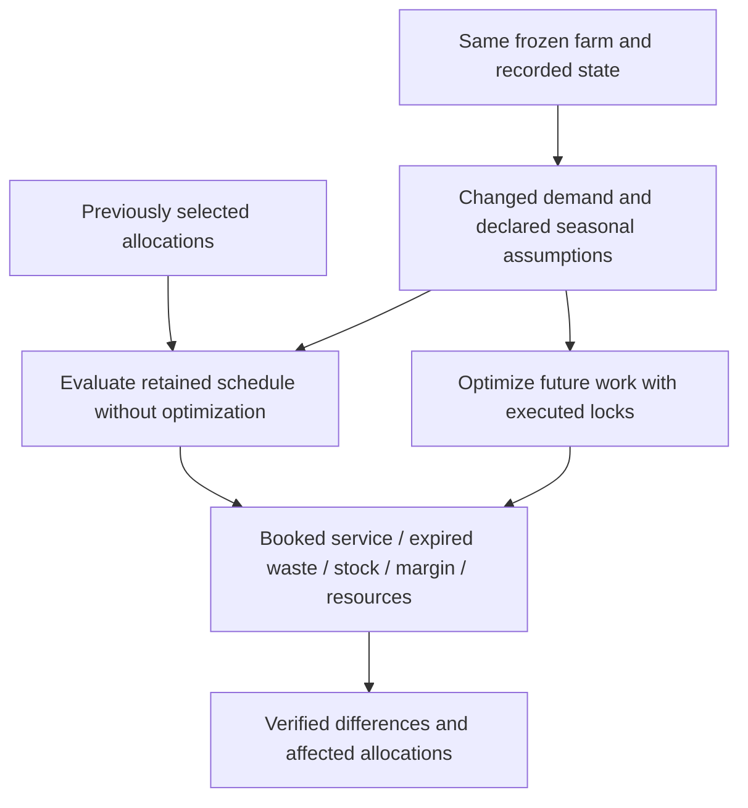
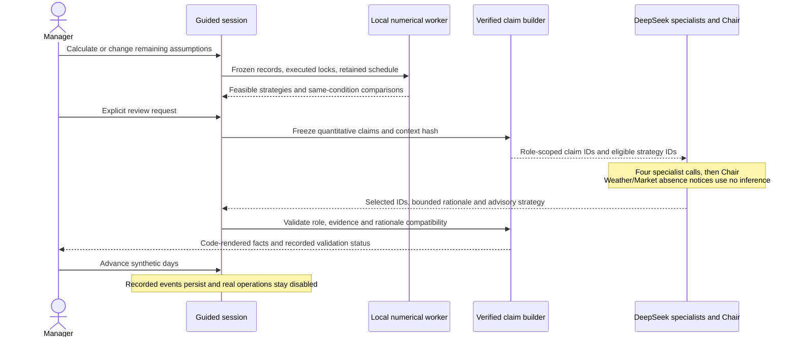
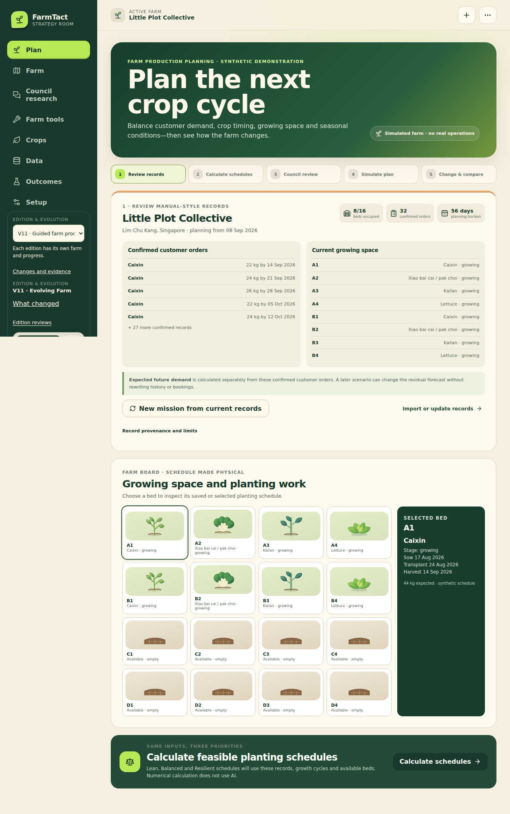

# V11 guided production planning: adaptation under identical conditions

**V11 reading copies:** [PDF](../../reports/v11/farmtact-report.pdf) · [offline HTML](../../reports/v11/farmtact-report.html).

State: V11 published from source `37802adbc9010bc80a50869ef725285a119af3f3`. See [the acceptance report](../../reports/v11/implementation.md) for exact validation, timings and source/image pins.

## 1. Problem and scope

The organizer's Farm Production Planning brief asks how managers can schedule planting from expected customer demand, crop cycles, available land and seasonal conditions while balancing capacity, changing demand and crop wastage. The complete supplied text and provenance are retained in [the implementation plan](../v11-implementation-plan.md).

V11 reshapes the existing numerical and visual product into one guided mission. It does not introduce a new trained crop model or claim real-farm gains. Four sheltered-hydroponic synthetic recipes, the 56-day reference farm, the local constrained scheduler, the inventory ledger and the seven-role Council remain the foundation.

| Brief requirement | Existing mechanism retained | V11 change |
|---|---|---|
| Expected demand | Point-in-time EWMA and confirmed bookings | Future demand adjustments affect only unbooked residual demand |
| Crop cycles | Nursery, transplant, harvest and sanitation dates | Dated seasonal sensitivities affect effective future harvest and occupancy |
| Available land | Whole-bed candidate selection and daily exclusivity | Guided interactive board links beds to selected planting work |
| Changing market demand | Frozen scenarios and future-only replanning | Keep the saved schedule versus replan under the same changed conditions |
| Wastage | FEFO/FIFO service, expiry disposal, closing inventory | Fulfillment and expired waste are adjacent comparison metrics |
| Manual records | Validated fixture/imported records | Readable record review starts the guided mission |

## 2. Numerical methods

The deployed statistical method remains EWMA. For crop/date residual demand R and an explicit applicable adjustment p, the adjusted residual is R × p/100. Confirmed order quantities are unchanged. Only an explicit add/amend/cancel operation alters a booked record; a future-demand control never rewrites historical training observations.

A seasonal assumption identifies one crop, the sheltered-hydroponic production system, an inclusive nominal-harvest window, a yield percentage, a delay in days, a reason and `synthetic_assumption` provenance. This is a user-declared sensitivity, not an inferred probability or a fitted climate response.

For an applicable unharvested allocation with nominal harvest date H and nominal marketable mass Y:

- effective harvest = H + declared delay;
- effective marketable mass = Y × declared yield percentage / 100;
- expiry and sanitation release follow the effective harvest date;
- effective yield/date enter labour, resource validation and inventory replay.

Windows cannot overlap for the same crop/system. Yield is bounded to 50–100% and delay to 0–14 days. Application always starts from preserved nominal values, preventing repeated compounding. Removing an assumption restores nominal projections for unharvested work. Recorded harvests remain byte-equivalent and produce no additional harvest or harvest labour; remaining sanitation occupancy still blocks the bed.

The full assumption set belongs to an input revision. A later request replaces that set; it is not an implicit incremental patch. Explicit order edits remain part of the derived farm version. Dates supplied for a remaining-horizon experiment must fit that horizon.

## 3. Fair adaptation comparison

A saved strategy supplies the retained planting schedule. After an input change, the backend evaluates that schedule without optimization or repair. It separately optimizes Lean, Balanced and Resilient using exactly the same changed demand, seasonal assumptions, opening stock, cost definitions and remaining horizon.

For each metric M and new policy P, the reported adaptation delta is M(P, changed conditions) minus M(saved schedule, changed conditions). The earlier result under earlier conditions is historical context, not the adaptation comparator. A retained schedule may become infeasible, and V11 reports that rather than silently repairing it. Infeasible simulated metrics are conditional accounting, not an executable recommendation.

Zero waste is not automatically a good outcome: withholding all production may leave customers unserved. Booked fulfillment and booked shortfall are therefore displayed alongside expiry waste. Closing usable stock remains inventory; it is not classified as waste or automatically sold at the horizon.

## 4. State, execution and worker lifecycle

Guided sessions link immutable result versions, queued jobs, explicit Council reviews and isolated simulation worlds. Every mutation is tenant-scoped, bound to an idempotency key and checked against an expected session revision. Reload retrieves the same session and completed result. A changed input invalidates current review while preserving previous result versions.

Numerical work executes in a spawned child process outside the HTTP process. One process-local admission lock covers guided and existing API numerical calls; it is **not** a cross-edition or host-wide semaphore. A bounded result-reader thread permits the parent to enforce cancellation/deadlines even while a large result frame is arriving. The end-to-end numerical bound is 150 seconds, with bounded process termination/cleanup thereafter. Cache reuse is in-memory, tenant-scoped and tied to the complete numerical payload; it does not survive a process restart.

Advancing commits the existing synthetic event and lot/cash ledger. Replanning starts on the next unexecuted civil day, carries opening inventory/cash forward, locks started work and excludes previously executed cycle IDs. Negative recorded cash blocks replanning explicitly rather than being clamped to an invented zero balance.

## 5. Council interpretation

The guided Council has its own versioned prompt/schema/validator/context/source contract. Initial planning produces direct strategy facts. Replanning produces paired facts with metric, strategy, operands, delta, direction, unit and a context hash binding assumptions and numerical outputs. Crop-ID set, allocation counts and crop-area composition remain separate claims.

The model selects provided claim IDs, an eligible proposed strategy and a bounded tradeoff/rationale. The validator checks role scope, rationale/metric compatibility and whether the cited evidence concerns the proposed strategy. Code renders the quantitative statements and rationale text. This deliberately constrains the guided Council's expression; it does not prove arbitrary free-form prose in older conversation workflows.

Weather and Market receive clearly labelled deterministic absence notices when no external observations are admitted. The guided workflow currently admits no such observations, so four specialists and the Chair make five ordinary provider requests. Its full reservation is seven requests including two potential repairs, within the unchanged nine-request absolute Council ceiling and shared 48-request daily limit. This saves actual requests without impersonating missing-role inference. Numerical results remain available on advisory review failure. Replay makes no provider call.

*Figure: the published guided starting screen. The visual farm board reuses the
existing crop artwork, while schedules and growth stages derive from numerical
and recorded simulation state. This image contains synthetic records.*

## 6. Verification

Evidence is retained in [reports/v11](../../reports/v11/). Focused tests cover demand separation, order changes, seasonal boundaries and idempotence, recorded-harvest immutability, retained-plan parity, cash/mass accounting, subprocess cancellation and large result transfer, session isolation/revisions, retention and Council counterexamples. Browser checks exercise responsive layouts and the actual numerical journey without inference. Provider acceptance and shared-host capacity must be reported independently from deterministic tests.

Prepublication staging uses the existing shared host with the candidate accessible only to an authenticated operator. The public release registry remains unchanged until acceptance. Candidate checks over loopback establish host behavior without public-network latency; public browser checks after publication establish the separately stated public workflow. Published editions retain their original source/image and state.

The full suite passed 643 tests with one skip; the subsequent staging-control change passed 63 focused tests. The real browser journey passed 24 checks. Three prescribed staged V11/V10 pairs passed the original p95<5s and completion<180s bounds. The separate staged journey passed 20 checks and used five DeepSeek calls with no repairs; the Chair retained an explicit 440 kg booked shortfall. Initial planning in that sustained run took 127.76 seconds, so short-trial latency must not be generalized. All eleven public health/source checks and captured prior-ten records passed preservation.

## 7. Remaining boundaries

No empirical crop/demand promotion, true physiological biomass model, calibrated seasonal distribution, real manual-planning benchmark, physical farm operation, broader resource model or human usability outcome is claimed. V8–V10 AI and capacity failures remain historical evidence. The guided Council's verified output contract does not retroactively certify the separate older direct/invited/research conversation mechanisms.

### Known Council presentation gap

The backend persists each finding's validation status and rejection reasons, but
V11's guided UI renders individual finding cards without separately showing that
status or withholding rejected rows. The overall review can also be `completed`
when the Chair validates despite a rejected specialist. The measured live run
contained five validated findings and two unavailable-source notices, so it did
not exercise this presentation edge case. A following immutable edition must
filter rejected advice from decision cards, display per-role rejection reasons,
and report an overall partial status whenever an active finding is rejected.
Add a browser case with a rejected specialist and validated Chair. Existing
server-owned fact text does not make a role-incompatible recommendation valid.
