# FarmTact V8 remediation: methods, implementation evidence, and validation limits

**Audit date:** 11 September 2026 UTC 
**System state:** immutable V8 published; all edition health and prior-state preservation checks passed; V9 AI correction under development 
**Data status:** synthetic demonstration only 
**Operational status:** real farm operations disabled 
**Live Council quality status:** **FAILED / remediation in progress**

## Abstract

This report evaluates the V8 remediation of FarmTact as a software and numerical system, rather than as a validated agricultural decision system. The evaluated implementation joins a deterministic demand baseline, a whole-bed planning model, a persistent synthetic execution world, bounded scenario and research workflows, and optional DeepSeek interpretation. Planned schedules can be advanced through a recorded civil-date clock with append-only events, order and lot attribution, inventory conservation, cash accounting, and future replanning. `daily-bed-cpsat-v3` adds absolute crop-cycle identities, collision-checked harvest-lot IDs, a persistent cross-replan origin map, exclusion of all historically executed cycle IDs, and resource reservations against the largest declared scenario yield. The data package preserves the original fixture hash while adding disjoint, versioned synthetic training and evaluation cohorts. Demand evaluation uses rolling origins and one-, two-, and four-week horizons; crop-cycle evaluation uses independent whole-batch outcomes. The current evaluator is `rolling-origin-demand-v4` and includes a behavioral counterfactual availability probe. No fitted candidate is eligible for production, and every real-data promotion gate remains blocked. The Council now selects server-owned typed facts and keeps execution, evidence, and decision influence as separate statuses. Conversation projection is V4 and mission-reference selection is V5: the model selects short lookup aliases that resolve exactly to canonical server-owned evidence. Role projection has explicit ranking and size bounds, frozen research inputs, abstention rules and preserved rejected attempts. The isolated PostgreSQL regression passed 589 tests with one skip; a subsequent focused AI suite covers the narrow V5 alias change. A 56-day network execution trial survived an actual application restart, and a separate 84-day regression exercised two replans and cross-segment lot attribution. The clean-checkout zero-inference pipeline and V3 synthetic numerical report passed. The final local research adviser passed reference validation using 6,704 prompt tokens, compared with 64,756 in the earlier retained request. Forty-four actual provider requests have been consumed across the retained experiments. The pre-context-fix scorer passed 8 of 18 cases and remains historical failed evidence. V8 was published from `a00e546b1270a5c532e8eae6b8b64e568c344c13`; all edition health and prior-state preservation checks passed. The public mission passed its mechanical gate using seven calls, but a public invited conversation stopped after its return turn exceeded the response limit. The public combined scorer passed six of ten completed cases and failed workflow completeness; no public conversation Council ran. Total consumption through V8 was 55 requests. These failures motivated the separate [V9 follow-up](v9-ai-followup.md); mechanical correctness and exact references do not establish qualitative truth.

## 1. Questions and claim boundary

The audit addressed six questions.

1. Can a frozen accepted mission become a persistent, inspectable synthetic world?
2. Do planning, replay, and execution share explicit schedule and inventory rules?
3. Can the model evaluation detect useful implementation differences without representing synthetic scores as farm accuracy?
4. Are model-generated statements traceable to immutable numerical facts while qualitative interpretation remains visibly unverified?
5. Do retries, cancellation, concurrency, and tenant isolation preserve one authoritative state transition?
6. Which report gaps are resolved in code, and which require live or real-world evidence before release or model promotion?

The strongest supported claim is an engineering claim: FarmTact V8 can calculate and persist bounded synthetic planning experiments with explicit provenance and replay controls. The evidence does not support a biological efficacy claim, a forecast-accuracy claim for a real farm, an economic-return claim, or permission to act on a farm. The system itself labels these boundaries in the private data contract, [simulation service](../../services/api/simulation.py), [model evaluation report](../../reports/v8/synthetic_model_evaluation.json), and [Council remediation report](../../reports/v8/council.md).

## 2. Evidence hierarchy and methods

### 2.1 Evidence hierarchy

The audit used the following order of authority.

| Level | Evidence | Interpretation |
| --- | --- | --- |
| 1 | Current executable source and strict schemas | Defines implemented behavior |
| 2 | Machine-readable generated reports with hashes and versions | Defines the recorded result of a bounded run |
| 3 | Focused test logs and retained browser artifacts | Supports a particular tested path and environment |
| 4 | Specialist narrative reports | Explains methods and known limitations |
| 5 | Specifications and earlier technical chapters | Defines intended behavior and historical context |
| 6 | Provider announcements | Defines external model naming and migration facts only |

Conflicts were resolved in favor of current source and newer generated artifacts. Historical reports were retained rather than rewritten. The machine-readable gap register was `in_progress` when inspected and was being updated concurrently, so this report states evidence dispositions without overriding its eventual integration status; see [gap-status.json](../../reports/v8/gap-status.json).

### 2.2 Static inspection

Static inspection covered the strict farm and outcome contracts, synthetic generators, feature construction, evaluation code, planner, accounting replay, simulation routes, SQL-backed stores, scenario and conversation workers, Council orchestration, provider gateway, client mutation transport, and the recorded-world UI. Primary entry points are listed in the reproducibility appendix. The review checked version constants, bounded collection sizes, tenant predicates, state-transition guards, frozen-input hashes, cancellation boundaries, and the absence of an automatic public-data-to-planner edge.

### 2.3 Dynamic evidence

Dynamic evidence came from existing local artifacts and focused test reports. No provider request was made for this document. The synthetic model report was regenerated with versioned seeds and contains its own report ID, manifest hashes, evaluation versions, and timestamp. The browser report was generated against a temporary isolated PostgreSQL database with the normal worker active and Council inference disabled. The concurrency reports used PostgreSQL rather than treating SQLite behavior as production evidence. Exact commands and the limits of each run appear in Section 12.

### 2.4 Status vocabulary

“Implemented” means a code path and contract exist. “Focused pass” means the cited bounded test completed successfully. “Synthetic result” means every target or execution outcome was generated by code. “Blocked” means a required external or operational condition is absent. “Pending” means the integration owner has not yet produced the final result. “Unsupported” means local evidence validation rejected a model statement even if the provider returned a syntactically usable response.

## 3. V8 system architecture

The browser speaks same-origin JSON and event-stream APIs to FastAPI. PostgreSQL holds tenant-owned farm versions, missions, branches, conversations, research sessions, simulation worlds, events, and mutation receipts. An in-process worker claims durable numerical and provider jobs. Local Python owns forecasting, optimization, replay, state transition, and factual rendering. DeepSeek is called only for explicit interpretation paths.

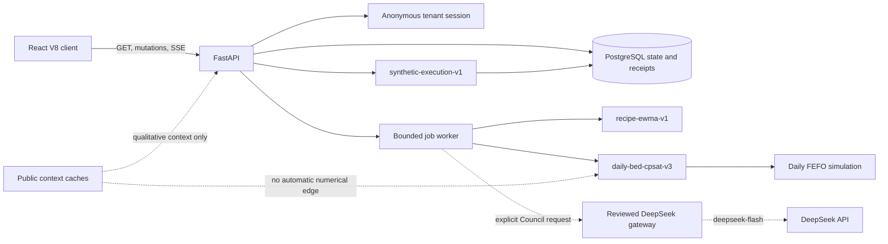

The implementation preserves the design separation described in [system-data-and-evidence.md](system-data-and-evidence.md): tenant farm state and explicit scenario controls can alter numerical inputs; public weather, news, and trade records cannot do so automatically. `public_features_used` is empty in both current numerical evaluation artifacts.

## 4. Persistent synthetic execution

### 4.1 Admission and world creation

A world can be created only from the current tenant's mission whose status is `ACCEPTED_FOR_SIMULATION` and whose input version is still current. The route rejects a stale mission, an unaccepted mission, overdue historical harvests without execution records, or a ninth world in the same session. Creation chooses the accepted strategy and freezes a central execution scenario with yield and demand factors equal to one. It stores the segment farm, allocations, deterministic replay trace, opening lots, opening cash, exact decimal revenue and cost accumulators, a civil-date horizon, and `real_operations_enabled=false`. The implementation is in [simulation.py](../../services/api/simulation.py).

The public world contains its revision, clock, bed states, inventory, task IDs, totals, cash, event sequence, plan history, runtime provenance, and state hash. Its stage representation comes from the shared [schedule-state-v2 helper](../../packages/growth.py), not from a second UI-specific growth rule. The helper explicitly declares that progress is elapsed schedule fraction and is not physiological biomass.

### 4.2 Canonical schedule semantics

The schedule states are `empty`, `nursery`, `growing`, `ready`, `harvested`, and `sanitation`. An executed harvest requires a recorded task; a snapshot does not infer that a past scheduled harvest occurred. Projected views may assume scheduled tasks execute. A bed is reserved through the harvest date plus `sanitation_days`, inclusive, and becomes available on the following civil date. The API exposes the same recipe calendar metadata to the client, including nursery, grow, sanitation, shelf-life, and growth-model version fields. The UI preview range ends at `horizon_days - 1`, so 7-, 56-, and 84-day horizons end at indices 6, 55, and 83.

### 4.3 Daily state transition

For each included day, execution verifies that persisted opening lot mass equals the frozen trace's opening mass. It records due sow, transplant, harvest, and sanitation-complete tasks once. It appends order-service events from exact order allocations. Revenue accumulates only when a delivered line has a non-null effective price. Input, labour, packing, and disposal costs are accumulated with `Decimal`, and public money values round at the cent boundary. The closing lot snapshot becomes the next day's inventory. The following invariant is checked for each day:

\[
M_{open} + M_{harvest} - M_{delivered} - M_{disposed} = M_{close}.
\]

The cumulative cash identity is:

\[
C_t = C_0 + \sum_{d \le t} Revenue_d - \sum_{d \le t} Cost_d.
\]

The daily event and world update share the store's ambient transaction, which is important because a multi-day advance must commit all included days or none. The world revision advances once per mutation, while the event sequence advances once per appended event.

### 4.4 Replanning

Replanning is admitted after at least one executed day and only when seven or more unexecuted days remain. The route allows at most twelve replans per world. It carries forward inventory, future orders, bounded nonnegative cash, and growing allocations whose sanitation occupancy reaches the new segment. Those allocations enter the planner as executed locks and cannot be silently removed or charged again for already completed sowing inputs. New candidate sowing cannot precede the new segment start. The local calculation runs outside the tenant lock; commit reacquires the lock and compares the original revision. If another mutation has advanced the world, the computed continuation is discarded. Only a feasible Balanced continuation replaces the future segment. The prior plan hashes and through-date remain in `plan_history`.

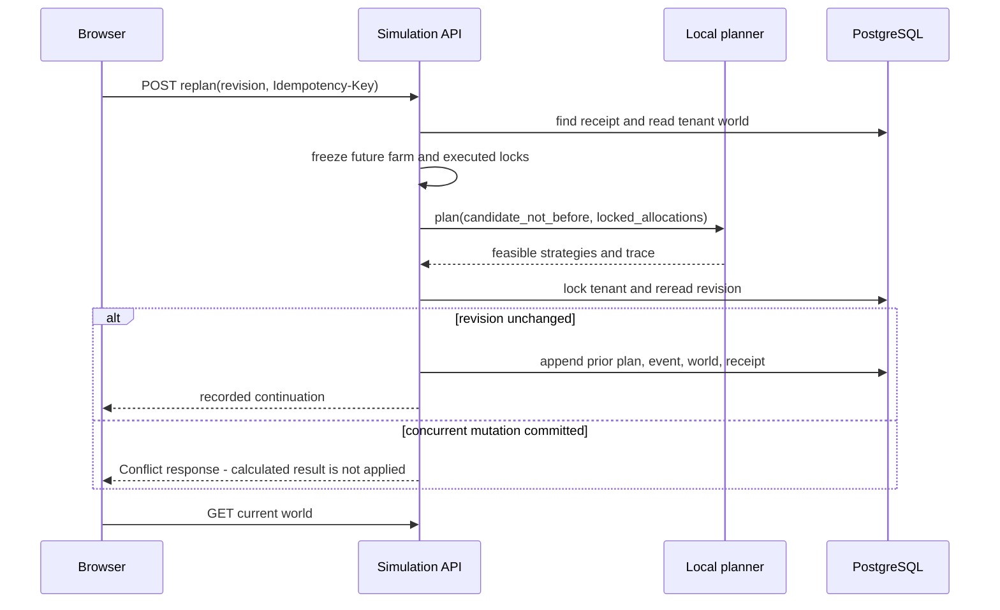

### 4.5 Absolute cycle identity and lot provenance

Final review found that horizon-relative allocation IDs could refer to different absolute crop cycles after a replan. This could suppress a later task while its numerical trace still produced harvest. The V3 planner now derives allocation identity from bed, crop, recipe and absolute sow/transplant/harvest dates. Replanning also excludes every previously executed allocation ID from new candidates, covering caller-controlled imported batch IDs while preserving existing locks.

Harvest lots use a separate deterministic hash and collision ordinal, checked against opening and earlier generated lots. The recorded world retains a lot-to-allocation origin map across replans. Harvest events expose produced lot IDs, and subsequent demand-service events carry their source allocation even when stock crosses a planning segment. These fields are provenance, not additional yield. The new 84-day ASGI HTTP regression replans after days 7 and 42 and checks cycle identity, harvest tasks and cross-segment lot attribution. Its initial failure is preserved in [the discovery record](../../reports/v8/late-replan-discovery.md).

### 4.6 Execution evidence and limits

The dedicated PostgreSQL test issued six simultaneous same-key advances and found one committed civil day and one matching receipt. Two different keys competing at the next revision produced one success and one 409 conflict. Historical receipt replay returned the original response without changing the newer world. A second tenant received 404 for the world, events, and mutation route. A reconstructed store observed the same world and ordered events. This focused test passed once in 7.38 seconds; details are in [execution-validation.md](../../reports/v8/execution-validation.md).

The archived intermediate 56-day HTTP trial in [v8_execution_trial.py](../../scripts/v8_execution_trial.py) passed across an application restart and made zero provider calls. Its immutable [intermediate artifact](../../reports/v8/archive/execution-trial.intermediate.json) records the exact synthetic counts and invariants it checked. The separate final network restart trial passed with 56 task events and 64 demand-service events: [execution-trial.json](../../reports/v8/execution-trial.json). The cash constraint remains narrower than the execution ledger: planning constrains new input cost, while execution deducts input, labour, packing, and disposal. A conserved ledger can consequently have a negative balance. That semantic gap must be resolved before cash is described as a full liquidity constraint.

## 5. Planner and accounting remediation

### 5.1 Weighted declared scenarios

`daily-bed-cpsat-v3` accepts an optional declared scenario set while preserving the original three-scenario default. The planner rejects empty sets, duplicate IDs, more than 100 rows, invalid factors, negative or non-finite weights, and non-positive total weight. Raw weights are normalized and converted to 1,000 deterministic integer objective units, with at least one unit for every positive weight. Returned scenario records expose raw, normalized, and integer weights. This is an engineering distribution chosen by the caller, not a calibrated probability model.

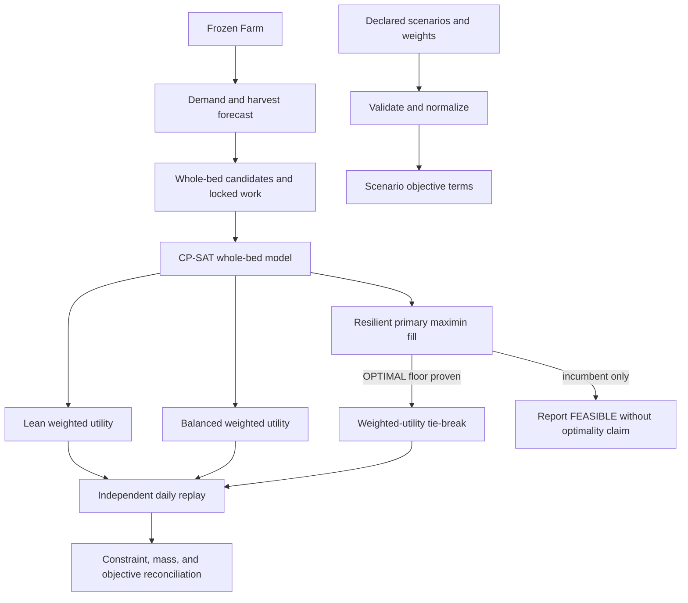

A constructed one-bed test changes the chosen action when the quiet/busy weights are reversed from 99/1 to 1/99. This behavioral check supports use of weights in the objective rather than merely their presence in metadata. The objective charges scenario-independent new-work cost once. Harvest-labour and conservative cash reservations use the maximum yield factor in the actual declared scenario set; custom factors above the default high-yield case cannot silently bypass those resource checks. The reported maximum quantization scale is approximately 0.001 of total objective weight.

### 5.2 Policy objectives and proof language

Lean and Balanced maximize weighted policy utility. Each scenario exposes revenue, packing cost, disposal cost, shortfall mass and coefficient, disposed mass and coefficient, terminal stock and coefficient, and new-work commitment cost. The resulting unit is described as SGD-equivalent policy score because penalty coefficients encode preferences; it is not literal expected profit.

Resilient first maximizes the minimum aggregate fill rate across all declared scenarios to one basis-point resolution. Only an `OPTIMAL` primary result freezes the proven floor for a secondary weighted utility solve. A merely `FEASIBLE` primary result is an incumbent and cannot support a claim of optimal downside protection. If the secondary stage times out, the proven primary schedule can be retained with an unfinished tie-break label. This is aggregate scenario service protection; it is not a per-order guarantee, chance constraint, CVaR estimate, or empirical risk distribution.

### 5.3 FEFO, order priority, and missing price

The CP model uses remaining-life buckets keyed to civil expiry dates. Replay allocates the earliest expiry first, then harvest date, then lot ID. For common shelf life this resembles FIFO; differing explicit expiry dates make the implemented policy FEFO. A later-expiring bucket cannot be consumed while an earlier bucket is available. The test space enumerated 81 small two-lot/two-day combinations and reconciled the allocator with the best feasible delivery/disposal outcome.

Demand service is sequential: booked commitments precede inferred residual demand, known higher prices precede lower prices within kind, and stable IDs break ties. Confirmed lines expand to current order IDs after cancellation. `order_allocations` records requested, delivered, and shortfall mass plus each lot's ID, quantity, harvest date, and expiry date. Residual lines use stable synthetic IDs. The schema lacks buyer priority, grade, and lot/customer eligibility, so the model makes no such allocation claim.

Forecast contract 2.0 retains numeric `price_sgd_per_kg=0` for compatibility when no booked price exists, but adds `price_status=unavailable_no_booked_price`. The planner converts that state to a null effective price and records unpriced requested and delivered mass. Dates with booked prices use `booked_weighted_average`. Missing price therefore does not become evidence of observed zero revenue.

### 5.4 Terminal stock and horizon effects

Closing inventory remains usable or expiring stock at horizon close. It has zero declared salvage value and is not counted as waste merely because the horizon stops. Lean, Balanced, and Resilient apply provisional closing-stock penalties of 0.50, 0.20, and 0.05 SGD-equivalent per kilogram respectively. A later horizon can convert that same mass into actual expiry disposal. These penalties require observed storage, spoilage, future-order, and disposal economics before operational interpretation. Implementation and test evidence are summarized in [planner.md](../../reports/v8/planner.md), with source in [engine.py](../../packages/planner/engine.py) and [accounting.py](../../packages/planner/accounting.py).

## 6. Data lineage and reproducible fixtures

### 6.1 Registry coverage

Coverage is derived from the current crop and evidence registries rather than hard-coded report prose. The validated registry contains 12 crop profiles and 24 evidence documents, plus registry versions and source-file SHA-256 digests. A contradictory manifest fails validation. The older 8 September data-quality artifact remains historical and was not edited to imitate a current rebuild.

The clean-checkout fixture bundle contains six small project-authored CC0-1.0 provider-contract payloads. Its manifest fixes byte counts and SHA-256 values and rejects unsafe paths or changed content before normalization. It produced 24 normalized rows: six weather observations, seventeen forecast rows, and one trade-contract row. Installation and rebuild produced identical dataset IDs, row counts, and normalized hashes in [data_pipeline_verification.json](../../reports/v8/data_pipeline_verification.json). The bundle is labeled `synthetic_contract_fixture`. Archived SingStat and NASA response bodies were not redistributed because lawful reuse had not been established.

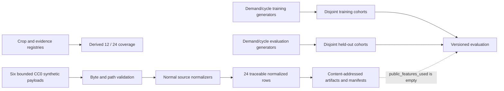

### 6.2 Compatibility fixture

The original `synthetic-farm-v1` remains byte-for-byte compatible. Its contract hash is `00286779541fa9ed1245ea2aff65d08c1a05241cdc6a399706aa6601fdbc3f76`. It remains useful for UI, numerical, and regression checks. It is not used as the sole evidence for V8 model behavior.

## 7. Synthetic model evaluation

### 7.1 Cohort design

Training and evaluation use different generator names, seeds, entity IDs, farms, buyers, batches, and date ranges.

| Partition | Version | Seed | Rows | Design |
| --- | --- | ---: | ---: | --- |
| Demand training | `synthetic-demand-train-v2` | 731104 | 7,488 | 6 farms, 18 buyers, 104 weeks from 2023-01-02 |
| Demand evaluation | `synthetic-demand-evaluation-v2` | 982451 | 3,072 | 4 unseen farms, 12 unseen buyers, 64 weeks from 2025-01-06 |
| Cycle training | `synthetic-crop-cycle-train-v1` | 445901 | 576 | 6 farms × 24 cycles × 4 crops |
| Cycle evaluation | `synthetic-crop-cycle-evaluation-v1` | 771283 | 256 | 4 unseen farms × 16 cycles × 4 crops |

Demand generation includes stable, growth, and compression regimes; a 13-week pattern; bounded heterogeneity; surge and drop shocks; booking lead times; cancellations; and separate booking, cancellation, and outcome availability. Crop generation uses independent whole-batch observations with planned and actual stage dates, area, recipe baseline, measurement method, operating regime, delay shocks, and quality shocks. It does not use weather inputs or contain a weather-response coefficient.

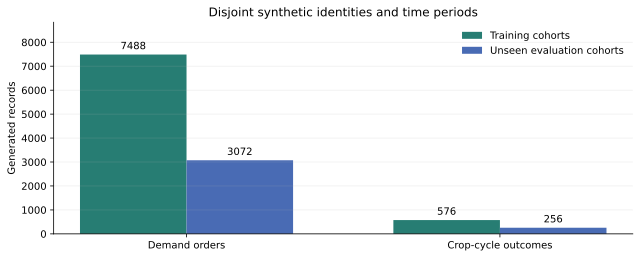

**Figure 1.** Synthetic cohort design generated from the current evaluation artifact. Distinct identifiers and time ranges test pipeline separation, but both partitions remain products of declared code and can share generator-design bias.

### 7.2 Rolling-origin demand method

`rolling-origin-demand-v4` evaluates farm/crop and buyer/crop series independently. For each forecast origin it supplies only dependencies whose availability timestamp does not exceed that origin. It evaluates one-, two-, and four-week horizons against last-week, 13-week seasonal-naive, fixed alpha-0.35 EWMA, and training-tuned EWMA baselines. Metrics are MAE, RMSE, WAPE, and signed bias. MAE uncertainty uses a deterministic series bootstrap with 500 replicates.

Alpha tuning uses only the training partition and freezes a cutoff of `2025-01-06T12:00:00+00:00`. Candidate alphas were 0.10, 0.20, 0.35, 0.50, 0.65, 0.80, and 0.90. The selected alpha was 0.80 based on one-step training MAE. The evaluation partition was not used for selection.

The initial dependency counter design had a structural weakness: it attempted to count late timestamps only after selecting rows already known to be on time. V4 now reports explicit included dependency auditing and adds an independent behavioral counterfactual. The counterfactual perturbs a permanently unavailable historical target and compares every resulting forecast for a held-out farm/crop and its buyers. It compared 492 farm forecasts and 1,476 buyer forecasts and changed zero. The probe status is `passed`. This supports the tested invariance; it does not prove the absence of every future feature-leakage defect.

### 7.3 Demand results

The held-out farm cohort contains 16 series and 656 predictions per model/horizon. The buyer cohort contains 48 series and 1,968 predictions per model/horizon.

| Cohort | Horizon | Best WAPE | Model | Tuned EWMA WAPE |
| --- | ---: | ---: | --- | ---: |
| Farm | 1 week | 0.048919 | tuned EWMA | 0.048919 |
| Farm | 2 weeks | 0.096992 | fixed EWMA | 0.100631 |
| Farm | 4 weeks | 0.121254 | fixed EWMA | 0.139717 |
| Buyer | 1 week | 0.061945 | fixed EWMA | 0.065245 |
| Buyer | 2 weeks | 0.093836 | fixed EWMA | 0.102266 |
| Buyer | 4 weeks | 0.140546 | fixed EWMA | 0.163816 |

The tuned candidate wins only the farm one-week WAPE comparison. The fixed EWMA performs better in the five other cohort/horizon comparisons shown. This is a useful negative result: training selection does not justify a general promotion claim even inside the synthetic benchmark. Complete metrics and bootstrap intervals are preserved in [synthetic_model_evaluation.json](../../reports/v8/synthetic_model_evaluation.json).

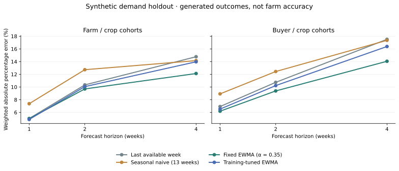

**Figure 2.** Current V4 rolling-origin synthetic demand results. The figure covers the two synthetic cohort levels and declared horizons; it contains no observed customer or farm demand.

### 7.4 Whole-batch crop-cycle method and result

The candidate adds crop-specific mean training residuals to recipe maturity and marketable-mass baselines. Features are crop ID, recipe cycle days, recipe marketable kilograms per square metre, and occupied area. Public weather, news, trade, and causal weather coefficients are excluded. The evaluation unit is an unseen farm's whole batch, not repeated measurements that could leak the same batch across splits.

| Target | Recipe baseline MAE | Residual candidate MAE | Better result |
| --- | ---: | ---: | --- |
| Fresh marketable mass | 3.722184 kg | 3.907328 kg | Recipe baseline |
| Maturity | 0.957031 days | 1.035536 days | Recipe baseline |

Training-residual 10th–90th percentile ranges covered 84.375% of held-out mass outcomes and 87.5% of held-out maturity outcomes. These are descriptive residual ranges and are not calibrated prediction intervals.

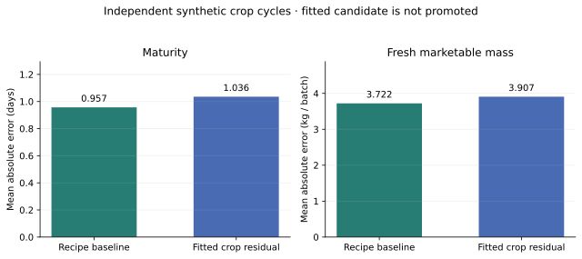

**Figure 3.** Independent synthetic crop-cycle evaluation. The fitted residual candidate fails to improve the primary MAE results and is not promoted.

### 7.5 Promotion decision

The policy is `farmtact-model-promotion-v1`. Schema and split integrity passed. The point-in-time gate passed based on zero included dependency violations, split availability assertions, and the counterfactual invariance described above. Three mandatory gates remain blocked:

- no authorized real farm/customer temporal holdout exists;
- no external farm cohort exists;
- no production drift, alert, rollback, or retraining trial exists.

The report therefore records `eligible_for_production=false` and status `blocked`. No fitted demand or crop-cycle candidate has been promoted. The forecast used by the application remains the declared engineering baseline `recipe-ewma-v1`.

## 8. Council evidence architecture and actual-call inventory

### 8.1 Exact roster and workflow

The current Council is `seven-agent-council-v3` with workflow `sequential_specialists_then_chair`. Six specialists independently receive role-projected slices of the same frozen context. Only the planning chair receives the prior claims, their evidence statuses, validation issues, and eligibility flags. The implementation does not claim a free-form debate or challenge round.

| Persona | Role identifier | Bounded responsibility |
| --- | --- | --- |
| Ravi | `demand_analyst` | Booked orders, forecast demand, required crop quantities and delivery dates |
| Hana | `weather_analyst` | Observed context and freshness; no unsupported yield adjustment |
| Idris | `market_analyst` | Prices and sourced reactions; reactions are not measured demand |
| Mei | `production_analyst` | Recipes, lead times, space, and modeled feasibility |
| Lina | `supply_chain_analyst` | Inventory, expiry, inputs, and delivery timing |
| Ben | `profit_analyst` | Computed costs, labour, cash, and margins under declared assumptions |
| Asha | `planning_chair` | Reconcile eligible claims and explain the deterministic selection policy |

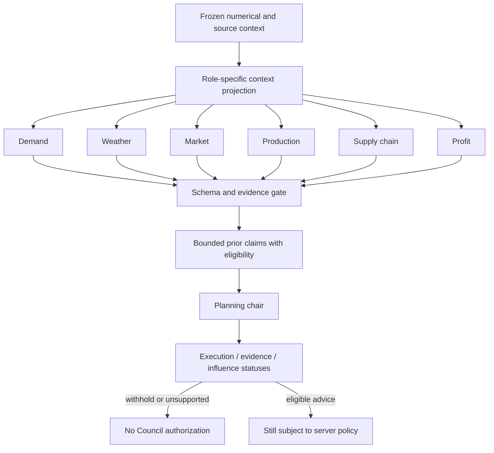

The normal mission budget is seven calls with up to two bounded structural repairs, for a maximum of nine. Direct and invitation workflows reserve their exact maxima separately. `RunBudget.cancel()` prevents subsequent transmission and stops bounded response consumption between transport chunks. It does not promise immediate interruption inside an already active synchronous HTTP call.

### 8.2 Typed facts and qualitative limits

V8 replaces numeric coincidence with selected `fact_refs`. The server builds a typed catalogue from frozen values and renders the value, unit, entity, period, and snapshot hash after model output. Model-authored quantities and dates are rejected even when they happen to match a value elsewhere in the context. `tool_result_refs` are restricted to qualitative context. Wrong entity, wrong unit, wrong meaning, citation laundering, and numeric prose have adversarial tests in [test_ai_injection_boundaries.py](../../tests/review/test_ai_injection_boundaries.py) and [test_ai_quality.py](../../tests/review/test_ai_quality.py).

`RESPONSE_LIMITS` is the shared prompt/schema authority: 400 content characters, one evidence reference, three context references, three typed facts, one highlight, and one proposed action. Conversation prompt/projection is V4; mission prompt/projection is V5. Mission outputs select exact short `F001`/`C001` aliases, resolved locally to canonical references with both forms preserved in the audit. Unknown aliases are rejected; alias resolution does not weaken numeric, membership or evidence checks. Role projection admits at most 48 typed facts, 24 qualitative references, 16 prior turns and six evidence records, subject to a hard 120,000-character serialized prompt limit. Exact research inputs referenced by the frozen result are included even when ordinary rank caps have been reached. Projection truncation is a declared limitation, and questions that cannot be answered from admitted context must receive an abstention. Contract versions identify prompt, output schema, validator, frozen context, and source context. New records include a public-context SHA-256 value. Earlier stored records remain readable through conservative additive defaults.

A structural format repair preserves the rejected attempt as an auditable record. Its instruction must preserve lexical meaning, relationships, proposed actions and evidence/highlight references; it may only remove or relocate an invalid number or date form. This correction can improve contract conformance but cannot retroactively make the rejected attempt valid or prove factual quality.

Execution status answers whether a provider workflow ran. Evidence status answers whether the returned references and typed facts passed the local checks. Decision influence answers whether policy can consider the result or must withhold. A successful HTTP response can therefore be `completed`, `unsupported_all`, and `advisory_only` at the same time. Qualitative interpretation remains `qualitative_unverified`; selecting a correct fact reference does not verify causal or agronomic prose.

### 8.3 Provider caller inventory

The fail-closed inventory in [deepseek_runtime.json](../../config/deepseek_runtime.json) contains four callers.

| Caller | Integration | Routes | Maximum | Failure semantics |
| --- | --- | --- | ---: | --- |
| Mission Council | active product | seven Council roles | 9 | visible withheld or partial |
| Persistent conversation | active product | direct, invite, Council, research interpretation | 9 | visible unsupported, partial, or failed |
| Synthetic label observer | active API | visual observer | 1 | visible missing visual evidence |
| Authenticated gateway trial | diagnostic only | demand, production, visual observer | 16 | preserved failed trial |

The gateway requires the compiled inventory and configuration to agree, restricts models to the reviewed set, verifies that the returned model ID exactly matches the requested ID, bounds request/response/image sizes and timeouts, limits concurrency to one, and records token categories where the provider supplies them. Helper or evaluator names do not imply an active caller.

### 8.4 Model migration

On 10 September 2026, DeepSeek announced V4.1-Flash, stated that it was live on the API with native multimodal support, instructed API users to select `deepseek-flash`, and retired the previous V4 Flash and Vision Experimental names; see the [official DeepSeek announcement](https://www.deepseek.com/en/news/deepseek-v4-1-flash/). The runtime's canonical model is consequently `deepseek-flash` for every current text and native-vision route. The discovery evidence is retained in [model-discovery.json](../../reports/v8/model-discovery.json). This migration statement establishes naming and routing policy; it does not prove FarmTact output quality.

### 8.5 Retained actual-provider evidence

The evolving experiment ledger preserves all attempts and reconciles actual paid requests; see [live-call-ledger.json](../../reports/v8/live-call-ledger.json).

| Experiment | Requests | Observed result | Audit interpretation |
| --- | ---: | --- | --- |
| Initial local planning Council | 1 | retired-model identity mismatch | Failed closed; run retained as incomplete |
| Canonical model with vision | 9 | native-vision path passed; five claims unsupported | Transport/capability evidence only; Council quality failed |
| V3 context/schema run | 7 | six valid outputs; one response rejected for the word `three` | Improved contract adherence, still incomplete |
| V3 format-repair run | 7 | six valid outputs; Supply Chain selected one unknown reference | Reference membership rejected locally; mission withheld |

The four mission counts sum to 24. Before the final V4 mission run, the ledger additionally records 11 V4 conversation requests and one V4 research request, for 36 actual paid requests. Conversation inputs totalled 805,878 prompt tokens and produced ten persisted adviser messages; the research request used 64,756 prompt tokens. These are usage measurements, not a quality score or a recommended production budget. The first mission failure demonstrates why exact returned-model validation matters. The canonical vision run shows that native visual input traversed the route, but five unsupported outputs prevent a quality pass. The next two runs each produced six locally valid role outputs and still failed complete coverage.

The retained [pre-context-fix scorer](../../reports/v8/ai-quality-before-context-fix.json) covers 18 cases: eight PASS and ten FAIL, so its overall automated status is **FAIL**. Exact workflow-integrity counts passed for direct, invite, Council, planning and research sequences. Those count checks show that the intended routes ran exactly once in the tested workflow; they do not establish entailment or usefulness. Conversation V4 and mission V5 address context admission, exact aliases and repair semantics, but no final live evidence yet proves that it fixes quality.

**Historical combined status: FAILED. Final V8 public quality status: FAILED.** No deployed-quality claim is made. The retained planning artifacts are [planning-local.json](../../reports/v8/planning-local.json), [planning-local-canonical.json](../../reports/v8/planning-local-canonical.json), [planning-local-v3.json](../../reports/v8/planning-local-v3.json), and [planning-local-v4.json](../../reports/v8/planning-local-v4.json). The final mission budget reserves at most nine requests; unused reservation is not counted as consumption.

## 9. Scenarios, conversations, and research state machines

### 9.1 Scenario attempts

Scenario roots are immutable tenant-owned numerical experiments. Each scenario keeps at most three append-only attempt summaries with queued, started, completed, cancellation, terminal status, and safe exception type. Retries preserve the frozen farm, baseline root, model versions, prior attempts, and original run idempotency key. A changed or stale key receives 409. An unsupported frozen version fails rather than being silently recomputed by the current model.

Cancellation atomically moves DRAFT, QUEUED, or RUNNING to CANCELLED. Queued cancelled jobs cannot be claimed. Because CP-SAT is synchronous, a running solve is observed as cancelled after the current local solve boundary; the compare-and-write guard prevents its stale result from overwriting the terminal cancellation. Scenario calculation makes no provider request.

Lists use SQL ordering and bounded `limit=1..30` with an exclusive `before` cursor. The thirty-first persisted scenario is rejected before numerical work. Idempotency lookup precedes the quota check so receipt replay still works at the limit.

### 9.2 Conversations

Conversations are independently capped at 30 per tenant and 120 messages per conversation. Admission rechecks capacity under the conversation lock, including the user message and every requested advisor turn. Queued and running requests can be cancelled through an atomic store primitive. Council execution checks cancellation before numerical context assembly, budget reservation, each initial or repair provider call, message persistence, and final completion. Cancellation is cooperative at call boundaries.

Replay preserves the original workflow type, model-call status, evidence state, decision influence, contract versions, and calculation provenance. It does not claim a new calculation or provider call. Historical records missing V8 fields receive conservative compatibility values.

### 9.3 Scripted research and challenge

Council Research is explicitly `scripted_research` with `inference_origin=local_rules` until a user requests a distinct advisor interpretation. Its dialogue can propose bounded reservations, unconfirmed-order treatment, and a 50–100% labour ceiling. Weather challenges state that outdoor rainfall is context rather than a numerical yield input for the sheltered synthetic farm. Farm time does not advance while research calculations run.

Each numerical result is tied to the research schema, forecast version, planner version, input version, and content hash. Revision history stores snapshots before mutations and exposes bounded incremental history pages. `cancel_calculation` and `retry_calculation` are separate from `stop`, which stops scripted dialogue only. A failed or cancelled current calculation can be retried up to three attempts; queued and running states cannot be duplicated. Actions require a current revision and an idempotency key.

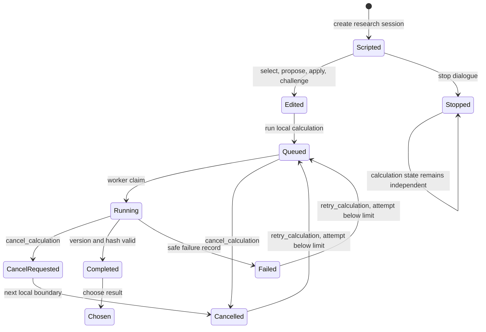

The research workflow supports comparison and provenance, but it does not establish that a proposed control is causally effective. Qualitative suggestions remain subject to the same local evidence labels when a provider is explicitly invoked.

## 10. Concurrency, tenancy, and idempotency

### 10.1 Server transaction model

The core store hashes the anonymous session bearer before persistence and scopes farm, mission, event, receipt, scenario, conversation, research, and simulation queries by tenant. PostgreSQL tenant transactions lock the tenant row to serialize state allocation. An ambient connection context lets nested event, world, and receipt writes join the same transaction. SQLite uses a serialization lock only as a test adapter; it is not the production concurrency claim.

Dedicated PostgreSQL tests used six concurrent same-key scenario retries after a forced transient failure and observed exactly one second attempt. Six concurrent scenario cancellations and six conversation-request cancellations each produced exactly one transition. The simulation concurrency result is described in Section 4.6. One pre-existing shared-database test observed a queued job become RUNNING because another live worker claimed it; the isolated V8 PostgreSQL test passed. This is why the final suite should run without unrelated workers polling the same test queue.

A later focused integration group passed 10 tests covering the SQLite background-worker serialization adapter and both queued and running research-calculation cancellation paths. This result supports those regressions in the test adapter; the production concurrency evidence remains the isolated PostgreSQL runs.

### 10.2 Client retry identity

The shared client mutation transport writes an idempotency key before transmission. Its session-storage identity includes immutable edition, HTTP method, API path, and serialized body. The key survives navigation and reload after a network error, 5xx, 408, 425, or 429 because the server may have committed even when the client lacks a response. Definitive success and definitive 4xx responses clear the pending operation. After a mutation or receipt replay the client fetches the current world, because an old exact receipt intentionally contains an older revision. Implementation is in [api.ts](../../apps/web/src/lib/api.ts) and [research.ts](../../apps/web/src/lib/research.ts).

The browser harness injected a 503 followed by a 429 and then success across page reloads. All three requests carried the same key. A later successful operation cleared it, and a deliberate 409 import response also cleared its separate pending key. This test exercises uncertainty semantics rather than merely checking storage keys.

### 10.3 Retention mechanism and remaining persistence limits

Anonymous-session authentication expires after 24 hours. An explicit operator CLI can identify inactive tenants and delete tenant-owned rows in dependency order within one transaction. It defaults to dry-run and 30 retained days, rejects fewer than seven retained days, considers at most 500 tenants per invocation, and skips any tenant with queued or running mission, scenario, conversation or research work. It covers the registered schema while preserving shared budgets and security controls; 12 isolated tests cover dry-run, full child deletion, recent/active retention and bounds. The command has no automatic schedule and Store initialization may create missing schema objects even in dry-run mode, so operators must target the intended database and inspect its JSON report.

Cancellation cannot preempt a CP-SAT solve or abort an already active synchronous provider call immediately. Concurrent identical replans may compute the same local solution more than once, although revision and receipt serialization allow only one committed state. There is not yet an approved production retention schedule or operating history for the CLI.

## 11. Browser behavior and visual evidence

The Outcomes room distinguishes a static schedule preview from recorded synthetic execution. The recorded panel can create a world from the accepted current mission, advance one or seven days, display clock and revision, show bed stage and progress, list task and demand events, show inventory and delivery/harvest/cash totals, and replan future work when at least seven days remain. It states that inference was not triggered and real operations are disabled.

Capability presentation separates configured routes, historical probe evidence, current verification, and last observed tenant execution. Planning does not treat “credential configured” as “provider verified.” Council cards separately expose execution, evidence, and decision influence, and label qualitative prose unverified. Council planning remains the primary action, while numerical-only planning is an explicit alternative and was used for this browser run.

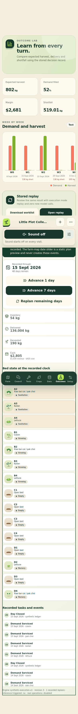

**Figure 4. Mobile browser evidence at 390 × 844 CSS pixels.** The Playwright run used an isolated local PostgreSQL database, normal background worker, numerical-only mission, one-day advance, future replan, then seven-day advance. It checked the visible execution totals, event rendering, shared sanitation calendar, mission persistence across refresh, and absence of body overflow. It made zero Council inference requests.

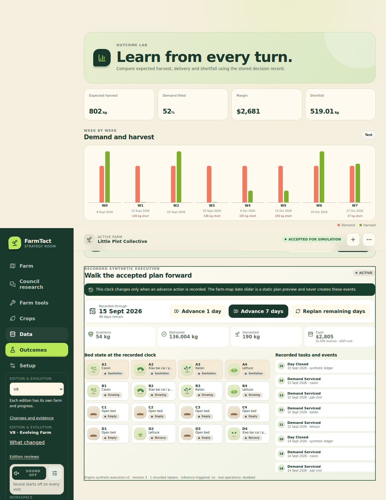

**Figure 5. Desktop browser evidence at 1280 × 900 CSS pixels.** This screenshot comes from the same numerical-only recorded world and the same 27-check run. The overflow assertion was repeated at 360, 390, 430, and 1280 CSS pixels. The screenshot does not show a live provider result or a real farm event.

The machine-readable [browser report](../../reports/v8/ui-browser.json) records 27 of 27 checks passing. It also records expected local `/api/releases` 404 responses plus deliberately injected 503, 429, and 409 responses. Those responses were excluded from the “unexpected failures” assertion because they are the intended retry-contract stimuli. The visible synthetic totals after the tested interactions were 54 kg inventory, 136.004 kg delivered, 190 kg harvested, $2,805 cash, $1,030 revenue, and $425 cost. These values belong only to that deterministic test world.

## 12. Verification results

### 12.1 Focused test evidence

| Subsystem | Command or artifact | Recorded result | Scope limit |
| --- | --- | --- | --- |
| Data/model/planner | focused pytest group in `reports/v8/data-ml.md` | 74 passed in 33.38 s | Synthetic and unit/integration scope |
| Planner plus adversarial contracts | focused group in `reports/v8/planner.md` | 36 passed in 61.05 s | Includes deterministic fallback paths |
| Council/gateway/offline quality | package group in `reports/v8/council.md` | 227 passed, 1 skipped, 1 PG test deselected | No live-provider quality pass |
| Council frozen subset | package group in `reports/v8/council.md` | 96 passed in 35.54 s | Bounded gate/gateway/cancel subset |
| Scenario reliability | V8 reliability unit suite | 5 passed in 3.30 s | Local service mechanics |
| Scenario/conversation concurrency | isolated PostgreSQL test | 1 passed in 2.81 s | Dedicated database/worker conditions |
| Scenario combined group | gameplay reliability group | 34 passed in 86.55 s | Focused, not whole repository |
| Simulation execution | execution unit suite | 3 passed in 7.76 s | Synthetic world behavior |
| Simulation concurrency | isolated PostgreSQL test | 1 passed in 7.38 s | Same-key, competing-key, tenant, restart-store |
| Worker/research cancellation | latest focused integration group | 10 passed | SQLite worker serialization plus queued/running cancellation |
| Root identity/retention/cancellation focus | `final-root-focused.xml` | 23 passed in 20.369 s | Includes 84-day ASGI world and replans on days 7 and 42 |
| Final V8 AI implementation focus | focused pytest group | 250 passed, 1 skipped, 1 PostgreSQL case deselected | Covers mission V5/conversation V4; no live-quality pass |
| Clean checkout | `clean-checkout.json` | PASS, zero inference calls | Rebuild/install/fixture/API path in recorded isolated environment |
| Numerical evaluation | `numerical_evaluation.json` | PASS, planner V3 | Synthetic-only; no fitted candidate promoted |
| Intermediate restart execution | `archive/execution-trial.intermediate.json` | PASS: 56 days, one restart, zero provider calls | Superseded by the final network PASS below |
| Web build | TypeScript no-emit plus Vite | PASS | Build only |
| Browser | `v8_simulation_ui.mjs` | 27/27 PASS | Local PG, zero inference, exact journey above |
| Intermediate full regression | `archive/full-regression.intermediate.xml` | 556 passed, 1 skipped in 398.002 s | Predates final identity/context changes |
| Final full regression | `full-regression.xml` | 589 passed, 1 skipped in 437.76 s | Predates only the narrow V5 alias and trial-harness changes, covered by focused regressions |
| Final network execution | `execution-trial.json` | PASS: 56 days, one restart, zero provider calls | Exact receipts and cash/mass/order-lot reconciliation |
| Final research adviser | `research-advisor-final.json` | PASS: references verified, one actual call | Exact references do not prove all qualitative prose |

These results are not additive because test sets can overlap. They should not be summed into a repository pass count.

### 12.2 Repository-wide gate

An earlier repository-wide run reported 499 passing tests and 34 failures while multiple packages were still editing generated manifests. The integration review attributed 32 failures to concurrent manifest churn and identified two actual defects, which were fixed. The next run completed with 557 collected tests: 556 passed, one skipped, zero failures and zero errors in 398.002 seconds. That result is preserved as [intermediate evidence](../../reports/v8/archive/full-regression.intermediate.xml), because planner identity, retention and V4 context changes followed it.

The later [focused root result](../../reports/v8/final-root-focused.xml) records 23 of 23 tests passing in 20.369 seconds. It includes the 84-day ASGI world, replans on days 7 and 42, cycle identity, lot origins, tenant retention, cancellation and SQLite worker serialization. The [clean-checkout result](../../reports/v8/clean-checkout.json) separately records a PASS with zero inference calls. These results narrow specific risks but do not replace the final repository-wide run.

**Final repository-wide regression gate: PASS.** The isolated-PostgreSQL run completed with 589 passed and one skipped in 437.76 seconds: [full-regression.xml](../../reports/v8/full-regression.xml). The subsequent narrow V5 alias and trial-harness changes have separate focused evidence. Release and live AI quality still require their own recorded checks.

### 12.3 Test interpretation

Unit tests support schema boundaries and small deterministic cases. Exhaustive tiny planner tests support equivalence only inside their integer-gram, single-grade, single-harvest domain. PostgreSQL tests support the exact concurrent schedules they execute, not arbitrary distributed failure histories. The browser test supports the specified sizes, controls, and local topology. Actual-provider runs support observed transport and validation outcomes but do not replace human agronomic quality assessment. Synthetic model metrics compare implementations under generator assumptions and cannot estimate field accuracy.

## 13. Gap dispositions

The authoritative machine-readable register was being revised during report preparation. The following table records evidence disposition for this report without changing or predicting that register's final status.

| Gap family | Implemented evidence | Required residual evidence |
| --- | --- | --- |
| DATA-01 | Dynamic validation derives 12 crops and 24 documents | Maintain registry/source review on future changes |
| DATA-03 | Versioned report 2.0 metadata and archived pre-V8 report | Clean final regeneration after frozen revision |
| DATA-04 | Self-contained hashed CC0 synthetic source fixtures | Authorized archival store for any real source snapshot |
| DATA-05 | Empty public feature set; no weather/news/trade coupling | Pre-registered real-data ablation before adding any edge |
| DATA-06 | Typed whole-batch outcome records and split checks | Authorized real farm batches and measurement protocol |
| NUM-03 | Weights affect objective behavior and are reported | Calibrated scenario probabilities if probability language is desired |
| NUM-04 | Resilient lexicographic maximin with proof status | Stakeholder-approved service definition and risk calibration |
| NUM-05 | FEFO solver/replay alignment and order/lot attribution | Grades, buyer rules, multi-cut and eligibility schema |
| NUM-06 | Terminal stock kept distinct from waste | Observed salvage, spoilage, disposal, and post-horizon economics |
| NUM-07 | Explicit missing-price state and unpriced accounting | Current observed prices and commercial validation |
| NUM-08 | Rolling-origin multi-horizon V4 evaluator | Real temporal and external-farm holdouts |
| NUM-09 | Promotion gates block synthetic candidates | Monitoring, rollback, drift, and approved thresholds |
| GAME-08 | Bounded attempt history, cancellation, retry, pagination and active-job retention exclusions | Wider soak testing and approved operational retention schedule |
| GAME-11 | Tenant locks, same-key receipts, revision conflicts and explicit bounded retention CLI | Multi-process fault injection, production monitoring and operator execution evidence |
| GAME-12 | Exact computed order delivery impacts | Buyer/grade/customer-priority contract expansion |
| Execution world | Durable clock, events, ledgers, replanning | Completed restart HTTP artifact and negative-cash resolution |
| AI-01/02 | Typed facts and independent local quality dimensions | Successful full live quality suite plus expert scoring |
| AI-03/12 | Execution/evidence/influence split | Validate comprehension with planned human study |
| AI-04 | Configured, historical, and observed statuses separated | Fresh successful explicit execution after quality fixes |
| AI-05/06 | Fail-closed caller inventory and bounded budgets | Dated cost controls and deployment reconciliation |
| AI-07 | Canonical harvest references and value status | Real measured outcome provenance |
| AI-08 | Truthful six-specialists-then-chair workflow | Measure incremental utility before adding challenge calls |
| AI-09/10/11 | Shared limits, rejection projection, version/hash provenance | Complete seven-role live conformance result |
| UX-01 | Recorded/static distinction and responsive controls | Planned human usability/accessibility study |
| OPS-01 | Local PG and build evidence | Final suite, immutable edition, deployment and post-deploy checks |

## 14. Scientific and operational limitations

### 14.1 Synthetic data validity

Every demand and crop-cycle target in V8 evaluation is generated. Independent seeds and cohorts prevent direct identity overlap, but they do not remove shared design assumptions. A model structurally similar to the generator can look favorable for the wrong reason. No score in this report estimates performance on an operating farm.

### 14.2 Biological scope

The schedule helper is a civil-date state machine, not a physiological growth model. Marketable mass uses recipes and declared scenario factors rather than measured light, nutrient, temperature, pest, cultivar, or operator effects. Crop intervals are descriptive synthetic residual ranges. No weather causal coefficient exists.

### 14.3 Demand and commercial scope

The private schema lacks buyer identity on orders, substitution, stockout-censoring state, grade, contract priority, and realized loss records. The demand forecast therefore cannot be described as buyer behavior modeling for a real operation. Missing current prices are made visible, but the system has no real pricing feed. Policy utility is not expected profit.

### 14.4 Optimization scope

The planner uses whole beds, integer grams, one grade, single-harvest lots, and declared scenario factors. It lacks split-bed, multi-cut, water, energy, packaging-capacity, rotation, substitution, partner-supply, and lot/customer eligibility constraints. Bounded CP-SAT `FEASIBLE` status does not prove global optimality. Scenario weights are not probabilities.

### 14.5 Execution scope

Execution replays the deterministic plan and central synthetic scenario. Events do not actuate equipment, assign a worker, send a buyer message, purchase an input, or record an observed harvest. The cash hard constraint does not yet cover every execution cost. The final 56-day HTTP protocol passed with a real application restart, exact historical receipts and reconciled cash/mass/order-lot totals. It remains synthetic engineering evidence.

### 14.6 AI scope

Typed rendering prevents a model from altering selected values, but it cannot make qualitative interpretation true. The current live quality status is failed: the pre-context-fix scorer passed 8 of 18 cases. Vision transport success is not agronomic visual validation. V4 role projection can omit relevant information under its 48/24/16/6 and 120,000-character bounds; it therefore requires abstention when admitted context is insufficient and must not be described as universal context coverage. Forty-four actual requests were consumed through the final local research trial. The final local mission still failed one reference check; the subsequent V5 alias change awaits public verification.

### 14.7 Operations and privacy scope

The session is an anonymous tenant, not an authenticated farm user. The explicit retention CLI supplies a bounded deletion mechanism, but it has no automatic schedule, approved production cadence or production execution evidence. Focused local PostgreSQL concurrency does not prove behavior under every network, process, database failover, or deployment condition. The final repository suite and network restart trial passed; deployment and final public AI verification remain pending.

## 15. Evidence required before stronger claims

Real demand evaluation requires authorized order-line history containing farm, buyer/SKU, booking, modification, cancellation, due, delivered, stockout, substitution, and availability timestamps. The evaluation protocol must freeze farm and buyer sampling, temporal splits, censoring policy, metrics, acceptance thresholds, and subgroup checks in advance.

Real crop evaluation requires independent batch records containing recipe and cultivar versions, sow/transplant/harvest and sanitation events, occupied area and system, fresh harvested mass, marketable mass by grade, packout, losses, measurement method, and availability timestamp. The current [outcome collection protocol](../research/v8-outcome-collection-protocol.md) is a protocol proposal, not a collected dataset.

Public weather or market context may enter a numerical model only after units, farm exposure, spatial mapping, and point-in-time availability are resolved and a pre-registered ablation improves an authorized real holdout. That analysis must distinguish prediction from causation.

AI promotion requires a complete current-model trial across direct, invitation, Council, vision where applicable, and research interpretation workflows. The retained report must include every request, repair, usage record, local issue, and failed output. Agronomic usefulness and harm must then receive independent human scoring under the [human study protocol](../research/v8-human-study-protocol.md).

Operational release requires a successful final build and regression, edition immutability checks, database migration checks, a final network restart trial, deployment health checks and a documented rollback target. Passing technical gates advance autonomously; there is no human release-approval checkpoint in this development phase. None of these steps enables real farm operations under the present policy.

## 16. Reproducibility map

| Purpose | Primary source or artifact |
| --- | --- |
| Private contracts and recipe calendar | [contracts.py](../../packages/contracts.py) |
| Canonical civil-date stages | [growth.py](../../packages/growth.py) |
| Compatibility and benchmark generators | [fixtures.py](../../packages/fixtures.py) |
| Public fixture installation and validation | [packages/ingestion](../../packages/ingestion/) |
| Feature/forecast contract build | [build_features.py](../../scripts/build_features.py) |
| Data rebuild entry point | [build_dataset.py](../../scripts/build_dataset.py) |
| Demand and crop evaluation | [evaluation.py](../../packages/models/evaluation.py) |
| Synthetic evaluation command | [evaluate_synthetic_models.py](../../scripts/evaluate_synthetic_models.py) |
| Synthetic evaluation result | [synthetic_model_evaluation.json](../../reports/v8/synthetic_model_evaluation.json) |
| Numerical evaluation result | [numerical_evaluation.json](../../reports/v8/numerical_evaluation.json) |
| Planner | [engine.py](../../packages/planner/engine.py) |
| Replay accounting | [accounting.py](../../packages/planner/accounting.py) |
| Simulation worlds and events | [simulation.py](../../services/api/simulation.py) |
| Scenario state machine | [scenarios.py](../../services/api/scenarios.py) |
| Core transactional store | [store.py](../../services/api/store.py) |
| Conversation persistence | [conversation_store.py](../../services/api/conversation_store.py) |
| Tenant retention mechanism | [retention.py](../../services/api/retention.py) |
| Retention operator command | [prune_expired_tenants.py](../../scripts/prune_expired_tenants.py) |
| Research state machine/history | [council_research.py](../../services/api/council_research.py) |
| Council orchestration | [council.py](../../services/api/council.py) |
| Council roster and gate | [agents.py](../../packages/agents.py) |
| Typed fact contract | [ai_contracts.py](../../packages/ai_contracts.py) |
| Offline quality scorer | [ai_quality.py](../../packages/ai_quality.py) |
| Provider policy and transport | [deepseek_gateway.py](../../runtime/deepseek_gateway.py) |
| Provider caller manifest | [deepseek_runtime.json](../../config/deepseek_runtime.json) |
| Client mutation transport | [api.ts](../../apps/web/src/lib/api.ts) |
| Recorded execution panel | [SimulationPanel.tsx](../../apps/web/src/components/SimulationPanel.tsx) |
| Browser method | [v8_simulation_ui.mjs](../../tests/browser/v8_simulation_ui.mjs) |
| Browser result | [ui-browser.json](../../reports/v8/ui-browser.json) |
| Intermediate restart execution | [execution-trial.intermediate.json](../../reports/v8/archive/execution-trial.intermediate.json) |
| Final restart execution target | [execution-trial.json](../../reports/v8/execution-trial.json) |
| Focused root regression | [final-root-focused.xml](../../reports/v8/final-root-focused.xml) |
| Clean-checkout result | [clean-checkout.json](../../reports/v8/clean-checkout.json) |
| Intermediate full regression | [full-regression.intermediate.xml](../../reports/v8/archive/full-regression.intermediate.xml) |
| Final full regression target | [full-regression.xml](../../reports/v8/full-regression.xml) |
| Pre-context-fix AI score | [ai-quality-before-context-fix.json](../../reports/v8/ai-quality-before-context-fix.json) |
| Execution concurrency method | [test_v8_simulation_postgres.py](../../tests/gameplay/test_v8_simulation_postgres.py) |
| Scenario/conversation reliability report | [game-reliability.md](../../reports/v8/game-reliability.md) |
| UI evidence report | [ui.md](../../reports/v8/ui.md) |
| Data/ML evidence report | [data-ml.md](../../reports/v8/data-ml.md) |
| Planner evidence report | [planner.md](../../reports/v8/planner.md) |
| Council evidence report | [council.md](../../reports/v8/council.md) |
| Execution evidence report | [execution-validation.md](../../reports/v8/execution-validation.md) |

The numerical report used a deterministic zero-second fallback and records `daily-bed-cpsat-v3`, `recipe-ewma-v1`, fixture hash, settings, cutoff, source revision, dirty state, report schema, and public feature exclusions. Bounded CP-SAT wall time, objective, and best bound can vary with solver build and runtime when a positive time limit is used. The archived pre-V8 report remains at [numerical_evaluation.pre-v8.json](../../reports/v8/archive/numerical_evaluation.pre-v8.json).

## 17. Conclusions and pending decisions

V8 materially improves the fidelity of FarmTact's synthetic planning experiment. The implementation now connects an accepted plan to a durable, revisioned execution world whose clock, tasks, lots, orders, costs, and replans can be inspected. Weighted objectives, maximin proof labels, FEFO replay, explicit missing-price state, terminal inventory and exact order attribution remove several important ambiguities from the numerical layer. Planner V3 further makes cycle identity absolute, collision-checks harvest lots, persists their origin across replans, excludes all historically executed IDs and reserves resources against the declared maximum yield.

The data and model work also improves the honesty of evaluation. Disjoint generators and cohorts, rolling origins, multiple horizons, whole-batch outcomes, fit cutoffs, and a counterfactual availability probe provide useful engineering tests. Their current result supports no fitted-model promotion, and the promotion policy correctly blocks production eligibility.

The Council architecture has stronger provenance and safer local validation. Its current actual-provider evidence nevertheless fails the quality gate. The canonical `deepseek-flash` migration, conversation V4 projection and mission V5 aliases are implemented, but the retained pre-fix score is only 8 of 18 cases passing. Exact workflow counts pass; answer quality remains unvalidated until the final live result is recorded.

The remaining integration decisions are evidence-driven and explicit:

- **PASS:** clean-checkout pipeline, V3 numerical report, 589-test PostgreSQL regression (one skip), focused AI/root regressions, final 56-day restart execution and final local research adviser;
- **ARCHIVED PASS:** intermediate 556-pass regression and intermediate 56-day restart-safe execution trial;
- **PENDING:** immutable V9 follow-up publication and live verification;
- **FAILED:** public V8 combined AI quality and exact workflow completeness (6 of 10 completed cases passed);
- **BLOCKED:** any production model promotion without authorized real outcomes;
- **DISABLED:** all real farm operations.

This report is therefore a reproducible V8 engineering assessment and limitation record, not a deployment certificate, agronomic validation, or operational authorization.

## 18. Final local integration results and release handoff

The final full PostgreSQL regression completed with **589 passed, one skipped, zero failed** in 437.76 seconds. The recorded 56-day HTTP world again passed after an actual application restart, with 56 day-close events, 56 task events, 64 demand-service events, a future replan, exact historical receipts and reconciled cash/mass/order-lot totals. The separate 84-day ASGI HTTP regression covers replans on days 7 and 42 and cross-segment lot attribution. These are synthetic engineering results.

The final research-adviser request passed `references_verified` with exact reservation dates, a bed-area fact and the unconfirmed-order context. Its prompt used 6,704 tokens, versus 64,756 in the earlier retained request. These are observed counts from separate bounded trial instances, not a cost or reliability benchmark. The final [research report](../../reports/v8/research-advisor-final.json) and [read-only replay](../../reports/v8/research-advisor-final-replay.json) retain the response and evidence.

A fifth local mission consumed seven requests and again withheld acceptance because Supply Chain shortened a complex order reference. This repeatable failure motivated a structural V5 mission-reference change: the model selects short `F001` and `C001` lookup aliases; the server resolves them exactly to the original canonical references before applying the existing type and evidence checks. Unknown aliases fail closed. Audit rows preserve both the mapping and the returned aliases, and public claims retain canonical references. This does not prove qualitative entailment. The [failed final local mission](../../reports/v8/planning-local-final.json) remains preserved.

The local total is 44 actual provider requests. The internal experiment ceiling was explicitly revised as defects were discovered; all revisions and request accounting remain in the [ledger](../../reports/v8/live-call-ledger.json). Runtime and shared-production daily limits were not changed. A public mission and public direct/invite/Council trial remain to be run after immutable V8 publication. Their results must be reported separately from these local passes.

The full suite predates the narrow V5 alias change; the focused AI suite then passed 250 tests, with one skipped and one PostgreSQL-only case excluded because the full PostgreSQL run covers storage. Root also checks the alias and interrupted-harness regressions separately. Final publication and automated live-quality outcomes remain pending in this source snapshot.

## 19. Immutable V8 publication and public quality result

V8 is published from `a00e546b1270a5c532e8eae6b8b64e568c344c13`, image
`sha256:8ed6fc3b1a6632f88bbc2b6a20b200b44bba13d7583c70f40e1c31f85c1e8357`.
[All eight health checks](../../reports/v8/deployment-health.json) matched source
pins and the [prior-seven preservation audit](../../reports/v8/preservation-after.json)
passed. Concurrent v7/v8 numerical scenarios completed in 22.768 and 36.169 seconds;
70 timed requests had read p95 0.2392 seconds. Cross-edition cookie rejection and
unchanged main-farm snapshots passed. Available memory after the trial was
2,325,268 KiB. This supports the tested light load, not general scalability:
[capacity evidence](../../reports/v8/shared-capacity-public.json).

The [public planning mission](../../reports/v8/planning-public.json) completed all
roles, passed reference/schema checks, was accepted for synthetic simulation and
passed its deterministic replan and zero-inference replay. It consumed seven
requests with no repairs. AI-assisted inspection nevertheless found missing role
relevance, metric mislabelling and a misleading policy explanation. These are
qualitative defects that reference membership alone cannot detect.

The public conversation consumed four requests: a direct reply, a Demand invite
and its schema repair, then a Production return rejected for excess content
length after the shared repair allowance was spent. The last request is PARTIAL;
the conversation Council was never started. The retained direct response also
omitted typed facts. The combined [public V8 scorer](../../reports/v8/ai-quality-public-v8.json)
passed six of ten completed cases, failed four, and failed workflow completeness.
The [postmortem](../../reports/v8/public-ai-postmortem.md) records exact outputs,
usage, failed checks and the limits of the AI-assisted semantic review.

V8 remains immutable. The subsequent [V9 follow-up](v9-ai-followup.md) corrects the
identified context/response-contract defects and has its own source, image and
live verification. The final-local observations in Section 18 are historical
checkpoints; this section is the final V8 public outcome.
