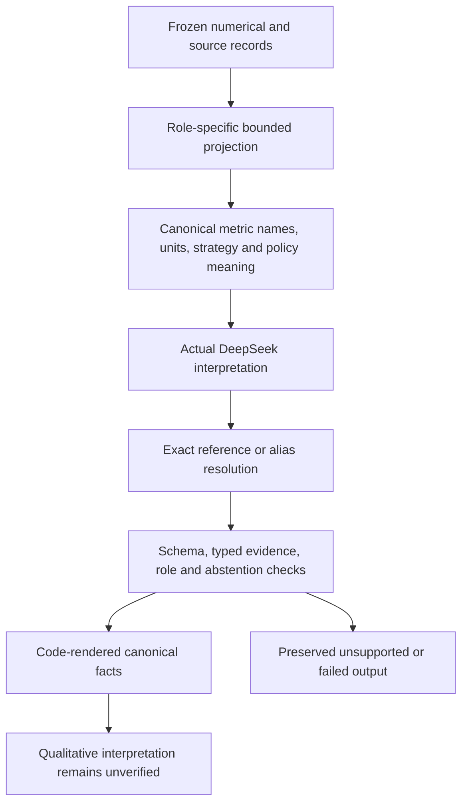
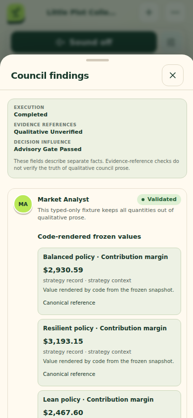
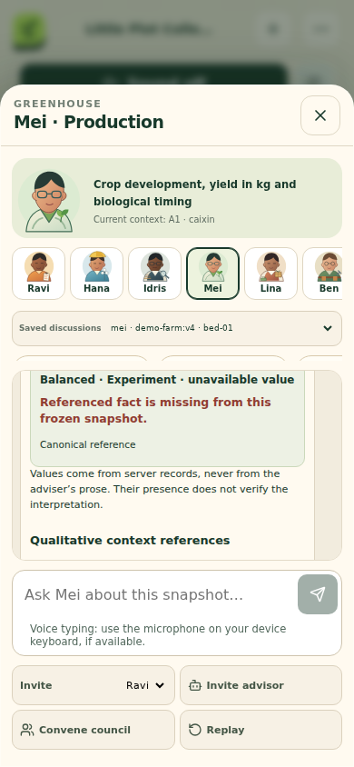
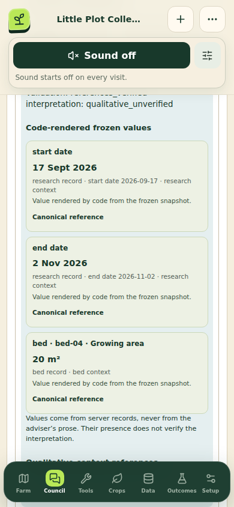

# V9 AI follow-up: semantic context and bounded answers

**Date:** 11 September 2026 UTC 
**State:** candidate; immutable publication and actual-provider verification pending 
**Scope:** AI context/validation corrections after the immutable V8 public trial 
**Data:** synthetic demonstration; actual farm operations disabled

## Abstract

The V8 public trial showed why successful HTTP transport, schema validation and
exact reference membership are insufficient evidence of answer quality. Its
planning Council completed seven roles but sometimes confused metric meanings,
omitted role-relevant facts or misstated the selection policy. Its conversational
invite stopped when a return turn exceeded the existing content limit. This
follow-up addresses the observed causes: opaque aliases that removed semantic
names, an incomplete comparison-field filter, unbalanced context admission,
missing numerical evidence and verbose answers. It retains all failed V8 evidence
and leaves that edition unchanged. Numerical planning, synthetic cohorts and the
recorded execution engine retain the V8 implementation and its separate evidence.

## 1. Evidence and hypotheses

The [V8 public postmortem](../../reports/v8/public-ai-postmortem.md) is the failure
record. The planning mission used seven actual requests and passed its mechanical
gate; the conversation used four requests and remained partial. The combined
scorer evaluated ten completed cases: six passed and four failed. Exact workflow
completeness also failed because the invited return and conversational Council
were absent. AI-assisted examination identified additional qualitative problems;
that examination was not human expert agronomic review.

| Observation | Identified mechanism | Bounded correction |
| --- | --- | --- |
| Market prose called margin a booked-value total | Mission aliases replaced canonical semantic reference names | Retain exact aliases for output selection while supplying canonical references, semantic labels, units, strategy identity and role purpose |
| Weather and Supply discussed general feasibility without useful role evidence | Generic strategy context could substitute for role context | Role-specific context admission; numerical roles require typed facts; explicit unavailable-source state requires abstention |
| Chair described withholding while the numerical selection was accepted | Conditional generic policy prose was ambiguous and the Council was not given the mission's required/advisory policy | Pass the actual mission policy and expose structured deterministic selection semantics |
| Numerical direct reply cited controls but no typed result | A qualitative context reference alone satisfied the local evidence gate | Require typed evidence for a non-abstaining numerical interpretation when relevant facts are supplied |
| Unrelated comparison metrics occupied the context | The filter recognized `.metrics.` but missed `.baseline_metrics.` and `.scenario_metrics.` | Recognize all comparison segments and apply the role metric set consistently |
| Relevant scenario values and deltas could be crowded out | Alphabetical reference order favored an early policy and segment | Admit available metric/policy triplet members atomically under the existing bound; prioritize controls and relevant source status |
| Authoritative typed values were absent from the UI | Saved conversation and research views rendered only legacy `tool_refs`; the mission sheet omitted typed claims | Render server-owned `rendered_facts`/`fact_refs` in all three actual-AI views, with explicit unavailable and unsupported states |
| Invited return exceeded 400 characters | Guidance encouraged explanation near the hard bound | Target fewer than 220 content characters, while retaining the 400-character schema limit and finite shared repairs |

These are testable software hypotheses. They do not claim that arbitrary free-form
prose is entailed by its references, nor that repeated success on this fixture
establishes provider reliability.

## 2. Revised evidence path

Mission prompt/context is V6; conversation prompt/context is V5. The common
validator is V4. Output schema V3 keeps the same 400-character content limit,
three typed references, three qualitative references, one evidence reference,
one highlight and one proposed action. Reference maps and provider-returned
aliases remain auditable; unknown aliases fail closed. Public facts use canonical
references, not private model lookup aliases.

The actual mission `council_policy` now crosses the application/Council boundary.
Required and advisory policy must remain distinct. The Council does not gain
permission to modify quantities, set a new ranking rule, run the numerical model,
change farm state or authorize operations. Only an explicit application action
can create a synthetic execution world from an accepted numerical result.

Conversation context includes server-authored response requirements. A numerical
non-abstention must select a supplied typed fact; a typed fact accidentally placed
in qualitative references remains eligible for the existing bounded format-only
repair, and the final response must still place it correctly. In Council mode an explicit absence
of relevant frozen weather or community-market observations requires abstention
from those external-source specialist assessments. Direct or invited questions
about an answerable frozen numerical result remain allowed; scenario/research
answers must then select typed facts.
General news does not become observed price, demand or weather evidence merely
because a feed is connected. Arbitrary unanswerable questions may still abstain.

The mission path currently supplies no site-weather observation or forecast, so
its Weather role must abstain. Market assessment depends on supplied community
observations, which are not connected in the default demonstration. Conversation
weather context can separately contain frozen public-source records. These paths
must not be conflated. The fixed seven-call mission still spends requests on
absence-driven abstentions; an explicit, correctly labelled deterministic skip
policy is a future cost experiment, not an implemented saving.

The context remains bounded to 48 ordinary typed facts, 24 ordinary qualitative
references, 16 ordinary prior turns and six evidence records, with declared
research/control and reply-target exceptions and a hard 120,000-character prompt
ceiling. Balanced admission improves coverage within these bounds; it does not
provide exhaustive context or prove that omitted records are irrelevant.

## 3. Validation design

Deterministic tests cover comparison-field exclusion, baseline/scenario/delta
triplets, required typed evidence, absence-driven abstention, exact alias mapping,
role evidence and required/advisory policy. Existing tests retain tenant isolation,
receipt replay, request accounting, preserved rejected attempts and format-repair
semantics. Tests use isolated PostgreSQL databases where required; background
application workers must never share a regression database.

The initial [conversation focus](../../reports/v9/conversation-focused.xml) passed 43 tests.
The subsequent [integrated AI focus](../../reports/v9/ai-focused.xml) passed 116 tests;
additional crowded-context tests cover atomic comparison groups.
The first full run had 603 passes, three setup failures and one skip because
a concurrent browser build temporarily removed the local static-asset directory.
The [race report](../../reports/v9/regression-build-race.md) retains all evidence.
The final [whole-repository rerun](../../reports/v9/full-regression.xml), after freezing the browser build, passed **606 tests with one skip** in 446.38 seconds. The earlier [V8 full regression](../../reports/v8/full-regression.xml)
passed 589 tests with one skip and remains evidence for its recorded source scope.
V9 does not claim new numerical accuracy from those software tests.

Actual-provider verification is a single bounded sequence on the new immutable
edition: planning Council (normally seven requests, at most nine), direct/invite/
conversational Council (normally ten, at most fourteen), and a frozen research
adviser (normally one, at most two). Stored replay and quality scoring make no
provider calls. Failures are retained; neither runtime limits nor validators are
relaxed to obtain a passing answer. Changes after publication require another
immutable edition.

## 4. Accounting and result interpretation

The [task ledger](../../reports/v8/live-call-ledger.json) records 55 actual requests
through V8, including failures and repairs. A revised internal experiment ceiling
of 96 permits at most 25 further requests for this V9 sequence, for a reserved
maximum total of 80. The application's shared production limit remains 48
requests per day. An internal reservation is not an actual call and is not a
change to the production budget.

A `PASS_AUTOMATED` quality result covers the specified roles, counts, persisted
validation, required topic/reference groups and known contradiction patterns.
It cannot establish the meaning of every sentence. AI-assisted case review is
labelled separately; human expert and real-farm outcome evidence remain absent.
A pass does not promote fitted models, make synthetic values observed, or permit
actual farm operations.

## 5. Immutable publication and final results

Publication, preservation, final live output and quality evidence are pending in
this candidate. The deployed V8 and its failed quality evidence remain available
and unchanged. The final report must attach the actual V9 source/image identity,
all-edition health, prior-edition preservation, workflow counts and per-case result
before describing this candidate as verified.

## 6. Display verification

The [mobile browser check](../../reports/v9/ui-typed-facts.json) passed 21 assertions across mission Council, saved conversation and research adviser views at 390 × 844 pixels, with no JavaScript errors. It used intercepted, server-shaped frozen fixtures and made zero provider calls. These images verify presentation, including missing-reference handling; they do not establish actual-provider answer quality.

