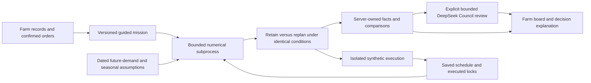

# V11: guided farm production planning

Status: implementation and acceptance in progress; not yet published.

## Organizer's original brief

> Farm Production Planning
>
> Farm managers determine planting schedules based on expected customer demand, crop growth cycles, available land, and seasonal conditions. Planning is largely based on historical experience and manual records, making it difficult to balance production capacity with changing market demand while minimizing crop wastage.

Source: the user supplied this organizer recap in the implementation conversation. It supersedes any suggestion that the original organizer problem was unavailable. Sumin Lee's PDF remains a product proposal; page 13 of the organizer briefing supplies the judging rubric.

## Accepted direction

Reuse the farm board, characters, four numerical recipes, three strategies and synthetic execution. Default to a guided mission, with a visible explicit Council checkpoint. Compare the saved schedule with replanning under identical changed demand and conditions. Seasonal effects are dated crop/system-specific assumed delay/yield sensitivities, not calibrated weather predictions. Start the edition chooser with the newest numbered edition, sorted numerically descending.

## Public contract

`/api/v1/planning-sessions` creates/lists isolated tenant missions; `/{id}` resumes one. `calculate`, `review`, `disrupt`, `advance` and `cancel` are explicit mutations with idempotency keys and expected revisions. Calculate/review/disrupt queue jobs; polling returns true stage/status and the current frozen numerical result. New snapshots invalidate review without destroying previous versions. API contracts are `packages/planning_contracts.py`.

Future demand adjustments target residual demand only. Booking additions/amendments/cancellations are explicit operations. Historical records never change through future-demand controls. Seasonal windows target nominal harvest dates and affect effective harvest, yield, expiry and occupied resources once. No automatic rainfall effect or invented causal attribution is admitted.

The retained schedule is evaluated without optimization under the same changed inputs. Its infeasibility is preserved. Compare booked fulfillment/shortfall, expiry waste, closing inventory, margin, resource usage and physical allocation changes. All outcomes remain synthetic; no observed manual-planning benchmark is claimed.

## Architecture

## Acceptance and publication

Run numerical assumption/ledger/lock tests, session idempotency/revision/isolation tests, actual local and public journeys, retained AI counterexamples and a bounded authenticated Council trial. Inspect responsive screenshots at 360/390/430/1280. Record all failed attempts. Three prescribed paired capacity runs require browse p95 below five seconds and terminal numerical jobs within 180 seconds; no threshold revision or favourable retry hides a failure. All former edition sources/images and state remain immutable. Publish only the next unused edition after final checks.
