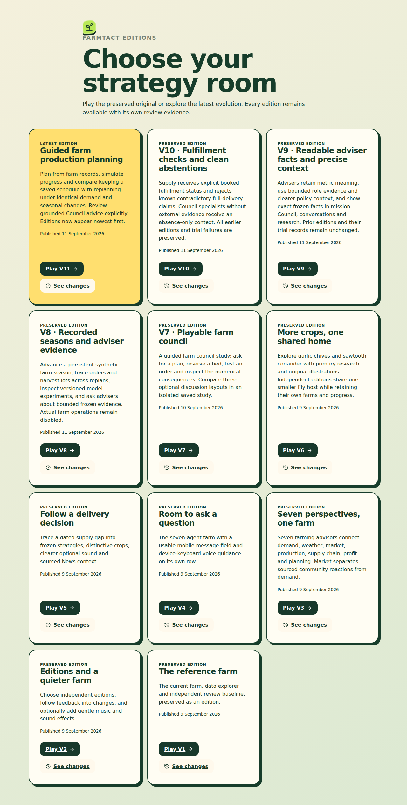

# V11 implementation and acceptance

## Purpose and intervention

V11 follows the organizer’s Farm Production Planning brief using the existing farm board, numerical scheduler and simulation ledger. The intervention is a guided record-to-replanning workflow, with an explicit advisory Council checkpoint and a retained-schedule comparison under identical changed conditions. Seasonal changes are dated synthetic sensitivities. They are not measured climate responses.

## Implemented behavior

- Records distinguish historical demand, unbooked expected demand and confirmed orders. Explicit edits alone alter booked orders.
- Initial planning returns Lean, Balanced and Resilient. The feasible numerical policy selection is distinct from an AI advisory suggestion.
- Simulation records days, inventory, cash and completed tasks. Future replanning preserves execution and evaluates the saved schedule without repair.
- Demand and seasonal changes apply to the remaining horizon. Nominal allocation fields prevent repeated compounding, and recorded harvests remain unchanged.
- The guided Council chooses verified fact IDs and bounded rationales. Quantities and comparative direction are rendered by code. Missing Weather/Market observations produce labelled deterministic notices.
- Spawned numerical workers enforce cancellation and deadlines without blocking HTTP. Admission and cache are process-local, not host-wide.
- Starting-screen and switcher editions sort by descending edition number, including V11 ahead of V10 and V9.

## Evidence interpretation

The first full run retained two failures: a test patched the old pre-worker boundary, and an adversarial fixture sought a harvest before the first scheduled harvest. Their corrected focused run passed eight tests. The first XML remains in archive/first-regression.xml. A separate local acceptance launch encountered the unchanged session-creation rate limit before creating work; local-journey.json retains that result. The actual browser journey passed 24 checks, including responsive visibility at 360, 390, 430 and 1280 pixels; it submitted numerical work and no inference.

Final regression, staged provider/capacity, publication and preservation results are recorded below when complete.

## Limits and next iteration

Software and provider checks do not establish farm efficacy or human usability. The four synthetic recipes and point-in-time EWMA remain demonstration models. Calibrate crop/demand models with real records, compare service/waste against a manual-planning baseline, and evaluate farmer comprehension before operational use. The guided Council contract does not repair or certify historical free-text conversation workflows. Real farm operations remain disabled.

## Final acceptance and release

Published at https://farmtact.fly.dev/v11/ from source `37802adbc9010bc80a50869ef725285a119af3f3`, image `sha256:e82ba02912d7a716ec4a4588a6fc83721cb361549d9fbbefc92eae1ce439cf7d`.

- Full regression: 643 passed, one skipped in 622.35 seconds. The subsequent staging admission correction passed all 63 control/gateway/deployment tests.
- Browser: 24/24 actual local journey checks and frontend build passed.
- Staged capacity: all three fixed paired V11/V10 trials passed, 106 browse samples, p95 0.287 / 0.312 / 4.190 seconds. V11 completion 12.98 / 10.98 / 16.45 seconds; V10 24.58 / 24.01 / 85.01 seconds. No inference. Loopback excludes public-network latency.
- Staged live journey: 20/20 checks. Initial calculation 127.76 seconds; replan 35.28 seconds; Council 34.48 seconds. Sustained latency remains variable on this shared host; the short paired trial does not guarantee uniformly fast planning.
- Council: five actual DeepSeek requests, no repairs/rejections; four specialists and Chair validated; two explicit deterministic source-absence notices. Replay made no additional request. The engagement ledger increases from 85 to 90 actual calls (44 local, 46 public), including historical failures/repairs. No other provider workflow is newly certified.
- All eleven public health/source checks and captured V1–V10 game-record preservation passed.

Initial operator staging failed at shared admission before numerical or provider work. The corrected gateway explicitly admits only the configured next unpublished edition, retaining authentication, shared counters and the 48-call cap; public routing remains registry-bound. That failure is archived. Candidate restaging changed only unpublished metadata/image; published source/images remained fixed.

The bounded semantic inspection in live-semantic-review.json confirms the Chair cites 300 kg delivered against 740 kg booked, leaving 440 kg shortfall. Balanced reduces projected expired waste by 74.8 kg and improves projected margin by SGD 251.65 relative to retaining the saved schedule under the same conditions. Those are synthetic accounting comparisons, not measured farm gains or causal treatment effects.

Public browser smoke passed 11 checks at 390 and 1280 pixels, with no calculation
or inference submission. Opening the guided page creates one empty mission; the
first smoke assumption of zero POST requests was corrected to allow only that
endpoint, and its first result is archived. The chooser itself creates no cookie.

*Figure: published V11 appears first; V1–V10 remain individually accessible.*

*Figure: published guided starting screen, using synthetic records. This initial
screen is not a screenshot of the separate live Council acceptance session.*

Final source review records a remaining rejected-finding presentation gap in the
V11 technical chapter: individual rejected specialist rows are not clearly
withheld/labeled by the UI, and overall completion is Chair-based. The live case
had no rejected findings. Fix this edge case in the next immutable edition; the
20 passing checks must not be generalized to that untested presentation branch.
