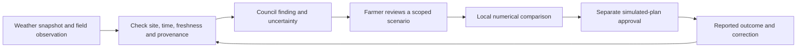

# V21 usability, playability and judging review

18 September 2026 · current public app, with lessons from V12 · assessment and proposed work, not an application release

**Recommendation:** preserve V21’s restored V12 structure, farm board, named destinations and visible Council. The next iteration should make the next action easier to find, explain which plan each section represents, and connect field observations to reviewable decisions. Add motion where it explains a real change. Do not replace this workspace with another universal card deck.

## Review identity and evidence

The earlier local assessment reviewed **V12**, not the current app. This report supersedes its current-state conclusions. V21 already fixes several of those findings; they are explicitly closed below.

- Public app inspected: <https://farmtact.fly.dev/> and `/play`.
- Public health verified `edition=v21`, source **`b980180dbb49a5261e43ee1d8e4916cc24457d7f`**. The rendered interface has `data-edition="v21"` and `data-experience="v12"`: the latter denotes the restored interface, not an old deployed version.
- Current release work is on **`feature/v21-v12-ux`**. At review time, `main` still points to the V12 handoff. The earlier review trusted that stale checkout. Future reviews should verify public identity and the matching release branch first.
- Read the [actual seven-part judging rubric](../../panel/judging-rubric.txt), current specifications, [V21 scope](../../../docs/v21-v12-ux.md), [V12/V15/V19 comparison](../../../docs/v12-restoration-ux-review.md), source and [V21 release evidence](../README.md).
- Fresh browser walkthrough used the **public UI and actual numerical backend**, not the previous V12 fixture. It covered initial entry, calculation, plan previews, full schedule, stage navigation and proposal/Inbox dialogs at 390px, then named sections at 1280px. Horizontal-overflow checks covered 360/390/430/1280px; that does not claim the complete functional journey at every width. Browser checks and screenshots are linked below.
- Two bounded read-only specialist audits covered data/feedback integration and rubric/persona concerns. These are agent/heuristic assessments, **not representative farmer interviews or usability-study results**.

Across the two passes, the walkthrough permits only fresh planning-session creation, one numerical calculation per pass and, in the final pass, isolated research-study creation; it blocks other mutations, including inference. No Council/vision inference, upload, approval, physical operation, deployment or application-source change was made. The initial pass blocked Council research’s automatic creation of an isolated study; that screen is **not an application failure**. A follow-up allows study creation, captures settled dialog screenshots and inspects public context. Neither pass submits a research calculation or provider question. Both passes completed **19 browser checks with no page exceptions**; numerical calculation took **13.420s** and **11.887s**, respectively. These are two bounded observations, not a latency guarantee. Fresh approval/task/correction execution is outside this review; those paths were source-reviewed and have separately dated V21 release evidence.

## V12 lessons: what is fixed, what carries forward

| Earlier V12 concern | V21 finding | Disposition |
|---|---|---|
| Stage clicks changed checkmarks without navigation/completion. | The rail now scrolls/focuses sections, explains prerequisites and does not fabricate completion. Public browser verified. | **Fixed.** Retain navigation versus saved-progress distinction. |
| Selected strategy could disagree with board preview. | Lean/Resilient selection updates the board and detailed brief together; preview is explicitly unsaved. Public browser verified. | **Fixed.** Next improve comparison, not state binding. |
| One allocation per bed hid later cycles. | Earliest cycle and cycle count are shown; the full dated schedule is available. Public browser inspected a 20-row Resilient schedule. | **Fixed for disclosure.** A filterable timeline would make it easier to use. |
| Calculation was buried after the board. | Calculate precedes the board and guidance names it. It is still below the opening mobile viewport. | **Partly resolved.** Improve first-action visibility. |
| Dialog accessibility/losing unsent edits. | Heading focus, Escape and opener return verified. Mounted-workspace draft retention, focus containment and late-response handling have V21 release tests. Reload/navigation still clears memory-only drafts, as disclosed. | **Substantially improved.** Consider recovery for field work. |
| No clear disabled-approval guidance. | V21 explains that an applied/recalculated proposal is needed and Council is optional. | **Improved.** CTA verbs and boundary summaries can be clearer. |
| Photos, measurements and weather should inform decisions. | Safe observation imports and quantitative task feedback exist, but contextual capture, feedback history and weather admission remain incomplete. | **Still a priority.** Extend existing mechanisms. |
| Consolidate everything into a new navigation model. | Current product direction explicitly restores named destinations after V15–V19 experiments. | **Do not carry this recommendation forward.** Improve scope labels and links within V21. |

## Priority findings and proposed iterations

P0 = next usability/correctness iteration; P1 = next meaningful product package; P2 = later validation/calibration. These are proposed priorities, not rubric scores.

### UX-01 · Make the first useful action visible — P0

**Observed:** at 390×844, the initial page is 3,245 CSS px tall. “What needs attention today?” begins at y=843; Inbox is at y=890 and Calculate at **y=1,149**. Sound controls, hero, rail and tutorial fill the first screen. Moving Calculate ahead of the board helped, but did not make it immediately visible. See [first viewport](01-mobile-first-viewport.png) and [measurement evidence](initial-walkthrough.json).

**Improve:** compact the hero and sound control; put “Next: Calculate options” in the visible area with a jump to the existing control. Returning users should see their saved plan, pending reviews or due tasks first. Keep the synthetic/simulation boundary readable. Do not add another onboarding shell.

**Test:** new owners identify the next useful action within 30 seconds without coaching, at 360/390px and enlarged text. Test fixed-header/footer clearance: a focused section should be visible below the sticky header, not merely have a nonnegative viewport coordinate. One normal-motion stage screenshot caught a partly obscured heading; quantify settled positioning before classifying a persistent defect.

### UX-02 · Explain the relationship between Plan, Farm, Tools and Outcomes — P0

**Observed:** after Plan returned three options, Farm showed **“0 plan options”**, Farm tools invited another planning mission, and Outcomes said **“No plan outcome yet”**. The source uses a separate guided planning session versus the bootstrap/main mission run. This is not evidence of lost data; it is a confusing presentation of separate contexts. Farm tools also says Council planning is primary while Plan says Council is optional.

**Improve:** preserve all destinations, but label their scope: “Current guided plan”, “Farm snapshot/main mission”, “Independent experiment”, “Recorded simulation outcomes”. Link an empty state to the existing guided result when appropriate. Label mobile “Council” as the independent research area, not the current Plan Council. Explain whether changing Setup affects an existing frozen planning session or a future one.

**Test:** users can locate their saved result after visiting another section and explain whether a displayed plan is the same revision. No automatic cross-workspace or historical-state merge.

### UX-03 · Expose consequential planning assumptions — P0

**Source confirmed and editor inspected:** adding an order exposes kg but implicitly selects the first allocation/order crop, assigns a due date +21 days for confirmed or +28 for tentative orders, and uses SGD 8/kg. Those defaults remain in V21’s [ProposalEditor](../../../apps/web/src/components/FarmerWorkflow.tsx). Percentage edits also need clearer baselines and affected dates.

**Improve:** expose crop, customer/reference, due date, quantity/unit, price and confirmed/tentative status before submission. Show the exact change summary, affected batches and immutable past work. Label 100% as “current estimate” and show absolute quantities. Keep farmer scenarios distinct from measured facts.

**Test:** a participant can explain exactly which crop/order/date changes before pressing calculate. An apparently simple quantity entry must not silently introduce a different commitment than intended.

### UX-04 · Make tradeoffs understandable — P0/P1

**Observed numerical example:** one fresh pass returned Lean at 44.9% booked coverage, 154kg projected expiry and SGD 2,467.6 contribution margin; Balanced at 54.1%, 176kg and SGD 2,930.6; Resilient at 62.9%, 221kg and SGD 3,193.2. These are synthetic projections from one bounded run, not stable benchmarks or farm outcomes. All were labeled numerically feasible despite substantial uncovered commitments.

**Improve:** pair percent with fulfilled/requested kg, period and outstanding shortfall. Explain “feasible within modeled limits” versus “fulfills every order”. Display the concrete difference from the selected alternative. Replace “Maximize the worst declared scenario fill rate, then improve weighted policy utility” with a farmer-facing description and optional technical detail. Put the full schedule in a filterable crop/bed/date table or timeline beneath the existing disclosure; keep all cycles.

**Test:** a farmer can explain why one plan was chosen and what it sacrifices. Do not assume “Resilient” means better on every metric or that contribution margin means net profit.

### UX-05 · Present Council status and recommendations clearly — P1

**Observed:** before any request, the overall panel says Awaiting but all seven cards say **Unavailable** and “Awaiting explicit review.” This makes an unrequested review look broken. **Source finding:** `normalizedFindings` renders summary/evidence/tool status but drops structured `tradeoff`, `rationale` and `proposed_strategy_id` from the central findings.

**Improve:** distinguish Not requested, Queued, Reviewing, Ready, Partial, Withheld and Unavailable. Keep all seven roles, adding a compact summary above them: what agrees, what differs, what evidence is missing and which next observation would help. Resolve evidence IDs into readable metric/strategy/value/unit/date, with raw provenance expandable. Show each validated recommendation beside the current preview and offer “Review this recommendation” with frozen context; do not apply it automatically. Specialist discussion already has a reviewed-proposal handoff—extend that explicit pattern.

**Test:** users distinguish “not asked yet” from “cannot answer”, and understand that checked references do not prove every causal explanation. Fresh AI quality was not tested here.

### UX-06 · Make the board useful during field work — P1

Plan’s bed tiles remain noninteractive articles, while the separate Farm map has bed/adviser interactions. A farmer should not have to discover a different room to inspect the pictured crop.

Add a bed detail entry within the existing Plan board: batch/crop, current recorded stage, upcoming dates, tasks, observation history and **Add photo / Report issue**. Explicitly distinguish recorded state from candidate preview. Preserve the map’s accessible list and non-drag controls. A schedule date or calendar progress bar is not proof of measured maturity.

### UX-07 · Make assistants’ reporting simple and retrievable — P1

The existing task form supports actual and rejected quantities, checklist, note, reviewed photo and corrections. However, photo attachment requires a previously confirmed Inbox upload; saved notes/photos/checklist history are not presented as a useful observation timeline. The form resets checklist selection on task change instead of presenting the saved report as a separate record.

Add a “Today’s work” entry within the workspace: bed/batch → task/checklist → quantity/photo/note → receipt. Show last saved report, who/when if supported, forecast change and correction history. Separate “view saved result” from “submit another result”. Provide recoverable drafts and explicit queued/failed sync states for field connectivity. An assistant view is a navigation preference until server-side assignment/permissions exist; do not imply hidden controls enforce access.

### UX-08 · Turn playability into learning from a decision — P1

Keep V21’s board and existing mission framing. Farm/Data already expose a useful dated question—cover a specific pak choi order whose deadline is earlier than new sowing can mature. Link such a question to the current plan instead of asking beginners to invent a scenario.

Let users predict a consequence, compare calculated options, choose a simulated plan, report an outcome and recover. Add one clearly labeled disruption at a time; compare unchanged versus revised plans under identical new conditions. Existing “Recovery needed” is an earned milestone when an exception exists; style it as **attention required**, then reward **recovery reviewed/completed** only when supported by saved evidence. Do not reward losses or AI-call volume.

### UX-09 · Keep knowledge and expert tools reachable — P1

Crops provides twelve profiles but only four demo planning recipes; Data exposes reference snapshots, records and experiments; Setup currently offers demo loading or JSON import. Preserve this depth. Add contextual links from a crop/date/constraint to the relevant evidence. For new owners, offer a short structured record-entry path before requiring JSON. For experienced farmers, add filters, bulk review and comparison deltas rather than removing details.

## Four audience journeys to validate

| Audience | Entry and main question | Proposed successful journey / likely perception |
|---|---|---|
| Judge | “What does this decide, and can I inspect why?” | Dated supply problem → actual numerical alternatives → evidence-backed review → explicit simulated approval → reported exception → future-only recovery. Strong potential on reasoning/guardrails; disconnected sections and unexplained IDs can obscure it. |
| New owner | “What should I do first, and what information do I need?” | Visible next action → guided records with “unknown” allowed → understandable tradeoff → plan boundary summary. Large hero, seven stages and jargon currently demand too much inference from the user. |
| New assistant | “Which bed/task, what quantity, and how do I report trouble?” | Due task → concise instructions → measurement/photo → saved receipt → owner review for exceptions. Avoid making daily reporting depend on understanding the Council or financial model. |
| Experienced farmer | “Show the assumptions, bottleneck and dates; let me challenge them.” | Filterable schedule → crop/site evidence → targeted override/scenario → before/after calculation → actual outcome. Preserve direct controls and provenance; expose defaults and site relevance. |

These are hypotheses, not observed human reactions. Allow switching views because an owner may also do field work. Continue using device-keyboard voice typing for notes; no custom recording/transcription integration is proposed.

## CTA changes to prototype

| Current CTA/status | Proposed wording | Purpose |
|---|---|---|
| Calculate options | Compare 3 planting plans | Explain input period; do not promise all will be feasible. |
| Inbox | Add or review records | Show pending count and photo/order/measurement shortcuts. |
| Apply & Recalculate, outside editor | Adjust assumptions | Accurately describes opening the form. |
| Apply & Recalculate, form submission | Calculate revised plans | Show exact crop/date/quantity changes first. |
| Approve & Create Actions | Save this simulation plan | Confirmation explains creation of simulated tasks and unresolved limitations. |
| Ask this specialist | Ask about this plan/risk | Context-specific question chips with free-text option. |
| Unavailable before review | Not requested | Reserve unavailable for an actual capability/evidence limit. |
| Review with Council | Review these plans with Council | Identify the explicit AI request and source coverage. |
| Save reported result | Save harvest result / Save delivery result | Explain accepted/gross/rejected weight and unit. |
| Replan remaining work | Compare recovery plans | Preserve completed work and show unchanged/revised alternatives. |
| Open Waste Rescue | Compare options for this surplus | Name the lot, dated quantity and expiry. |
| Missing on a bed/task | Add photo / Report crop issue | Prefill crop/batch/task and observation time. |

## Photos and real-data feedback

### Build on what exists

Reviewed photo candidates are tenant-scoped, observation-only and cannot establish yield or authorize actions. Reviewed photos can already attach to tasks. Quantitative task feedback replaces projected harvest kg and adjusts delivery acceptance/rejection and financial projections in [refresh_reported_forecast](../../../services/api/planning_sessions.py). Notes, photos and sow/transplant observations do not automatically recalibrate survival, timing or yield.

The [V12 vision evidence](../../v12/vision-quality-review.json) used a synthetic graphic and demonstrated visible-text/shape observation and abstention. It does **not** establish disease diagnosis, crop identification, maturity, biomass or yield estimation on field photographs. V21 does not supply new field validation.

### Proposed observation-to-decision loop

1. **Capture from the work:** bed/task-local camera or file choice; prefill crop, bed, batch, stage and time. Explicitly choose crop/task photo versus receipt/document photo—the current upload UI classifies all images as generic photo observations.
2. **Describe what changed:** whole-bed plus close-up when helpful, first noticed, affected plant count/area, farmer-reported severity, recent work and measurements. Permit “not sure”.
3. **Review:** show thumbnail/original, user statement, extracted visible findings and uncertainty separately. Correct metadata/observations; save without AI when capability is unavailable. Existing secure source-view endpoints can support this.
4. **Link and follow up:** append to the crop/task timeline; compare dated photos from a similar viewpoint; record issue status and a next observation. Show what saving changed and what remains unchanged.
5. **Discuss:** offer “Ask Council about this observation”, citing the reviewed observation and related measurements. A photo can justify asking for evidence, not a silent assumed yield loss.
6. **Compare a scenario:** farmer-reviewed typed changes or separately validated agronomic rules can propose a scoped delay/resource/yield scenario. Local numerics calculate consequences; explicit approval remains separate.
7. **Close the loop:** record what actually happened, the measurement method and any correction. Compare against the original prediction and preserve the evidence trail.

Keep raw-image access controlled, strip unnecessary location metadata, handle offline/retry/duplicate uploads, and treat image/document text as untrusted input. All actual helper/vision inference remains on the allowlisted DeepSeek gateway. Do not turn an unvalidated visual hypothesis into diagnosis or treatment instruction.

### Additional useful inputs

| Feedback | Best moment | Potential planning benefit and boundary |
|---|---|---|
| Sown, germinated, transplanted and surviving counts | Nursery/transplant checks | Reveal batch shortfall; counts are not harvest mass. |
| Actual stage/milestone date | Bed inspection | Compare expected versus observed timing; revise future work explicitly. |
| Gross/marketable/rejected harvest weight | Harvest and packing | Reconcile mass, grade and lot identity; state unit and measured versus estimated. |
| Labour time and interruption reason | Task/shift completion | Compare resource estimates against actuals, including rework. |
| Buyer acceptance/rejection, cancellation and price | Delivery/order update | Separate fulfilled demand, rejected quality, unserved demand and tentative requests. |
| Inventory count, storage conditions, expiry/spoilage | Stock check | Improve dated surplus and rescue comparisons without inventing stock. |
| Temperature/humidity, water use, EC/pH, equipment availability | Manual measurement or sensor import | Site-specific context; retain calibration, source, location, time, unit and missingness. |
| Owner override/reason and later outcome | Decision review/follow-up | Learn which assumptions were useful; preserve disagreement and uncertainty. |

Collect only fields relevant to the current task. For later calibration, use real measured crop cycles with crop/system/site/date/provenance, held-out time periods and uncertainty. Do not train on model projections as if they were observations or silently pool tenants. Real-world effectiveness remains a separate validation requirement.

## Weather and other live data: make the influence inspectable

**Current gap:** NEA ingestion already supports rainfall, air temperature, humidity, 24-hour forecasts and four-day outlooks. But [the guided planning worker](../../../services/api/planning_sessions.py) calls `review_plan` without external `news_context`. [Planning Council](../../../services/api/planning_council.py) therefore takes its deterministic absence path for Weather/Market. Its role context also needs actual typed external facts; passing a presence check alone would not supply them. Public weather/news display elsewhere does not prove use by the current guided review.

**Live data finding:** the inspected Public context selector labeled its sources, including D01–D05 weather, **metadata only**. The selected rainfall source showed 0 records, “No ingested rows”, “Not retrieved” and unknown freshness. See [public-context screenshot](09-public-context.png) and `observations.public_context` in the walkthrough record. This is what the current view exposed, not proof that every external provider is unavailable. Connector code or a registry entry is not a successful current ingestion. Refresh/coverage/error handling and Council admission are both needed; do not present this screen as live weather-informed planning.

**First package:** admit one frozen site-relevant weather snapshot to this review, not another disconnected feed. Show source/station, site coverage/distance, observation versus forecast, issue/retrieval/valid times, units and freshness. Make “Context only” versus “Changed this scenario” explicit.

- Match weather exposure to the production system and crop stage. Sheltered hydroponics and open-field growing should not share an assumed rainfall response.
- Respect horizon: near-term forecasts can support inspection/scheduling questions; they cannot become a precise 56-day yield forecast.
- Start with explicit scenario assumptions. “Compare a two-day delay” is a scenario unless measured or supported by a validated crop/site model. Research agronomic rules separately before implementation.
- Weather identifies exposure; Crop checks stage/biology; Capacity checks labour/bed/cash; Demand checks delivery consequences; Plan Reviewer checks evidence and unsupported causal claims.
- Keep approved inputs frozen. A new forecast offers a new comparison rather than rewriting a saved plan. Handle stale/missing data with a visible limitation, not invented confidence.
- Prioritize confirmed order changes, onsite readings, equipment outages and measured labour availability next. Distinguish a buyer quote from the farm’s contracted price and a headline from confirmed demand.

**Test:** trace a source through the exact crop/date/parameter it influenced and compare under identical conditions. Also test irrelevant site, stale source, conflicting onsite measurement and absent-source abstention. New sensor/model integrations require their own validation.

## Animation production plan

Reuse existing SVG crops/advisers, components, reduced-motion handling and captioned guides. The Plan workflow is mostly static plus loading indicators; richer Farm/research visuals elsewhere do not automatically explain the guided decision loop. Create finite SVG/CSS/React transitions tied to actual events. No new raster-generation pipeline is needed for these interactions.

| Priority / animation | Trigger and proposed sequence | Meaning and motion-off alternative |
|---|---|---|
| P0: section orientation | Stage click scrolls/focuses below fixed header; brief 150–250ms highlight. | Where the user landed. Instant focus and heading highlight in reduced motion. |
| P1: plans ready | Completed numerical job reveals three options once, with actual completion state. | Work finished. Static “3 plans ready” receipt; no fabricated progress percentage. |
| P1: candidate delta | Strategy selection highlights changed beds/dates and pairs old/new metrics, ~300–500ms. | Unsaved preview difference. Static comparison table; exact numbers, not invented intermediate counts. |
| P1: observation saved | Successful save adds photo thumbnail/note to the correct bed/task history, ~250–400ms. | Where evidence was stored. Static saved receipt; no success before acknowledgement. |
| P1: Council status | Actual role events update queued/reviewing/partial/withheld; focus relevant evidence. | What ran and what remains unknown. Static status list; no fictional debate or active avatars when idle. |
| P1: proposal and tasks | Successful recalculation marks the new revision; approval reveals returned task count/dates. | Distinguish preview, saved proposal and approved simulated actions. Static revision/task receipt. |
| P1: reported versus projected | Saved actual adds a marker beside projected quantity; show delta and exception. | What the observation changed. Static values with units, source and time. |
| P1: recovery | Shade/lock completed timeline segments; highlight only changed future work after calculation. | What is preserved and what changes. Static preserved/changed lists. |
| P2: weather relevance | Opening an admitted alert highlights its valid time window/affected work, then scenario difference. | Source-to-decision explanation. Static numbered chain; no unsupported crop-damage animation. |

For every animation specify event/revision ID, old/new state, duration, interruption/stale-result behavior and reduced-motion equivalent before building. Avoid replaying celebrations on reload, fake crop growth during calculation, color-only meaning, obligatory sound and motion blocking input. Calendar growth stays labeled a projection. Test keyboard focus, repeat taps, delayed responses, errors and enlarged text in both motion modes. Caption videos and retain transcripts, but put the important explanation beside the action.

## Judging rubric: show the evidence, not just the interface

The repository rubric provides seven criteria with examples and no numeric weights. No score is inferred here.

| Criterion | Best demonstration | Remaining risk / improvement |
|---|---|---|
| Goal & Scope Definition | One dated buyer commitment constrained by biological lead time, beds, labour and cash. | Begin with a concrete decision; projected margin is not actual profit. |
| Architecture & Reasoning Loop | Frozen inputs → local calculation → role findings → reviewed proposal → approval → report → recovery. | Show current revision and persistent state across the loop; clearly distinguish other room contexts. |
| Tool Use & Integration | Purpose-specific import, typed facts, solver, reviewed observation and trace. | Weather/photo presence is not proof of decision integration; show exact influence and limits. |
| Autonomy & Human-in-the-Loop | Automatic calculation/validation with explicit consequential review. | Explain why observations, proposals and simulated approval have different authority. |
| Safety, Security & Guardrails | Tested tenant/stale-evidence isolation, untrusted-input handling, idempotency and disabled real operations. | Provide exact adversarial cases and a tool-authority table; avoid a generic “safe AI” claim. |
| Observability & Evaluation | Inspect one input snapshot, version, evidence reference, validation result and task event. | Separate numerical/UI/adversarial/provider-semantic/field evidence. Passing references or test counts alone do not establish truth or usability. |
| Platform & Tooling Usage | Explain React/API/PostgreSQL, local solver and bounded schema-validated Council roles. | Describe the actual orchestration rather than implying autonomous multi-round debate; keep technical detail out of routine farmer tasks. |

Suggested 5–7 minute judge walkthrough: identify the exposed order and simulation scope; calculate and compare; inspect one evidence-backed review; make one scoped change; save a simulated plan; report a short result; show correction/recovery and trace. Clearly label any replay and distinguish it from fresh inference. Real calculation latency must remain visible; do not disguise it with fake progress. Use the dated release evidence for approval/restart/provider boundaries, not this read-only review as a substitute.

V21 release reports 811 backend passes/one skip, 62 exact-image UX checks, 50 lifecycle checks and other bounded operator/polling/preservation checks. These are **existing release results**, not tests rerun for this review and not evidence of human comprehension, sustained capacity or agronomic effectiveness.

## Recommended delivery sequence and acceptance

1. **A — clearer decisions:** visible next action, scope labels/return links, explicit crop/date/price fields, improved CTA/status wording and human-readable tradeoffs. Preserve named sections and server authority.
2. **B — field reporting:** contextual capture, source preview, observation/task history, actual-versus-plan receipt and recoverable drafts. Add save/result/recovery transitions alongside these flows.
3. **C — Council and live evidence:** structured recommendation/synthesis, evidence-linked handoff, one admitted weather snapshot and explicit scenario mapping. Keep unavailable/partial behavior honest.
4. **D — learning and playability:** same-condition disruption comparison, meaningful evidence milestones, filtered timeline, measured cycle feedback and validated calibration. Treat field efficacy as separate work.

Prototype with three new owners, three assistants and three experienced farmers as a small formative starting point, plus separate judge-style review. Give equivalent tasks without coaching: find next action; edit a dated order; explain a tradeoff; add a bed photo; report a short harvest; correct weight; identify preserved work; find the result after changing sections. Measure completion, time, wrong turns, interpretation of uncertainty and confidence in the next action. Test physical devices, outdoor readability, one-handed use, weak connectivity, keyboard and reduced motion.

Proposed targets: next action found within 30s; routine report within 60s; contextual observation within 30s; users can distinguish recorded/projected/reported and preview/applied/approved; no false completion from browsing; no photo mistaken for a verified diagnosis. These are targets, not measured outcomes. Compare against V21 before choosing a broader redesign.

## Reproduction and artifacts

- [Final public walkthrough record](walkthrough.json), [initial pass](initial-walkthrough.json), [script](walkthrough.mjs).
- [Opening mobile viewport](01-mobile-first-viewport.png), [initial page](02-mobile-initial-page.png), [calculation guidance](03-calculate-guidance.png).
- [Plan comparison](04-mobile-plan-comparison.png), [proposal editor](05-mobile-proposal-editor.png), [Inbox](06-mobile-inbox.png).
- [Full mobile plan](07-planned-390.png), [full desktop plan](07-planned-1280.png), and room/public-context captures in this folder.

Run from repo root with Playwright Chromium installed: `npm ci --prefix apps/web`, then `node reports/v21/usability-review/walkthrough.mjs`. This is a **live review**, creates disposable sandbox state and performs one numerical calculation per invocation; it is not an offline test. It verifies the pinned V21 identity and stops if that changes. It never prints/stores credentials or browser cookies. Screenshots use settled/disabled transitions for legibility; browsing uses normal motion. Both passes' 19 checks passed with no browser exceptions and zero provider calls; the second pass adds research entry/public-context inspection and settled screenshots. The final record has zero blocked requests and only the three permitted writes (planning-session creation, calculation and isolated research-session creation). No new application release is required for this documentation.
